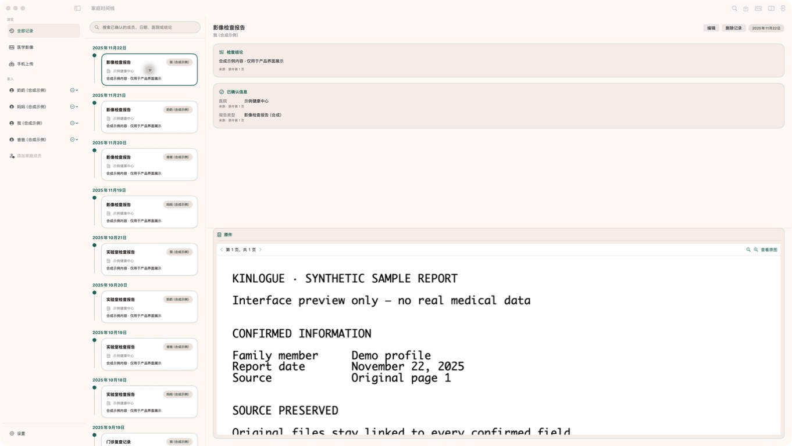

<p align="center">
  
</p>

<h1 align="center">续页 · Kinlogue</h1>

<p align="center">
  <strong>家人的健康记录，前后相续。</strong><br>
  <em>Your family’s health history, continued.</em>
</p>

<p align="center">
  macOS 14+ · Swift 6 · Local-first · GPL-3.0
</p>

<p align="center">
  
</p>

<p align="center">
  <sub>产品界面预览 · 仅使用合成示例数据，不包含真实健康资料</sub>
</p>

续页（英文名 **Kinlogue**，读作 **KIN-log**）是一款 Mac 优先、隐私优先的家庭健康记录应用。它把散落在 PDF 与图片里的检查报告、化验单和门诊记录，按家人与时间串联起来，让历史资料在下一次复诊时随手可查。

*Kinlogue turns your family’s medical reports into one continuous history, ready for every follow-up.*

> [!IMPORTANT]
> 当前源码仍是发布前开发候选，不是已完成公共发布的产品。候选身份、自动化状态和人工门禁以 [当前候选证据](docs/acceptance/current-release.md) 为准。

续页负责整理、检索和呈现可信的原始记录，不替代医生，也不提供诊断、趋势判断或治疗建议。

## 为什么做续页

一份报告往往只回答一次检查的问题，真正影响复诊效率的却是它与过去资料的关系。文件可能散落在手机相册、聊天记录、下载目录和不同家人的文件夹里；需要回顾时，人们还要重新辨认日期、项目与前后变化。

续页希望把这个过程变得简单而可信：保留原件，用本机 OCR 帮忙转录，让用户确认关键信息，再把一页页报告续成可以搜索、回看和比较的健康历史。

## 核心体验

- **按家人整理**：在同一台 Mac 上管理多位家庭成员的资料与时间线。
- **保留可信原件**：导入 PDF 和报告图片，记录转录内容对应的来源页。
- **本机 OCR**：使用 macOS Vision / PDFKit 在设备上提取文字，不把报告发送到云端。
- **先确认，再入档**：OCR 只生成候选；用户确认后，记录才进入时间线、搜索和比较。
- **前后对照**：搜索已确认记录，并排查看历史结论与原件。
- **加密目录备份**：把完整资料库写成可恢复的加密文件，保存到用户选择的本地目录或网盘客户端同步目录。
- **就诊前导出**：从“设置 → 数据管理”把所有已确认报告和医学影像的原始文件按家庭成员与日期整理为一个 ZIP，保存到用户选择的位置。
- **手机临时投递**：用户主动开启后，手机可在同一局域网中通过浏览器上传一份或多份报告。

```text
Mac 导入 / 手机临时投递 → 本机验证与 OCR → 人工确认 → 时间线、搜索与比较
```

## 隐私与医疗边界

| 边界 | 当前实现 |
| --- | --- |
| 数据处理 | 报告、OCR 和索引在这台 Mac 上处理；没有账号、内置云同步、iCloud、CloudKit、HealthKit、遥测或广告。启用备份后只写用户选择的目录。 |
| 本机存储 | App Sandbox 内的资料库目前是**明文存储**，不使用应用层加密或 Keychain。 |
| 数据备份 | `.kinloguebackup` 恢复点经过客户端认证加密；续页只验证目录中的本地文件，无法证明阿里云盘、百度网盘或其他客户端已经上传。 |
| 手机投递 | 只在用户主动开启的临时会话中工作；监听所选 Mac 接口，并在 HTTP 前限制为该接口的 IPv4/IPv6 网络前缀。传输仍是普通 HTTP，仅适合可信任的私人 Wi-Fi 或有线局域网。 |
| 内容可信度 | OCR 是待确认的来源转录，不是医学解释；只有用户确认的记录进入正常查询。 |
| 删除范围 | 续页只管理 App 自己保存的副本，无法删除原始源文件、Time Machine 备份、APFS 快照或其他外部副本。 |

这些限制是当前产品设计的一部分，不应被“本机优先”或“隐私优先”的表述掩盖。完整说明见 [隐私说明](PRIVACY.md) 和 [隐私与安全工程文档](docs/privacy-and-security.md)。

Mac App 界面当前支持简体中文和英文。默认跟随 macOS 的 App 语言偏好，也可以在侧栏“设置”中即时选择“简体中文”或 “English”；选择会保存在当前 Mac 用户的 App 偏好中。OCR 关键词和用户导入的报告文字属于内容数据，不会因界面语言切换而翻译或改写；实现与新增文案流程见 [本地化说明](docs/localization.md)。

## 从手机接收资料

在侧栏打开“手机上传”，点“从手机接收”，确认当前是可信任的私人 Wi-Fi 或有线局域网后开始接收。手机与 Mac 连接同一局域网时，可扫描二维码或在浏览器输入页面上的地址，再输入一次性验证码。手机页面是一个可以反复追加图片或 PDF 的文件列表，不需要先分报告或排序；上传完成后，Mac 会把相同原件合并到单一待确认队列。用户可以单选或多选原件，在 Mac 上确认报告页序、家庭成员和日期，再作为一份报告加入“等待确认”。

切换网络、锁定或睡眠 Mac、关闭最后一个主窗口、退出 App 或主动停止，都会终止当前会话；会话不会自动恢复。手机页面只显示本次会话的上传状态，不能浏览 Mac 上的成员、历史记录、OCR、时间线或原件。协议、生命周期与排障说明见 [局域网上传文档](docs/lan-upload.md)。

手机只在有界逐块比较确认字节完全相同时忽略重复选择；无法确认时仍会上传，由 Mac 使用 SHA-256 和长度做权威合并。若所选原件与已有报告完全一致，Mac 会复用已有报告而不重复创建；部分重合或近似内容仍由用户确认。

## 医学影像文件夹

当前源码提供独立的 DICOM 文件夹导入、人工确认、成员时间线入口、医学影像库和受限的本机二维 Viewer。DICOM 原件、自由文本和像素不进入报告 OCR、搜索或比较；该能力不提供诊断、测量或通用影像工作站功能。准确的格式、交互和未验证边界见 [DICOM 专题](docs/dicom.md) 与 [验收矩阵](docs/acceptance/dicom-mri-viewer-matrix.md)。

## 导出全部原始文件

在“设置 → 数据管理”选择“导出原始文件…”，App 会先提示导出内容是未加密健康资料，再让用户通过系统保存面板选择一个 `.zip` 位置。压缩包只包含已确认报告和已确认 DICOM 检查的原始文件；按家庭成员与日期排列，包括已归档成员的确认报告和未注明日期的确认报告。它不包含 OCR、来源转录、备注、搜索索引、目录、草稿、待确认 DICOM 或手机待确认队列。

导出过程流式读取并复核原始字节，显示文件数和字节进度，最终验证完整 ZIP 后才原子发布；提交前可以取消并清理未完成内容。这个 ZIP 是提供给医生查看或打印的明文副本，不是可恢复的资料库备份。导出后副本位于续页管理范围之外，删除本机资料库不会删除它。

## 加密目录备份与恢复

在“设置 → 数据备份”选择一个父目录后，续页会在其中建立专用 repository。该目录可以由阿里云盘、百度网盘或其他桌面客户端同步，但续页不连接这些服务，也不知道远端上传状态。自动备份默认关闭；手动与自动恢复点共用保留池，默认 5 份、可设为 2–30 份。

首次设置会生成必须独立保存的恢复码；续页不使用 Keychain，也不会保存恢复私钥。如果设置在发布 repository 身份时中断，重启后可以输入已保存的原恢复码继续同一备份身份，或经二次确认放弃后重新配置；续页不会在恢复未完成设置时生成新恢复码。恢复时选择一个已下载到本机的 `.kinloguebackup`，输入恢复码，完整验证后明确确认替换当前资料库。活动资料库仍是明文，只有外部恢复点使用应用层认证加密。详见 [备份与恢复](docs/backup-and-restore.md)。

## 当前版本

源码仓库已公开，但项目尚未正式发布可下载产品。当前版本、最低系统、自动化状态和人工门禁只在 [当前候选证据](docs/acceptance/current-release.md) 维护；验证命令见 [测试与发布](docs/testing-and-release.md)。

## 当前存储边界

报告原件、DICOM 原件与索引、手机上传待确认项、成员资料、OCR 结果和搜索字段会被复制到 App Sandbox 内的本机资料库。当前版本不进行应用层加密，也不使用 Keychain。能够访问当前 macOS 用户资料的人员或软件，以及包含资料库的 Time Machine 备份、APFS 快照或其他副本，可能读取这些内容。

资料库使用原子清单提交和不可变对象文件，SHA-256 摘要只用于发现意外损坏和本机去重，不提供保密性、身份认证或针对恶意回滚的保护。上传完成的唯一原件会保留在待确认队列，直到用户明确删除或将其成功归档；归档失败不会移除队列项。进入报告等待确认后，删除投递箱接收副本不会删除已经归档的原件。当前版本提供用户选择目录的加密备份与整库恢复，但不提供内置云同步；显式导出的原始文件 ZIP 仍不能用于恢复资料库。

## 本机构建

要求 macOS 14 或更高版本，以及包含 Swift 6 的 Xcode 或 Command Line Tools。

```sh
scripts/lint.sh
swift build --disable-sandbox
scripts/compile-localizations.sh --check
scripts/test.sh
```

完整 Xcode 环境还可以构建并验证本机测试 App：

```sh
scripts/verify-app.sh
scripts/build-acceptance-app.sh
scripts/run-acceptance.sh
```

`scripts/verify-app.sh` 会重新构建正式的 `dist/Kinlogue.app`，检查架构、Info.plist、签名、仅含入站服务的精确 entitlement allow-list、中英本地化资源与局域网用途说明、内嵌手机页面、无原始请求内容日志、无 Security.framework 直接依赖及无旧加密运行时代码，并生成 `dist/verification-report.json`。安装验收只使用合成资料，不应访问真实病历；自动验收通过也不会替代真实设备、真实样本 OCR、键盘或 VoiceOver 等人工门禁。完整前置条件和结果解释见 [测试与发布](docs/testing-and-release.md)。

## 品牌

- **续页**：强调家人的健康资料一页页延续，并在需要时接上过去。
- **Kinlogue**：`Kin` 代表家人，`-logue` 联想到记录、档案与对话。
- **图标意象**：一张翻开的纸页延伸为连续轨迹，三个节点代表不同时间的检查与复查。
- **图标文案**：**翻开一页，接上过去。**

品牌以深玉绿 `#1E6254`、暖象牙白 `#F7F1E4` 和柔和杏色 `#DF8A4A` 为母色，避免医疗十字、心电图、盾牌、云端或 AI 星光等符号。界面令牌、交互状态和无障碍取舍见 [Warm Sanctuary 设计系统](docs/design-system.md)。

## CI/CD 与候选分发

仓库内的 GitHub CI 会在 pull request 和 `main` push 上执行 lint、隐私门禁、全量测试与正式 bundle/XPC 验证，并以 30 分钟为异常硬上限；独立 CodeQL workflow 在 macOS runner 上分析 Swift。Dependabot 检查 SwiftPM 与 GitHub Actions 更新。推送与 `Info.plist` 版本一致的 tag 后，distribution workflow 不需要 Apple 开发者账号或 Secrets，会生成经过复验的 Apple Silicon ad-hoc ZIP，并发布为 GitHub Pre-release。

公开仓库中的 Pre-release 对任何人可见，但仍只是知情测试候选。校验 SHA-256、解压并拖入当前用户的“应用程序”文件夹后，首次打开需要在 macOS“系统设置 → 隐私与安全性”中明确选择“仍要打开”。不要关闭 Gatekeeper，也不要递归删除 quarantine 属性。

该候选包没有 Developer ID 签名和 notarization，macOS 无法验证开发者身份或 Apple 恶意软件检查状态，只适合作为知情测试者主动下载的候选包，不能据此声称已经正式发布。未来取得 Apple 凭据后可使用 `scripts/package-distribution.sh` 生成 Developer ID/notarized 草稿证据，但仍需完成兼容性和真实设备门禁。存储是否加密与是否具备分发签名是两个独立问题。安装方式和仍未完成的门禁见 [ad-hoc 候选包安装说明](docs/adhoc-candidate-install.md) 与 [测试、构建与发布验收](docs/testing-and-release.md#ci)。

## 项目结构与文档

| 目录 | 责任 |
| --- | --- |
| `Sources/KinlogueCore/` | Foundation-only 领域模型、状态机与跨平台规则 |
| `Sources/KinloguePlatform/` | 明文 Vault、OCR、文件处理与 LAN receiver / inbox |
| `Sources/KinlogueApp/` | SwiftUI / AppKit composition root、服务、ViewModel 与界面 |
| `Tests/` | 单元、集成、并发、脚本安全与安装验收测试 |

SwiftPM manifest 是 App 的构建与测试入口；当前只发布 `Kinlogue` executable product，Core、Platform 与测试辅助 target 不承诺稳定的公共 library API。

- [项目知识库索引](docs/index.md)：产品、架构、数据、存储、OCR、LAN、隐私和验收导航。
- [项目总览](docs/project-overview.md)：当前能力、用户流程、非目标和发布状态。
- [Agent 工作约束](AGENTS.md)：事实优先级、安全边界、修改流程和验证要求。
- [架构说明](docs/architecture.md)：SwiftPM 分层、运行时组装和主要数据流。
- [贡献指南](CONTRIBUTING.md)：开发流程、合成数据规则和 PR 要求。
- [安全报告](SECURITY.md)：私密漏洞报告渠道和披露边界。
- [行为准则](CODE_OF_CONDUCT.md)：参与规范与执行方式。

## 私密测试资料

真实病历不得复制进仓库、测试夹具、日志、截图、构建目录或 App bundle。自动化测试只创建合成资料。需要使用私有样本时，只能从仓库外位置在关闭内容日志和截图后做本机人工抽检。

公开源码前必须同时通过当前工作树门禁和 Git reachable-history 门禁；删除当前文件不能清除旧 commit 中的内容。公开仓库应从经过审计的净化快照建立，并只保留通过历史门禁的 branch/tag。

## License

Kinlogue is licensed under the [GNU General Public License v3.0](LICENSE).
