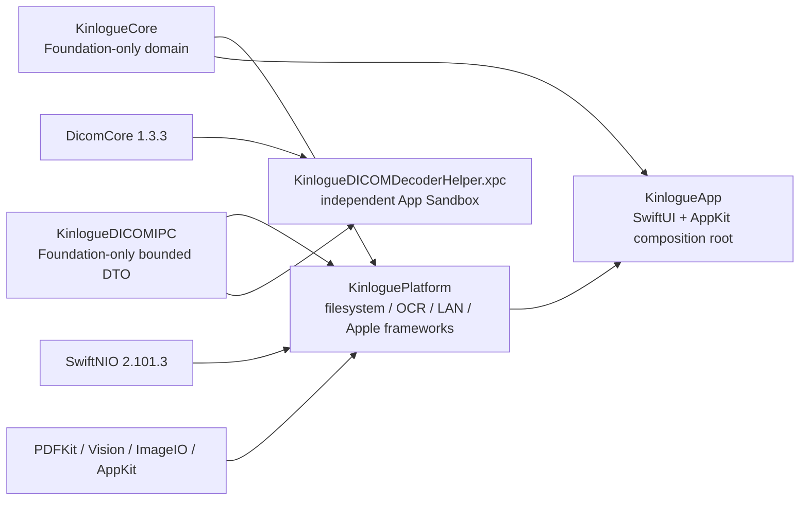
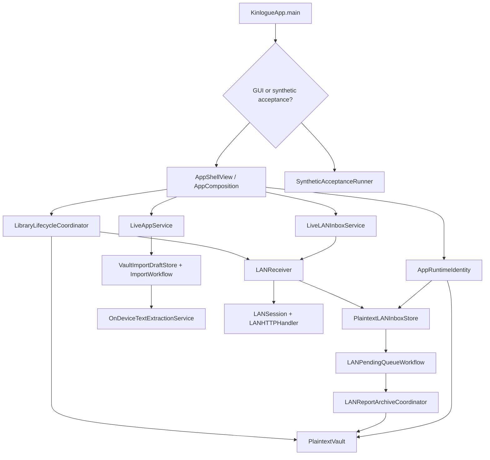
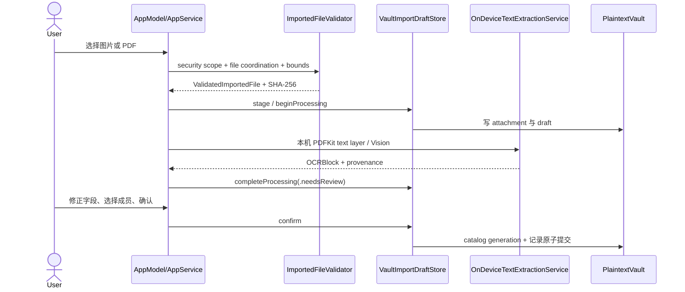
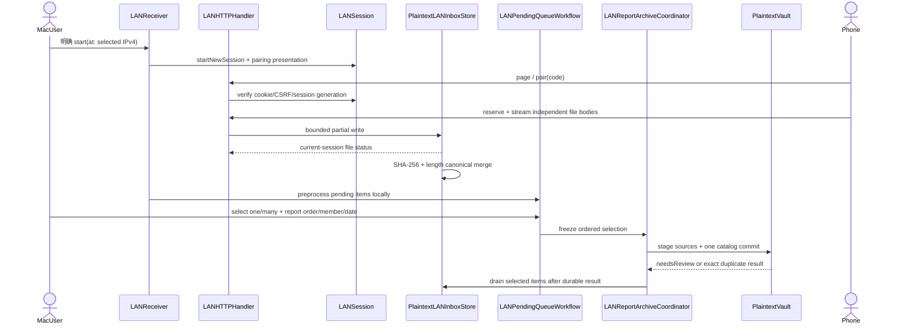

# Kinlogue 架构说明

## 分层原则

Kinlogue 的主 App 继续由 SwiftPM 构建，并保持 `KinlogueCore → KinloguePlatform → KinlogueApp` 的依赖方向；DICOM 解码是唯一额外的 checked-in Xcode XPC service 构建边界：

### Target map

| Target | 类型 | 责任 | 依赖 |
| --- | --- | --- | --- |
| `KinlogueCore` | internal library target | 领域模型、状态机、import/LAN 协议、DICOM study/index、catalog v3、查询、fingerprint、backup contract/retention 和平台无关验证 | Foundation |
| `KinloguePlatform` | internal library target | `PlaintextVault`、原子文件、删除、PDF/Image OCR、LAN receiver/inbox、流式原始文件 ZIP、加密 backup container/restore transaction、内嵌手机资源 | `KinlogueCore`、ZIPFoundation `0.9.20`、SwiftNIO `NIOCore/NIOHTTP1/NIOPosix`、CryptoKit 与 Apple frameworks |
| `KinlogueDICOMIPC` | library | Foundation-only、有界 request/response DTO、固定错误码和 descriptor-only NSXPC contract | Foundation |
| `KinlogueDICOMDecoderHelper` | non-published executable / XPC service | 在独立 sandbox 中把只读 descriptor 复制到 opaque 私有临时文件，并只解码受支持的单帧 MR 对象 | `KinlogueDICOMIPC`、exact `DicomCore` 1.3.3 |
| `KinlogueDICOMTestSupport` / `KinlogueDICOMXPCProbe` | non-published test support | 生成无身份 Explicit VR Little Endian MR fixture，并验证真实 embedded XPC round-trip | Foundation、`KinloguePlatform`（probe） |
| `KinlogueApp` | executable | SwiftUI/AppKit UI、App service、ViewModel、运行时身份和合成验收入口 | `KinlogueCore`、`KinloguePlatform` |
| `KinlogueStorageProcessFixture` | executable | 跨进程存储协调和安装测试 fixture；恢复测试只负责 seed/驱动/strict verify，并通过 test-only SPI 调用生产恢复事务 | `KinlogueCore`、`KinloguePlatform` |
| `KinlogueExportWriterProbe` | non-published executable | 对 exact ZIP writer 做高 entry-count、RSS、取消、heartbeat 和清理 characterization；不进入生产 product | ZIPFoundation `0.9.20` |

语言模式是 Swift 6，最低平台是 macOS 14；Swift package 只对外声明 `Kinlogue` executable product，Core 与 Platform 保持内部 target。SwiftNIO 固定为 `2.101.3`，ZIPFoundation 以 exact `0.9.20` 作为 root dependency 直接链接到 `KinloguePlatform`。DICOM-Swift 同时在 root manifest 和 Helper Xcode project 中固定为 exact `1.3.3` / revision `9ae0851e134af274651b646519b8a7aaeee05f05`，两个 `Package.resolved` 都受门禁约束。Helper 是 non-published target；主 App/Core/Platform 不 import 或链接 `DicomCore`。主 App 的 ZIP 导出是独立的 Platform 能力，并把 ZIPFoundation 的 SwiftPM `PrivacyInfo.xcprivacy` resource bundle 放入主 App；这不改变 DicomCore 仍只存在于 Helper 的隔离边界，Helper 的 Xcode-generated ZIPFoundation resource bundle 处理也保持原样。

### DICOM 解码隔离边界

主 App/Core/Platform 不 import 或链接 `DicomCore`；第三方 decoder 只存在于独立签名、无网络和无 Vault-root 权限的 XPC Helper。App 通过 `LiveAppService` 和共享 lifecycle fence 组合目录导入、确认、Viewer 与删除，View/ViewModel 只接触 App-owned summary、command 和像素 handle。

Helper 的 descriptor contract、watchdog、资源打包、slice memory、Viewer generation 和安装证据统一由 [`dicom.md`](dicom.md) 维护。架构上的不变量只有三点：Core/Platform 不链接 decoder、XPC 没有网络或 Vault-root 权限、生产路径没有 in-process fallback。

## 运行时组装

生产入口是 `KinlogueApp`：

1. `KinlogueApp.main()` 区分 GUI、合成验收和拒绝的非法启动参数。
2. GUI 通过 `AppShellView` 创建 `AppComposition`。
3. `AppComposition.makeDefault()` 调用 `LiveAppServiceEnvironment.makeDefault()`。
4. `AppRuntimeIdentity.current()` 从系统 Application Support 和签名 bundle 信息解析生产或隔离验收身份，不接受任意环境变量或用户路径。
5. 生产 Vault 根目录是 `~/Library/Application Support/Kinlogue/Vault`；验收根目录是 `~/Library/Application Support/Kinlogue/Acceptance/<runID>/SourceVault`。
6. 环境组装 current-format `PlaintextVault`、`VaultImportDraftStore`、报告 `ImportWorkflow`、`DICOMImportWorkflow`、按 presentation 创建的 `DICOMSliceService`、本机 OCR、`LiveLANInboxService` 和共享生命周期协调器。
7. `AppComposition` 同时构造 backup configuration store、`LiveBackupService` 和 seed-only restore stack，但不会因构造而创建备份身份；`AppStartupCoordinator` 先收敛 restore receipt，再启动普通存储，最后启动自动备份调度。

### 全部原始文件导出链

`SettingsView → AppModel → OriginalExportModel → LiveOriginalExportService → PlaintextOriginalArchiveExporter → PlaintextVault` 保持 UI、生命周期、平台写入和领域规划的依赖方向。App 层先显示明文/非备份警告，再用 `NSSavePanel` 取得 `.zip` 目标；长期状态只保存语义 phase/error，不缓存已本地化错误。`LiveOriginalExportService` 把整个导出纳入 `LibraryLifecycleCoordinator.withActiveOperation`，删除资料库时 revocation hook 请求取消并等待 admitted export；Platform 报告 `.committing` 后 cancellation gate 拒绝新取消，避免把已原子发布的文件误报为取消。目标文件已同步、验证并原子发布后，父目录同步是 best-effort：Powerbox 文件级授权导致的目录权限错误不改变成功结果，真实目录 I/O 错误仍保持发布状态不确定。

Core 的 `OriginalArchivePlan` 只消费 `VaultCatalog` 和类型扩展映射，负责 eligibility、稳定排序和 identifier-free 安全路径；Platform 固定 revision、逐项打开 verified descriptor、流式写入/复核 ZIP 并原子发布。成功前不暴露 `.zip` work item；进度 DTO 只有 phase、bytes 和 entry counts，不含成员名、文件名、路径或内部 ID。

### 加密备份与整库恢复链

`SettingsView → BackupModel → LiveBackupService → BackupOperationCoordinator/BackupScheduler → BackupCheckpointPublisher → EncryptedCheckpointWriter → PlaintextLibraryBackupSource` 负责目录授权、进程内串行调度、跨进程 repository publication lease、一致 dual-head snapshot、加密发布、完整正式文件回读和 durable witness。状态加载只读取配置/scheduler/destination metadata，不调用 `PlaintextLibraryBackupSource.prepare()`；实际启用自动备份、scheduler 事件和 writer 仍在操作边界生成权威 source plan。`BackupCheckpointPublisher` 在固定 control leaf 的 cancellation-aware exclusive lease 内完成权威扫描、sequence 分配和 writer 全流程；retention 取得同一 lease 后以一次权威扫描形成批次，随后只对每个待删叶做 descriptor/identity/content 精确复核，并在同一配置锁临界区内串行执行最终 revision fence、删除与 witness 移除。若删除后配置写入失败，额外 witness 会保守保留，不会让其他恢复点获得删除资格。配置 witness 以稳定 writer identity 追加到配置锁内的最新记录，不因自动化、scheduler、bookmark 或其他 witness revision 改变而丢失并发状态。security scope 覆盖每次异步目录操作；配置只固定 repository identity、恢复根公钥和设备签名身份，不保存恢复 seed 或解密私钥。

恢复由 `RestoreModel → LiveRestoreService → BackupRestoreService → BackupRestoreVerifier/BackupRestoreTransaction` 完成。verifier 在 App-owned 同卷 staging 解密并以真实 Vault/inbox strict reader 验证；`LiveRestoreService` 用 operation generation 隔离并发 preparation，让迟到结果只清理自己的 staging。确认后 destructive fence 与 `LibraryLifecycleCoordinator` 取消并等待报告 import/retry/OCR、LAN、DICOM 和导出活动操作，durable receipt 再保护 whole-root replace/rollback；activation 失败进入不可关闭的 restart-only UI。`KinlogueStorageProcessFixture` 不复制 phase、rename、receipt、rollback 或 cleanup 算法，只通过不会进入 App composition 的 `Testing` SPI 在生产 transaction durable phase 强退子进程，并由下一子进程调用同一个 production reconcile。详细格式与产品边界见 [`backup-and-restore.md`](backup-and-restore.md)。

App 层的服务 DTO、command、projection 和 protocol 集中在 `AppServiceContracts.swift`；生产组装与 `LiveAppService` 实现保留在 `AppServices.swift`，原件导出的生命周期适配与 Platform 错误/进度映射由 `LiveOriginalExportService.swift` 独立承载。View/ViewModel 只依赖这些 App-owned 契约，不直接创建或读取 Vault、LAN、OCR、DICOM descriptor 或解码器实现。

界面文案由 `AppLocalization` 解析：`KinlogueApp` 用 `@AppStorage` 持久化“跟随系统 / 简体中文 / English”选择，显式选择优先于 main app bundle 的 preferred localization，并把解析后的 locale 注入 SwiftUI environment；正式 `.app` 只访问 main bundle 中的打包资源，非 App 的 SwiftPM 开发/测试目标才惰性回退到 `Bundle.module`。`MemberSidebarView` 的固定设置入口在 `AppShellView` 中切换到两栏 `SettingsView`，不创建存储、网络或 OCR 实例。String Catalog 和生成资源的职责、手机页面边界见 [`localization.md`](localization.md)。

## 核心数据流

### 本地导入

### LAN inbox

## 并发与所有权边界

- `PlaintextVault` 是 actor；每次 `initialize/load/read/commit/destroy` 都经过与同根目录共享的 `VaultMutationCoordinator`。catalog + object 消费者通过一次短 lease 的有界 `readSnapshot` 获得同一 generation，耗时 OCR/UI 工作在 lease 外继续。
- 报告复核由 `ImportDraftStore.loadReviewSnapshot` 作为目的型 Core 契约读取；`VaultImportDraftStore` 在一次 `readSnapshot` 中取得同一 generation 的 draft、OCR document、成员与首个原件，App 只做候选刷新、成员投影和展示 DTO 映射，不解析 Vault JSON。
- `PlaintextLANInboxStore` 维护独立的 `lan-inbox/inbox.json` manifest，但与 Vault 使用同一 root-scoped mutation coordination，并通过 `VaultRootBinding` 重新验证父目录、root inode 和 vault ID。
- `LANInboxChangeMonitor` 只把 inbox 目录/partial 文件系统事件折叠为 content-free generation；它不替代 store 验证。`LANInboxModel` 保留一秒 receiver liveness 心跳，仅在 generation 变化时刷新权威投影，并在 receiver 停止时无条件最终刷新。
- `LANReceiver` 管理一个运行时 receiver、transport、HTTP handler、session、逐文件上传 lease 和当前会话文件状态；停止时先撤销 authority，再关闭 listener/连接、取消上传、停止 network monitor 和 session。
- `LANSession` 的 pairing code、cookie、CSRF、计数器和 idle 状态都是 memory-only；stop 或 replacement session 会清空它们。
- `LibraryLifecycleCoordinator` 是进程内的 whole-library revocation 前半段：恢复或删除 Vault 之前先关闭 LAN，取消并等待 admitted 报告 import/retry/OCR、DICOM 和导出任务，再撤销 publication guard，避免 whole-root 切换过程中仍有可写入口；普通只读查询不占用该 fence。
- `BackupOperationCoordinator` 串行当前 App 中的手动/自动 writer、retention 和 destructive operation；repository-scoped publication lease 另行阻止升级残留进程或另一个 App 进程从同一历史分配重复 sequence，并与 retention 共用 `repository → configuration` 锁序。恢复/删除配置清除与 Vault root 切换都位于同一进程内 fence；稳定 writer identity 的两次校验仍让跨进程 reset/re-enrollment 在 publication 前或 witness 前失败关闭。跨启动的 scheduler 状态、full-reader witness 和 restore/preflight receipt 位于 Vault 外的 app-private sibling。
- `AppModel` 与 `LANInboxModel` 还各自维护不可逆的 UI lifecycle lock + generation fence；删除开始后，所有旧异步 service 结果都必须被拒绝，不能重新发布快照、队列、Viewer、预览或 catalog 回调。只有进程重启才重新建立普通访问。
- PDF 原件 renderer 把 `PDFDocument`、`PDFPage`、metadata cache 和 raster 工作限制在单一 actor；open 只发布 `id + pageCount`，当前页 metadata 才按 `(sessionID, pageIndex)` 请求并最多缓存 200 项。SwiftUI 的 keyed state 拒绝切页或 release 后的迟到结果，render 仍独立重验页面与 media box 并执行像素上限。
- `KinlogueStorageProcessFixture` 与相关测试覆盖跨进程写入、重启、崩溃和共享根目录竞争；不能只依赖 actor 内的单进程串行化。

## 扩展规则

1. 新的领域规则优先放在 `KinlogueCore`，并为状态、边界和编码/解码补测试。
2. 新的 Apple framework、文件系统、网络或 OCR 实现放在 `KinloguePlatform`，由 protocol 注入给 Core/App 使用。
3. View 只负责呈现和用户意图；不要在 View 中读取文件、计算 fingerprint、构造 HTTP 请求或直接修改 catalog。
4. 任何新持久化字段都要说明 generation、版本拒绝/升级策略、孤儿清理、恢复和隐私影响，并更新 [`storage.md`](storage.md)。
5. 任何新网络 endpoint 都要先验证 session/authorization，再解析 body 或映射远端 ID；日志只能使用 allowlist 事件码。
