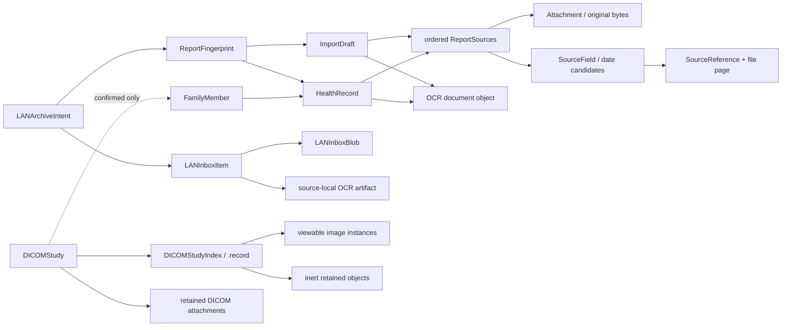
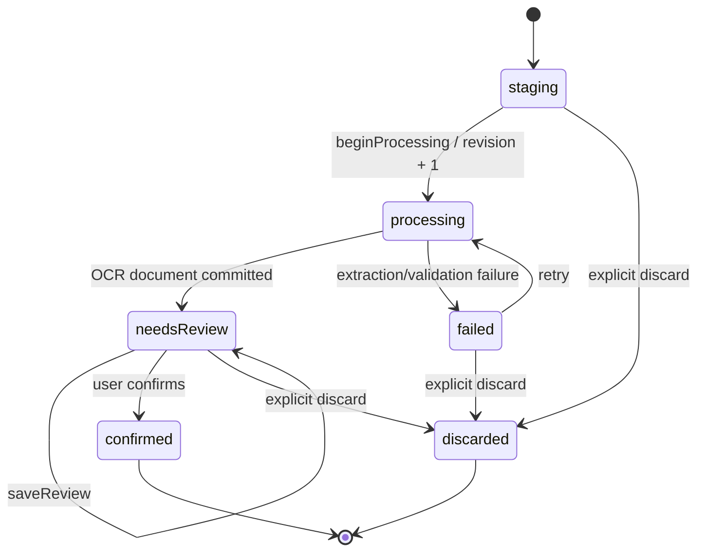

# 领域与数据模型

## 领域对象关系

`VaultCatalog` 是 catalog v3 的单一领域快照，包含 `members`、`records`、`attachments`、`importDrafts` 和独立的 `dicomStudies` 根。原件和 OCR 大对象在 Vault 对象目录中保存，catalog 通过稳定 UUID 引用它们；每个 DICOM study 还通过一个独立 `.record` index 闭合 retained object、Series 和可查看 instance 的关系。

## 核心对象

| 对象 | 关键字段/含义 | 重要约束 |
| --- | --- | --- |
| `FamilyMember` | `id`、展示名、可选消歧标签、归档标记 | ID 唯一；展示名去首尾空白且不能为空。 |
| `Attachment` | 内容类型、字节数、SHA-256、稳定 ID | digest 必须 32 bytes；字节数非负；不把 digest 当作安全认证。 |
| `ReportSource` | source row ID、attachment ID、展示名、文件页数 | 页数 > 0；source row ID 独立于 attachment ID。 |
| `ReportSources` | 一份报告的有序、非空 source rows | 同一 attachment 可以出现多次；每个 attachment 的 page count 必须一致；逻辑页码由顺序动态投影。 |
| `ImportDraft` | sources、状态、revision、processing attempt、OCR object、可选成员 | 只有 `.needsReview` 可保存/确认；`processing` 用 lease 防止旧任务回写。 |
| `HealthRecord` | 成员、sources、OCR provenance、字段候选、日期候选、notes、import state、revision | 只有 `.confirmed` 参与正常 timeline/search/comparison；字段引用必须指向现有 source 和合法文件页；编辑必须匹配当前 revision。catalog v3 中缺少 revision 时按 `0` 读取，revision 为 `0` 时编码继续省略该 key，以保持既有 v3 canonical bytes/digest 可重开。 |
| `SourceField` | OCR 原文、可选人工修正、source references、entry method | 修正替换显示转录但保留原文；无来源的文本必须显式标为 manual。 |
| `ReportDateCandidate` | 日期、日期类型、来源字段 | 时间线选择必须指向候选或显式手工日期；不把猜测日期写成事实。 |
| `OCRBlock` | 页码、文本、bounding box、confidence、方法、engine version、block ID | OCR 文档只存来源转录与 provenance，不生成医学结论。 |
| `DICOMStudy` | 状态、versioned fingerprint、index object ID、权威 attachment ID 集合 | `needsReview` 不得带成员/日期；`confirmed` 必须指向活跃成员和有限日期；不进入 report/OCR 模型。 |
| `DICOMStudyFingerprint` | 固定 domain/version/count 与排序后的 digest + byte count | 覆盖所有唯一 retained DICOM 原件，包括惰性非影像对象；不使用文件名、原始 UID 或 DICOM 自由文本。 |
| `DICOMStudyIndex` | vault-local UID digest、retained/viewable 分类、Series/instance 顺序、几何和像素布局 | 自描述且独立版本化；index 与 study attachment 集合必须精确相等；惰性对象不出现在可查看 Series 中。 |

`DICOMStudyIndex.orderingPolicyVersion` 只接受并写入 v2：完整 geometry 使用 orientation normal projection，geometry 全缺失时才使用完整 Instance Number，最后才使用 digest/length content identity；file name、path 和 raw UID 不参与。reopen 重新验证持久顺序和 Series geometry/layout，但不静默改写；其他 policy version 均失败关闭。

`ImageAttributes` 只接受有限 rescale 和成对 W/L；Default LINEAR Window Width 必须至少为 1。相同下界也在 XPC frame 和运行时 custom window 入口重验，避免持久层、Helper reply 与显示层产生不同解释。

查看态不进入 catalog schema。`DICOMSliceSeriesSession` 只携带 vault revision token、opaque study/Series/instance/attachment ID、content digest/length 与受限 image attributes；`DICOMSliceImage` 的 8-bit pixel storage 是可失效的引用型运行时对象，不持久化，也不进入 OCR、搜索、时间线或比较。

## ImportDraft 状态机

`ImportState.canTransition` 是唯一状态转移规则；任何旧 attempt 或 stale revision 都不能覆盖新状态。review 界面加载时冻结 draft revision，保存、确认和放弃都把它作为 expected revision 传到 Vault mutation；store 在同一代 catalog 上验证 revision 后才提交，因此另一个进程或窗口已经保存 N+1 时，N 的终态动作不能移除新内容。`confirmed` 和 `discarded` 是终态，确认后的记录仍保留原件和 OCR provenance。

启动恢复只自动取得 `.staging` 和上次中断的 `.processing` draft；`.failed` 保持失败终态，必须由用户显式重试后才重新进入 processing，避免每次启动重复执行已知失败的 OCR。

## 已确认记录的并发编辑

编辑页打开时冻结 `HealthRecord.revision`，保存命令把它作为 `expectedRevision` 传入真实 App service。服务在同一 catalog mutation 中验证记录仍是 `.confirmed`、revision 未变，并把成功保存后的 revision 严格推进一；如果另一窗口或进程已经保存，旧命令返回结构化 `recordChanged`。App 随后刷新 catalog：能取得同一记录的新 revision 时，编辑页先保留本地表单并停用旧 revision 的重复保存，再由用户显式选择“重新载入最新版本”；该动作会明确替换未保存字段，并让下一次保存使用新 revision。若无法安全取得最新记录，则要求关闭编辑页，不会用通用失败提示诱导重复提交旧内容。revision 达到 `UInt64.max` 时同样失败关闭，不发生整数回绕。

## 来源转录与逻辑页

`ReportSource` 的 row identity 解决了“同一物理附件被同一报告引用多次”时的歧义：

- OCR reference 持有 `sourceID`、`attachmentID` 和 file-local page number；
- `ReportSources.logicalPage(forSourceID:filePage:)` 按当前 source 顺序计算逻辑页；
- 排序或移除文件只改变派生的逻辑页投影，不改写持久化 OCR block 的 file-local provenance；
- `HealthRecord.hasValidSourceReferences` 和 catalog validation 在加载/提交时重新校验引用。

这让 UI 可以保留“来自哪一个原件、哪一页、哪一个 OCR block”的可追溯关系。LAN 待确认项各自缓存 file-local OCR；Mac 调整本次报告顺序时只重新投影逻辑页，不重跑 OCR。

## 精确去重

`ReportFingerprint` 是一个 versioned、排序后的 source digest multiset：每一项包含 SHA-256 和字节数，重复的 source 保持重复。它不使用文件名、OCR 文本、成员、日期或上传顺序作为身份。

当前有两个互补层级：

1. LAN 待确认原件以 SHA-256 + byte count 作为 `LANInboxContentIdentity`；相同原件合并为一个 canonical item。
2. 报告归档以完整 source digest/length multiset 形成 `ReportFingerprint`，依次查找已确认 `HealthRecord` 和当前 `.needsReview` `ImportDraft`。

完整 source 内容、长度和 multiplicity 全部一致才会复用已有报告；部分重合、近似内容或不同 multiplicity 都不会跳过。文件名、成员、日期和页序不参与身份。LAN 归档保留 durable intent/receipt，使同一操作的重试返回同一结果，不重复创建 draft。

DICOM 使用独立的 `DICOMStudyFingerprint`：对 exact duplicate 折叠后的每个唯一 retained 对象编码 SHA-256 和字节数，排序后用固定 domain/version/count 做长度分帧。它与报告 fingerprint 不互换，也不把确认成员/日期或原始 DICOM UID 编入身份。

## DICOM study 状态与导航边界

- 持久化只有 `needsReview` 和 `confirmed`；扫描、校验、staging 和 commit 进度属于未持久的导入状态，不塞进 study header。
- 确认/重新分配只能改成员和用户确认日期，不改 study ID、fingerprint、index 或原件集合。
- DICOM 原件、自由文本和像素不进入报告 OCR、搜索或比较。U3 Platform service 从一个目录原子发布完整 `needsReview` study，U4 Platform service 可从已验证 Vault object 按需生成一个可失效的 8-bit slice；App snapshot 只投影 study 摘要，`confirmed` 检查按成员和日期进入对应成员时间线与独立医学影像导航域，`needsReview` 检查不会进入这些已确认入口。用户必须明确确认成员与日期。

## LAN inbox 领域状态

LAN 相关当前模型位于 `KinlogueCore/LAN/`，主要关系是：

- `LANInboxTransportIdentity` 和 metadata 只描述当前手机会话的一次独立文件传输；
- 完整 body 经 SHA-256 + length 合并后发布 `LANInboxItem`，item 具有稳定 sequence、revision 和 source-local derived artifact；
- item 独立处于 `stored/preprocessing/reviewable/unsupported/failed/integrityFailed`，一个异常项不阻塞其他项；
- `LANArchiveIntent` 冻结 Mac 选择的 item revision、内容身份、页序、成员、日期和报告 fingerprint；
- `LANArchiveTerminal` 记录已接受 draft 或 exact duplicate，成功后所选 item 从队列移除；
- phone 侧只得到通用传输结果，内部 item/blob/destination、vault ID 和具体失败原因留在 Mac 侧。

## 查询与比较

- App snapshot 只把 `records.filter { importState == .confirmed }` 暴露给时间线和普通搜索。
- 比较使用 `HealthRecord.comparisonPresentation`，只呈现来源字段的 verbatim reported results、verbatim conclusion 和有来源的 abnormal items。
- 没有 conclusion 时使用 `.notProvided`，不能由比较逻辑补写新的总结。
