# 导入、OCR 与人工确认

## 处理原则

Kinlogue 处理的是“原件 + 有来源的转录”，不是自动医学解释。导入路径必须先验证文件，再保存原件，再在本机提取 OCR；候选字段永远需要用户 review。

```mermaid
flowchart LR
  Select["Finder / LAN blob"] --> Validate["ImportedFileValidator"]
  Validate --> Stage["attachment + draft staging"]
  Stage --> Extract["PDFKit text layer or Vision"]
  Extract --> Blocks["OCRBlock with provenance"]
  Blocks --> Candidates["deterministic candidate extraction"]
  Candidates --> Review[".needsReview + original preview"]
  Review --> Confirm["user correction / member / date"]
  Confirm --> Timeline[".confirmed record"]
```

## 输入校验

`ImportedFileValidator` 打开真实 regular file 时使用 `O_NOFOLLOW`，由调用方负责 security-scoped access 和 file coordination。它读取有限字节后计算 SHA-256，并检查内容实际类型，而不是信任文件扩展名。

### 当前支持

- PDF；
- JPEG、PNG、HEIC、TIFF 的单帧 raster image。

其他 regular file 可以在 LAN inbox 作为“不支持但保留”的附件存在，但不能走当前 OCR/提交 ready 路径。任何 unsupported 内容都不会被执行或主动渲染。

### DICOM 文件夹导入与 App 确认

DICOM 不复用报告/OCR workflow。一次文件夹选择只能完整发布一个 `needsReview` 检查；mixed study、unsupported/corrupt image、资源超限或图不闭合都不会发布部分 Series。用户确认成员和日期后，App 才显示检查级时间线入口；DICOM 自由文本和像素始终不进入报告 OCR、搜索或比较。

目录扫描、manifest 后取消终态、ordering policy、XPC、slice memory、Viewer 生命周期和支持格式由 [`dicom.md`](dicom.md) 统一维护。本页只保留报告图片/PDF 的导入与 OCR 契约。

### 输入上限

| 项目 | 默认值 |
| --- | ---: |
| 单文件字节数 | 100 MiB |
| PDF 页数 | 200 |
| PDF media box 单边 | 14,400 points |
| raster 单边 | 20,000 pixels |
| raster 总像素 | 120,000,000 |
| animated/multipage image | 拒绝 |

locked PDF、空/损坏文件、实际类型不支持、页数/尺寸/像素超限和 ImageIO probe 失败都会返回明确的内部 validation error，并由 App 映射成用户可理解的失败类别。

## 本机 OCR 路径

`OnDeviceTextExtractionService` 根据内容类型选择：

### PDF

1. 用 PDFKit 逐页打开，不接受 locked 或空 PDF。
2. 如果 text layer 足够可用（有意义字符足够、控制/替换字符比例合理），按行保留 PDF text layer block、页码和归一化 bounding box。
3. text layer 缺失、空或不可用时，将单页渲染到最大长边 2,400 pixels，再送入 Vision。
4. 第一个需要 OCR 的页面解析一次当前 revision 支持的语言组合，后续扫描页复用同一不可变尝试顺序；一次只持有当前页的渲染 buffer，按页顺序返回 blocks。任何一页资源超限都会让整个处理失败，不返回半份结果。

### Image

1. 用 ImageIO 读取 orientation、宽高和单帧属性。
2. 小于 2,400 pixels 的图直接缓存；更大的图创建最大 2,400 pixels 的 thumbnail，并保留 orientation。
3. 使用 Vision `VNRecognizeTextRequestRevision3`、`.accurate`，优先尝试 `zh-Hans` 与 `en-US`，关闭 language correction 以减少对来源转录的改写。
4. 观察结果按页面坐标排序，保留 confidence、bounding box、识别方法和 engine version。

OCR 输出预算：最多 4,096 blocks；单 block UTF-8 最多 64 KiB；总文本最多 1 MiB。预算超限属于 resource failure，不通过截断把不完整内容伪装成成功。

## 候选字段与来源

`ReportCandidateExtractor` 只做可重复的候选抽取，例如成员名、机构、科室、报告类型、标题、日期候选、reported results、conclusion 和 abnormal items。它不生成 OCR 中不存在的 conclusion。当前 extraction version 4 在保留既有标签的基础上，覆盖以下保守别名：

| 候选字段 | 支持的常见标签示例 |
| --- | --- |
| 成员名 | 姓名、患者姓名、病人姓名、受检者姓名 |
| 机构 | 医院/院区抬头，以及医疗机构、医院名称、机构名称、送检单位、检查机构、检验机构 |
| 科室 | 科室、申请科室、开单科室、送检科室、就诊科室、临床科室、执行/检查/检验科室 |
| 报告类型 | 报告类型/类别/种类、检查类型/类别、检验类型，以及独立出现的常见检查或报告类型 |
| 标题 | 标题、报告标题/名称、检查名称/项目、检验名称/项目、项目名称 |
| 检查结果 | 检查所见/结果/表现、影像所见/影像学表现/放射学表现、超声/内镜/病理所见、检验结果 |
| 检查结论 | 检查结论/诊断、诊断意见/结论/提示/印象、报告结论，以及影像、放射、超声、内镜、病理诊断 |
| 日期候选 | 报告/检查/检验时间或日期，采样/采集/收样/送检时间或日期，入院/出院/就诊时间或日期 |

带竖线、圆点、横线、半角或全角星号装饰的段落标题仍可识别。带“项目 / 结果 / 参考值”的检验表格优先于叙述型结果；未发现表格时才收集检查所见类段落。段落在下一结果/结论标题、任一受支持日期、审核信息或查看操作前停止，避免把相邻章节和页脚并入来源转录。日期候选按报告、检查、采集、入院、出院或其他日期分类，并保留 OCR 中完整的来源时间文本。

日期候选使用 UTC 公历构造后再精确核对年、月、日；非闰年的 2 月 29 日、2 月 30 日和 0/13 月等 OCR 错识结果会被忽略，不会被系统日期 API 自动折算成另一天。合法闰日继续作为带来源的候选保留，仍需用户 review。

打开 extraction version 较旧且仍保存 OCR blocks 的待确认 draft 时，App 会用当前规则重新抽取，只填充原先为空的候选字段；已保存的候选、用户修正和 review state 保持不变。该刷新不重新执行 Vision OCR，也不把自动候选直接确认为健康记录。

待确认页的“重新识别并覆盖”是另一条仅由用户明确触发的路径：App 从 Vault 中重新读取这份 draft 的全部有序原件，逐份运行 PDF text layer / Vision OCR，再用新 blocks 重建候选、来源引用和 review state。该动作会用新候选替换标题、机构、科室、报告类型、检查结果、检查结论、异常标记和日期候选；新 OCR 没有候选的字段也会被清空。成员、手工日期和用户备注保留；已选择的识别日期只有在新候选中找到相同日期、类型和来源转录时才继续选中，否则回到 unknown。识别失败时不保存新 document，当前表单保持不变。

每个 `SourceField` 保存：

- `originalTranscription`：OCR 或原始来源转录；
- `correctedTranscription`：用户修正，若有；
- `references`：source row、attachment、文件页和可选 OCR block；
- `entryMethod`：来源转录或明确的 manual entry。

用户修正改变显示的 `transcription`，但不会删除原始 OCR。没有来源的手工日期/字段必须显式保存为 `.manual`，不能伪装成检测出的报告日期。

## Review 与确认

- draft 在 OCR 完成后进入 `.needsReview`，用户可以关闭后稍后继续；
- Review 页面同时提供原件和候选字段，不把 OCR 结果当成只读结论；首次加载通过一个有界一致性快照取得同一 generation 的 draft、OCR document、成员和首个原件，不能混用两次读取的状态；
- 图片原件可在当前预览中向左或向右旋转 90°，旋转只改变显示方向，不重写附件字节、OCR blocks、来源引用或已提取候选；PDF 保持原始页面方向；
- 已确认记录的编辑页面继续并排显示不可变原件和可编辑转录；切换原件只更新内存预览，不修改原件或来源顺序；页面冻结记录 revision，陈旧保存返回记录已变化而不能覆盖另一实例的新内容；
- 用户可以明确要求重新 OCR 并覆盖当前字段；处理中确认、稍后处理和删除动作保持禁用；
- 用户必须选择成员，时间线日期可以选择一个 detected candidate、手工日期或 unknown；
- `HealthRecord` 保存 ordered sources、OCR document object ID、候选字段、修正和 notes；
- 只有 transition 到 `.confirmed` 后才出现在普通 App snapshot、时间线、搜索和比较中；
- 比较展示 verbatim reported results/conclusion；没有 conclusion 就显示 not provided。

## 失败、重试和幂等

`ImportDraft` 的 processing 使用 `revision + attemptID` lease：旧任务完成、失败或取消后，不能覆盖一个新 attempt。启动时只自动恢复 `.staging` 和中断的 `.processing`；失败 draft 保持失败状态，只有用户显式 retry 才回到 processing，无法处理的 draft 可以明确 discard。待确认页的手动 OCR 只接受当前 `needsReview` revision，并通过 `saveReview` 原子发布新的 OCR document；过期页面不能覆盖较新的保存结果。

存储侧先持久化原件/草稿，再写 OCR document，最后把引用完整的 catalog generation 原子发布。重启读取会保留结构完整的 `.needsReview` / `.failed` 供用户处理，只把 `.staging` / `.processing` 交给自动恢复，不返回 dangling source reference。

App 层把 Finder 报告导入、失败草稿重试和“重新识别并覆盖”三条可持久化路径纳入共享 `LibraryLifecycleCoordinator`。整库恢复或删除撤销 lifecycle 时，注册 hook 会取消这些 admitted OCR/import task 并等待它们结束；已经取消但仍处于 `.processing` 的 draft 由下一次正常启动按既有 lease 恢复，迟到 task 不能在 whole-root 切换后发布旧 generation。只读的复核快照、原件加载和查询不进入该 fence。

## 测试重点

- `ImportedFileValidatorTests`：类型、锁定 PDF、页/像素/大小边界、坏内容和多帧图片。
- `TextExtractionTests`：PDF text layer、Vision 路径、页顺序、orientation、预算和 provenance。
- `ReportCandidateExtractorTests`、`ImportDraftTests`、`ImportWorkflowIntegrationTests`：候选、叙述段落边界、提取版本刷新、状态转移、lease、重试、确认和落盘。
- `DICOMFolderScannerTests`、`DICOMStudyIndexerTests`、`DICOMImportWorkflowIntegrationTests` 与 `CatalogProcessCoordinationTests`：有界目录 intake、staged-byte authority、atomic publication、journal recovery、取消、并发、强制终止和 Vault destroy 竞争。
- `DICOMSeriesGeometryTests`、`DICOMDisplayTransformTests`、`DICOMSliceServiceTests` 与 `DICOMSliceVaultIntegrationTests`：policy-v2 顺序、stored sample 到 grayscale、进程级预算/cache/scheduler、取消/失效和 verified descriptor/destroy fence。
- `DICOMImportModelTests`、`DICOMStudyReviewModelTests`、`DICOMAppModelTests`、`DICOMViewSafetyTests` 与 `LiveDICOMAppServiceIntegrationTests`：文件夹入口、晚到结果 fence、明确确认/删除、独立导航域、报告查询隔离和生成式真实 Vault 链路。
- `LiveAppServiceTests`、`RecordDetailViewLayoutTests`、`ComparisonModelTests`：真实 App service 链路、原件展示和 verbatim comparison。

Vision 输出可能随 macOS 版本变化；测试应优先断言 anchor、顺序、方法和来源引用，不使用对整段 OCR 字节的脆弱快照。真实样本 OCR 抽检必须在仓库外完成。
