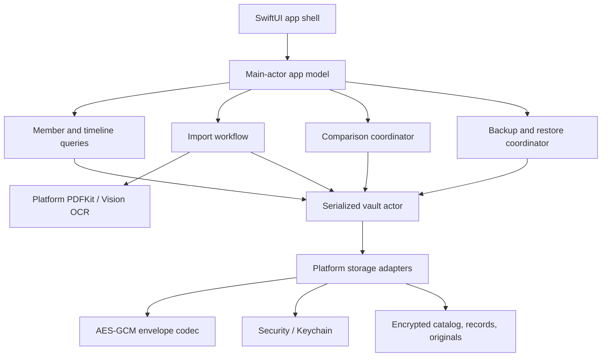
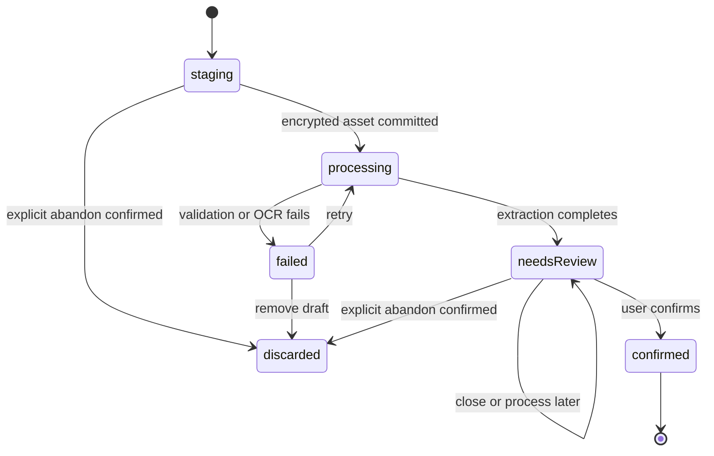
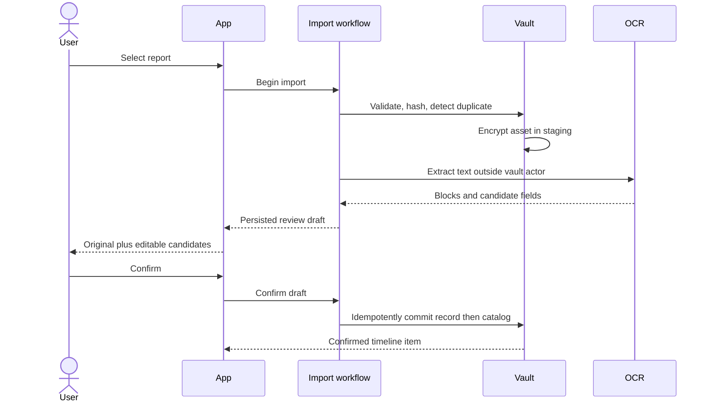
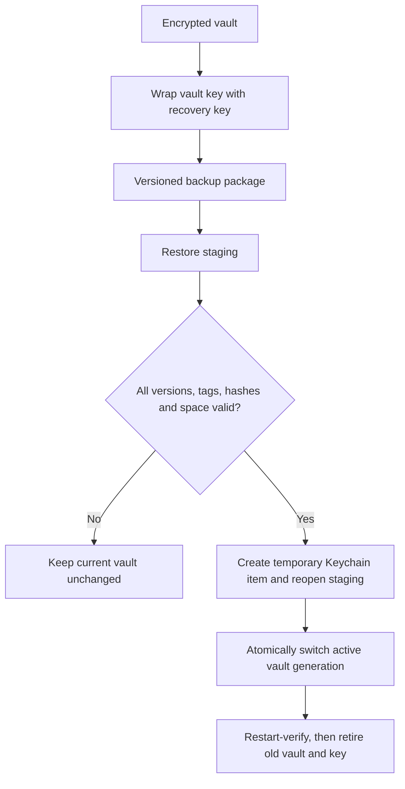

# Kinlogue macOS Local Health Vault - Plan

> 历史方案：本计划描述 Keychain 与应用层加密版本，已由 `2026-08-01-002-feat-kinlogue-plaintext-mvp-plan.md` 取代，不代表当前 MVP 的实现或隐私承诺。

## Goal Capsule

- **Objective:** 交付一个可在本机安装和验证的原生 macOS MVP，让一位用户为多位家人导入、校对、检索和比较医疗报告原件。
- **Product authority:** 本计划中的 Product Contract 及用户确认过的原始报告是产品行为的权威来源；OCR 结果不是医学事实。
- **Execution profile:** 绿地、隐私敏感、Deep 级实现；先建立可信存储底座，再接入 OCR 和 UI。
- **Stop conditions:** 不得把健康资料写入网络、iCloud、明文日志、Spotlight、Git 或自动化测试附件；认证解密或恢复校验失败时必须停止写入。
- **Tail ownership:** 执行者负责完成源码、自动化测试、ad-hoc 签名 `.app` 和本机启动验证；Developer ID、notarization 和 App Store 上架不在本次交付范围。

---

## Product Contract

### Summary

Kinlogue（续页）首版提供一条纯本地闭环：把 PDF 或报告图片复制进加密资料库，通过本机 OCR 与少量人工确认建立家庭成员时间线，并在需要时并排查看两份报告的原文结论和原件。

### Problem Frame

家庭健康资料常散落在微信、相册和 Finder 文件夹中。复诊时，主要照护者需要快速找到某位家人的历史报告并核对原件，但现有文件管理方式缺少稳定的成员、时间和报告类型结构。

医疗报告包含高敏感个人信息。首版必须让开发者和任何远程服务都看不到资料内容，并且不能为了自动化而牺牲原文忠实性。产品负责整理和查找，不负责诊断、解释或给出医疗建议。

### Actors

- A1. **本机资料管理员：** 唯一直接使用 App 的 macOS 用户，负责导入、校对、归档、备份和删除。
- A2. **家庭成员：** 报告所描述的资料主体，不拥有独立账号或应用权限。

### Requirements

**资料库与成员**

- R1. A1 可以在同一资料库中新增、编辑、归档和区分多位 A2；显示名必填并允许重名，可添加仅在本机加密保存的称谓/区分标签，重名仍冲突时所有选择器显示稳定的非敏感短标识。
- R2. App 将用户选择的 PDF、JPEG、PNG、HEIC 或 TIFF 复制为不可变原件，并以原始字节 SHA-256 识别完全重复内容。
- R3. 原件、成员资料、OCR、搜索字段、缩略图和哈希均以应用层认证加密保存；主密钥只存本机不可同步的 Keychain 项。
- R4. 资料库存在而 Keychain 密钥缺失时，App 必须进入不可解锁状态，不能静默生成新密钥或覆盖现有资料。

**导入、OCR 与人工确认**

- R5. 每个导入文件独立经过校验、加密暂存、文本提取、待确认和确认状态，失败或取消不能破坏其他文件或源文件。
- R6. PDF 逐页优先使用可用的原文字层，仅对无可用文字的扫描页使用本机 Vision OCR；图片使用本机 Vision OCR。OCR 结果保留页码、归一化坐标、置信度、来源方式和引擎版本。
- R7. OCR 只提出成员、带类型与来源的日期、医院、科室、报告类型、标题、明确结论段和报告自带异常标记等候选值，A1 选择时间线日期并确认后才能进入时间线、搜索或比较。结论和异常项是绑定页码/区域的逐字来源字段，只允许校正转录；备注或改写必须与来源字段分开且不进入比较。
- R8. 缺失日期、医院或结论时保持缺失；App 不用当前日期、参考区间计算或语言模型补写内容。

**浏览、检索与比较**

- R9. A1 可以按成员和时间浏览已确认记录，并在应用内搜索成员、日期、医院、报告类型、确认结论和确认异常项。
- R10. 记录详情以原件为主，并在同一界面展示已确认字段及其来源；编辑来源字段只表示校正转录，用户备注另行标注，编辑字段或重分配成员不得修改原件。
- R11. A1 可以选择两条已确认记录并排查看原文结论，然后查看各自原件；没有结论栏时显示“原报告未提供结论”，只列报告自身的高低或箭头标记。
- R12. 比较和搜索不得生成趋势、异常判断、疾病推断、治疗建议或其他医学解释。

**生命周期、安全与恢复**

- R13. A1 可以创建版本化的加密本地备份，并使用单独生成的高熵恢复密钥在没有原 Keychain 项的环境中恢复资料库。
- R14. 恢复必须先完整验证格式、认证标签、清单、资产和空间，再原子替换目标资料库；任何失败保留原资料库。
- R15. A1 可以删除单条记录、清空成员资料或销毁整个资料库；App 只承诺删除自身管理的数据和密钥，不承诺擦除用户导出的副本或系统备份。
- R16. App 不启用账号、网络连接、iCloud、CloudKit、HealthKit、遥测、第三方崩溃 SDK 或 Spotlight 健康内容索引。
- R17. UI 使用 macOS 原生导航、菜单、键盘焦点和辅助功能语义，并提供 `⌘O` 导入、`⌘F` 搜索和空状态指引。
- R18. 真实病历只能用于本机人工验收；Git、日志、CI 和自动化测试只能使用程序生成或匿名化资料。

### Key Flows

- F1. **首次启动与建库**
  - **Trigger:** A1 首次启动 App。
  - **Actors:** A1
  - **Steps:** 创建资料库目录和主密钥；显示本地处理及备份边界；允许创建第一位家庭成员。
  - **Outcome:** 空的加密资料库可用。
  - **Covered by:** R1, R3, R4, R16
- F2. **导入并确认报告**
  - **Trigger:** A1 通过文件选择器或拖放提供报告。
  - **Actors:** A1
  - **Steps:** 校验文件；检查重复；加密暂存；提取文本；展示原件和候选字段；由 A1 确认、稍后处理或明确放弃。
  - **Outcome:** 文件选择器取消时不创建对象；暂存后关闭校对页或选择“稍后处理”会保留加密草稿，只有经确认的“放弃导入”才删除草稿及其暂存对象。
  - **Covered by:** R2, R5-R8, R18
- F3. **复诊查找**
  - **Trigger:** A1 需要找到某位家庭成员的历史报告。
  - **Actors:** A1
  - **Steps:** 选择成员；按时间或搜索过滤；打开记录详情和原件。
  - **Outcome:** 在不离开 App 的情况下定位原件。
  - **Covered by:** R9, R10, R17
- F4. **比较两份报告**
  - **Trigger:** A1 从工具栏或菜单进入比较选择模式。
  - **Actors:** A1
  - **Steps:** 通过点击或 Space 选择且最多选择两条已确认记录；界面显示 0/2 至 2/2 的可访问计数，2/2 时才允许比较；并排阅读已校正的逐字原文结论，随后按需打开两侧原件；Escape 或取消返回普通导航。
  - **Outcome:** 用户看到忠实原文，不看到应用生成的医学解释。
  - **Covered by:** R11, R12
- F5. **备份与恢复**
  - **Trigger:** A1 创建备份，或在新资料库环境中恢复。
  - **Actors:** A1
  - **Steps:** 生成只显示一次的分组恢复密钥；A1 重新输入指定分组确认已另行保存后才发布加密包；恢复时在 staging 验证全部内容，展示非 PHI 的创建时间、成员数和记录数并要求确认替换，成功后提交新资料库和 Keychain 密钥。
  - **Outcome:** 资料可以在不依赖原设备 Keychain 的情况下恢复。
  - **Covered by:** R13, R14
- F6. **删除与重分配**
  - **Trigger:** A1 删除记录、成员或整个资料库。
  - **Actors:** A1
  - **Steps:** 对有记录的成员先重分配或逐条删除；确认破坏性操作；删除密文和对应密钥。
  - **Outcome:** App 管理的数据按用户意图退出活动资料库。
  - **Covered by:** R1, R10, R15

### Acceptance Examples

- AE1. **重复导入** — Covers F2 / R2, R5. Given 同一文件已确认入库，when A1 再次导入原始字节相同的文件，then App 显示已有记录并默认跳过，不创建第二份密文原件。
- AE2. **未知日期** — Covers F2 / R8. Given 报告没有可靠日期，when A1 完成确认，then 记录进入“日期未知”分组，不使用导入时间冒充报告日期。
- AE3. **无结论化验单** — Covers F4 / R11, R12. Given 原报告没有结论栏但印有高低标记，when A1 比较记录，then App 显示无结论提示及原始标记，不自动总结异常。
- AE4. **密文被篡改** — Covers R3, R4. Given 任一密文认证标签或内容被更改，when App 解锁或读取，then 操作失败并显示不含 PHI 的损坏提示，不返回部分明文。
- AE5. **Keychain 项丢失** — Covers R4. Given 资料库仍存在而主密钥不存在，when App 启动，then 只允许恢复或明确清空重建，不创建新密钥覆盖现场。
- AE6. **恢复失败不破坏当前资料** — Covers F5 / R14. Given 当前资料库有效且恢复密钥错误、备份被截断或磁盘不足，when A1 尝试恢复，then 当前资料库保持可用且内容不变。
- AE7. **跨环境恢复** — Covers F5 / R13. Given A1 持有完整备份和恢复密钥但没有原 Keychain 项，when 恢复验证通过，then App 创建新的本机 Keychain 项并能打开全部记录。

### Success Criteria

- 新用户可在 5 分钟内创建成员、导入一份报告并完成确认。
- 用户可在冷启动、未预选成员的模拟复诊任务中，仅凭成员、日期和医院线索，从 4 位成员、每位 24 条跨两年的合成记录中于 30 秒内找到并打开目标原件。
- 所有持久化健康内容均通过认证加密；合成敏感字符串和原始文件 magic 不出现在资料库明文扫描结果中。
- 核心测试覆盖加密往返与篡改、原子提交、OCR 候选规则、比较降级规则、备份恢复和损坏恢复。
- 本机产出可启动、可导入合成报告的 ad-hoc 签名 `Kinlogue.app`。

### Scope Boundaries

**Included in MVP**

- 单台 Mac、单一资料管理员、多位家庭成员。
- PDF 与常见静态图片导入、本机 OCR、人工确认、时间线、搜索、详情和两条记录比较。
- App 管理的加密资料库、便携式加密备份、逻辑删除和密钥销毁。

**Deferred to Follow-Up Work**

- 完整 Xcode 工程、XCUITest、Developer ID 签名、notarization、Mac App Store archive 和多系统版本矩阵。
- 基于用户口令的备份 KDF；首版使用高熵恢复密钥，避免自创或误用口令派生方案。
- 批量文件夹监控、扫描仪接入、打印、分享、脱敏导出和复诊资料包。
- 独立应用锁、自动锁定和每次访问时的 LocalAuthentication 门槛。
- 非 iCloud 的、由用户控制的端到端加密同步可在独立的合规、安全和密钥生命周期设计后重新评估；MVP 不预留网络能力或同步实现。

**Outside this product's identity**

- iCloud/CloudKit 健康资料保存、默认云端保存、云端优先体验、多人协作、家庭账号与远程访问。
- DICOM/PACS、医院 HIS/EHR 对接、HealthKit 写入。
- 医学诊断、风险评分、化验趋势解释、治疗或用药建议。
- 慢病打卡、用药日历、保险理赔和通用家庭网盘。

### Key Decisions

- **Local-first single-operator vault** (session-settled: user-directed — chosen over accounts and cloud-first sync: the first release must keep family health records on one Mac). Governs R1-R4, R16.
- **Human-confirmed OCR** (session-settled: user-approved — chosen over treating OCR output as authoritative: recognition errors must remain visible and correctable). Governs R5-R8, R10.
- **Conclusions and originals for comparison** (session-settled: user-directed — chosen over numeric trends and medical interpretation: the comparison task is faithful retrieval, not analysis). Governs R11, R12.
- **No synthesized conclusion when the source has none** (session-settled: user-approved — chosen over AI-generated summaries: absence must remain explicit). Governs R8, R11, R12.
- **Encrypted local backup and restore in MVP** (session-settled: user-approved — chosen over waiting for future cloud sync: local-only records still need a recovery path). Governs R13-R15.

---

## Planning Contract

### Threat Model

- **Protected assets:** 原件、成员资料、OCR 与人工校正、检索字段、对象关系、备份密钥材料和资料库完整性。
- **Trusted boundary:** 当前已登录的 macOS 用户会话、Data Protection Keychain、CryptoKit、Security、PDFKit、Vision 和 App Sandbox。
- **In-scope threats:** 离线读取或篡改 App 管理的文件；重放旧 catalog；恶意、损坏或资源炸弹式导入/备份；意外写入日志、缓存、剪贴板、Quick Look、Spotlight、测试和分发产物。
- **Out-of-scope threats:** 与 A1 同一登录会话中的恶意软件、管理员/root、已解锁屏幕的系统级截图、实时内存取证和被攻破的 Apple 系统框架。App 不把这些非目标描述为已防护。

### Key Technical Decisions

- KTD1. **SwiftPM native macOS structure with enforced dependency direction.** Use Swift 6.3 language mode and macOS 14. `KinlogueCore` owns Foundation-only domain models, state machines, use cases and protocols; `KinloguePlatform` owns CryptoKit, Security, filesystem, PDFKit and Vision implementations; the SwiftUI `KinlogueApp` is the composition root and depends on both. XCTest targets mirror these boundaries.
- KTD2. **Dependency-free Apple frameworks.** Use SwiftUI and AppKit for UI, PDFKit for PDF viewing, Vision revision 3 for OCR, CryptoKit for SHA-256/AES-GCM, Security for Keychain, ImageIO for image decoding, and UniformTypeIdentifiers for file validation.
- KTD3. **Versioned authenticated vault with immutable generations and replay protection.** Each original and record document uses an independently versioned AES-GCM envelope with opaque UUID filenames and non-PHI authenticated metadata. A catalog generation only references already durable immutable objects; the vault keeps the active and previous verified generation until the next startup verification completes. A non-synchronizable Data Protection Keychain state binds vault ID, key ID, current generation/digest and an optional pending generation/digest. Catalog commits use this current/pending head as a recoverable two-phase protocol, so a previously valid catalog cannot be silently replayed after a confirmed deletion. Keychain items use the default app access group, `WhenUnlockedThisDeviceOnly`, stable service/account identity and fail closed on duplicates or attribute mismatch. (session-settled: user-approved — chosen over filesystem or database encryption alone: all app-managed health content must remain encrypted). Governs R3, R4.
- KTD4. **Encrypted projections plus in-memory index.** Avoid SwiftData/Core Data for MVP because their stores and journals are not application-encrypted. Keep only bounded timeline/search projections and object references in the encrypted catalog; store raw OCR blocks and detailed provenance in per-record encrypted documents loaded on demand. Do not persist a plaintext search index.
- KTD5. **Serialized vault actor, bound identity and persistent import state.** A single actor owns catalog mutations and atomic generation switches. The root binds an immutable vault ID, key ID and format version; startup distinguishes absent, partial, mismatched and complete vault/key states before enabling writes. Imports move through `staging`, `processing`, `needsReview`, `confirmed`, `failed`, and `discarded`; only confirmed records join normal queries.
- KTD6. **Stable page-level OCR compatibility path.** Evaluate every PDF page independently: keep usable text-layer blocks and render only missing, empty or unusable pages for `VNRecognizeTextRequest` revision 3 with accurate recognition and runtime-supported Chinese/English languages. Decode oriented images within explicit pixel and render bounds, process one page buffer at a time, merge blocks in page order and retain per-block provenance. Candidate extraction is deterministic, dates retain type/source, and conclusion/abnormal fields remain verbatim source transcriptions. (session-settled: user-approved — chosen over automatic semantic extraction: every proposed medical field remains user-confirmed). Governs R6-R8.
- KTD7. **Bounded private in-memory original viewing.** A viewing session owns decrypted `Data` and PDF/image objects, retains at most the two documents required by comparison, and releases them when the view closes. Detail and comparison viewers allow only in-app page navigation, scrolling and zoom; they suppress Copy, drag-out, Share, Open With, Quick Look, context-menu export and plaintext URL handoff, and never write plaintext preview files.
- KTD8. **Closed recovery-key backup package with two-phase restore.** Export a fixed, authenticated catalog snapshot plus its reachable ciphertext, and wrap the vault key with a new 256-bit recovery key bound to the backup identity. The package accepts only authenticated-manifest UUID entries, rejects links/special/unknown/duplicate entries, and enforces per-object/count/aggregate limits before extraction. The key is shown only in a one-time model, never persisted or copied to the clipboard, and the backup is published from same-volume staging only after the user re-enters requested key groups. Restore first creates a temporary Keychain item and validates confined staging with it, then asks for an informed replace confirmation and switches the active vault generation; the old vault and key remain until a successful restart verifies the new pair.
- KTD9. **Sandboxed local test bundle.** Build the executable with SwiftPM, assemble a standard `.app` bundle, add only App Sandbox and user-selected read/write file entitlements, and ad-hoc sign it. Treat this as a local test artifact, not a notarized distribution.
- KTD10. **No-content observability.** Errors and diagnostics contain stable event codes, opaque object IDs and sizes only. Tests and repository guards reject known PHI hashes, real names, report filenames and accidental fixture directories.

### High-Level Technical Design









### Output Structure

```text
Package.swift
Sources/
  KinlogueCore/
    Domain/
    Import/
    OCR/
    Backup/
    Storage/
  KinloguePlatform/
    Import/
    Security/
    Storage/
    OCR/
    Backup/
  KinlogueApp/
    App/
    Views/
    ViewModels/
Tests/
  KinlogueCoreTests/
  KinloguePlatformTests/
  KinlogueAppTests/
packaging/
  Info.plist
  Kinlogue.entitlements
scripts/
  build-app.sh
  verify-app.sh
docs/
  plans/
README.md
PRIVACY.md
.gitignore
```

### Sequencing

1. Establish build, test and packaging scaffolding before feature code.
2. Complete the encrypted vault and failure behavior before importing real or synthetic reports.
3. Add OCR and deterministic candidate extraction behind testable protocols.
4. Build the native UI on top of confirmed domain behaviors.
5. Add comparison, backup, restore and destructive lifecycle flows.
6. Finish with security inspection, local bundle launch and manual acceptance.

### Implementation Constraints

- The current machine has Swift 6.3.3 and macOS 26.6 but no full Xcode, signing identity or `xcodebuild`; all required gates must run through SwiftPM and system command-line tools.
- The first implementation limits each imported file to 100 MiB and each PDF to 200 pages. Raster inputs are limited to 20,000 pixels per edge and 120 megapixels per frame; PDF media boxes are limited to 14,400 points per edge, OCR rendering to 2,400 pixels on the long edge, and only one decoded page buffer may be retained at a time.
- OCR tests assert anchors, ordering and provenance rather than byte-for-byte full transcripts because Vision output can change across OS revisions.
- No execution step may copy the two real supplied medical images into the repository, DerivedData, test results or distribution bundle.

### Sources & Research

- [Apple App Review Guidelines 5.1.3](https://developer.apple.com/app-store/review/guidelines/) — personal health information must not be stored in iCloud.
- [Accessing files from the macOS App Sandbox](https://developer.apple.com/documentation/security/accessing-files-from-the-macos-app-sandbox) — user-selected URLs and security-scoped access lifecycle.
- [Keychain Services](https://developer.apple.com/documentation/security/keychain-services/) and [Storing CryptoKit keys in the Keychain](https://developer.apple.com/documentation/cryptokit/storing-cryptokit-keys-in-the-keychain) — small secret storage and key persistence.
- [CryptoKit AES-GCM](https://developer.apple.com/documentation/cryptokit/aes/gcm) — authenticated encryption, nonce and combined sealed-box behavior.
- [VNRecognizeTextRequest](https://developer.apple.com/documentation/vision/vnrecognizetextrequest) — on-device text recognition and language configuration.
- [PDFDocument](https://developer.apple.com/documentation/pdfkit/pdfdocument) and [PDFView](https://developer.apple.com/documentation/pdfkit/pdfview) — in-memory PDF parsing and native preview.
- Repository research found no source, tests, documentation or prior conventions beyond `.git`; this plan establishes the initial project standards.

---

## System-Wide Impact

- **Reference integrity:** Every active catalog reference must resolve to an object whose ID, kind and authenticated content match. Objects referenced by the active or rollback generation cannot be cleaned up.
- **Vault/key identity:** The app enables writes only when the vault ID, key ID, format version and authenticated root catalog agree. A key-only, vault-only, mismatched or interrupted initialization state is recoverable but never writable.
- **Commit behavior:** Every catalog mutation produces immutable objects and a new catalog generation. Interruption at any boundary must restart into the complete old generation or complete new generation, never a mixed graph.
- **Deletion behavior:** Logical removal commits before ciphertext cleanup. Cleanup is idempotent, and a confirmed deletion cannot reappear through rollback; physical secure erasure is not promised on APFS snapshots or external backups.
- **Backup consistency:** A backup represents one fixed catalog generation and its complete reachable object set. Concurrent writes cannot enter a backup after its snapshot generation is selected.
- **Restore consistency:** Filesystem activation and Keychain activation form a recoverable two-phase transaction. The old vault/key pair remains available until the new pair survives a restart validation.
- **Privacy surface:** Search, UI preview, errors, logs, tests, backup and verification share the same no-plaintext persistence rule. Quick Look, Spotlight, clipboard, App-created captures and third-party SDKs cannot become alternate content paths; system-level screenshots of an unlocked screen remain outside the threat boundary.

---

## Risks & Dependencies

| Risk or dependency | Impact | Mitigation and stop condition |
|---|---|---|
| No full Xcode or signing identity | Cannot claim archive, XCUITest, notarization or public distribution readiness. | Deliver only a SwiftPM-built ad-hoc local test bundle; mark public distribution gates as not executed. |
| Ad-hoc Sandbox and Keychain behavior | A locally signed build may differ from a provisioned production build. | Require installed-bundle restart and Keychain persistence tests; failure is NO-GO for the local artifact. |
| Whole-file CryptoKit/PDFKit data | Compressed files or oversized pages can exhaust memory after decoding. | Enforce byte, page, dimension, pixel and render limits before Vision/PDF rendering; process one page buffer at a time and defer reviewed chunked encryption. |
| Vision output varies by OS revision | Exact transcript snapshots become brittle. | Assert anchors, order and provenance; require human confirmation and real-sample manual spot-checks. |
| Recovery key is lost or mistyped | Portable backup becomes unrecoverable. | Use a checksummed printable encoding and require verification before reporting backup success. |
| User-selected iCloud destination | Apple policy does not clarify whether encrypted user-selected backups are exempt. | Reject known ubiquitous destinations in MVP and keep iCloud entitlements absent. |
| Interrupted mutation, deletion or restore | Could create dangling references, resurrect data or mismatch key and vault. | Use immutable generations and recoverable transactions; any mixed or unverifiable state is NO-GO. |
| PHI enters build or validation artifacts | Violates the local-only promise and exposes real records. | Use a unique synthetic canary and scan repo, tests, bundle, reports, container and backup; any hit outside approved in-memory UI is NO-GO. |

---

## Implementation Units

### U1. Bootstrap the native app and local bundle

**Goal:** Establish a reproducible SwiftPM project, native macOS shell, test targets, repository privacy guards and local `.app` packaging.

**Requirements:** R16-R18; KTD1, KTD2, KTD9, KTD10.

**Dependencies:** None.

**Files:** `Package.swift`, `Sources/KinlogueApp/App/KinlogueApp.swift`, `Sources/KinlogueApp/Views/AppShellView.swift`, `Tests/KinlogueAppTests/AppLaunchModelTests.swift`, `packaging/Info.plist`, `packaging/Kinlogue.entitlements`, `scripts/build-app.sh`, `scripts/verify-app.sh`, `.gitignore`, `README.md`, `PRIVACY.md`.

**Approach:**

1. Create dependency-free `KinlogueCore`, `KinloguePlatform`, `KinlogueApp` and mirrored test targets with macOS 14 minimum deployment; only Platform depends on Core, while App is the composition root for both.
2. Add a `NavigationSplitView` shell, system commands and an empty-state import action.
3. Assemble and ad-hoc sign a standard app bundle with no network, iCloud or HealthKit entitlement.
4. Add ignore rules and a repository scan for private fixture paths and known real-sample identifiers.

**Test scenarios:**

- A clean checkout builds both library targets and the executable target without Xcode.
- The app launch model exposes members, timeline and detail destinations with an empty initial state.
- The built bundle has the expected identifier, executable, minimum system version and only approved entitlements.
- The repository guard fails when a synthetic forbidden PHI marker is staged and passes for normal source files.

**Verification:** `swift build`, `swift test`, bundle assembly, property-list validation, entitlement inspection and executable launch smoke all succeed.

### U2. Define domain models and confirmed-record queries

**Goal:** Create stable models for members, attachments, OCR provenance, import states and confirmed timeline/search behavior.

**Requirements:** R1, R5-R12; F2-F4; KTD4, KTD5.

**Dependencies:** U1.

**Files:** `Sources/KinlogueCore/Domain/FamilyMember.swift`, `Sources/KinlogueCore/Domain/HealthRecord.swift`, `Sources/KinlogueCore/Domain/Attachment.swift`, `Sources/KinlogueCore/Domain/OCRBlock.swift`, `Sources/KinlogueCore/Domain/SourceField.swift`, `Sources/KinlogueCore/Domain/ReportDateCandidate.swift`, `Sources/KinlogueCore/Domain/ImportState.swift`, `Sources/KinlogueCore/Domain/VaultCatalog.swift`, `Sources/KinlogueCore/Domain/RecordQuery.swift`, `Tests/KinlogueCoreTests/DomainModelTests.swift`, `Tests/KinlogueCoreTests/RecordQueryTests.swift`.

**Approach:** Keep verbatim source transcriptions, user corrections, optional notes and provenance separate. Store multiple typed/source-linked date candidates and one explicit optional timeline-date selection. Give duplicate member names an optional visible disambiguation label plus stable short ID. Query only confirmed records by default, sort unknown dates into a dedicated group, and compute comparison presentation from source fields without clinical interpretation.

**Test scenarios:**

- A confirmed record appears in member timeline and text search; a `needsReview` or failed record does not.
- Covers AE2. A missing report date remains absent and sorts into the unknown-date group.
- Multiple source dates retain their types and provenance; only the user-selected candidate orders the timeline.
- Covers AE3. A report without a conclusion returns the no-conclusion presentation and only source-marked abnormal items.
- Correcting a transcription changes the source field while a note remains separately labelled and never enters comparison.
- Duplicate display names remain distinguishable in every picker and search result.
- Reassigning a record changes the owning member without changing attachment identity or hash.
- Archiving a member hides it from normal selection while an explicit include-archived query can return it.

**Verification:** Domain tests prove stable Codable round-trips, state invariants, query filtering and comparison fallback behavior.

### U3. Build the authenticated encrypted vault

**Goal:** Persist every App-managed health artifact as authenticated ciphertext with safe Keychain and atomic-update behavior.

**Requirements:** R2-R5, R15, R16; AE4, AE5; KTD3-KTD5, KTD10.

**Dependencies:** U1, U2.

**Files:** `Sources/KinlogueCore/Storage/VaultProtocols.swift`, `Sources/KinlogueCore/Storage/VaultError.swift`, `Sources/KinloguePlatform/Security/VaultKeyStore.swift`, `Sources/KinloguePlatform/Security/KeychainVaultKeyStore.swift`, `Sources/KinloguePlatform/Security/VaultCipher.swift`, `Sources/KinloguePlatform/Storage/VaultLayout.swift`, `Sources/KinloguePlatform/Storage/AtomicFileStore.swift`, `Sources/KinloguePlatform/Storage/EncryptedVault.swift`, `Tests/KinlogueCoreTests/VaultStateTests.swift`, `Tests/KinloguePlatformTests/VaultCipherTests.swift`, `Tests/KinloguePlatformTests/EncryptedVaultTests.swift`, `Tests/KinloguePlatformTests/AtomicFileStoreTests.swift`.

**Execution note:** Implement encryption, tamper and interruption tests before connecting the vault to any UI.

**Approach:**

1. Encode a versioned envelope with magic, non-PHI object identity, kind and AES-GCM combined bytes.
2. Store the 256-bit master key and replay-protected current/pending catalog head in a non-synchronizable Data Protection Keychain generic-password item with explicit accessibility and identity attributes; expose an in-memory test store.
3. Write encrypted objects to same-volume staging paths and atomically replace them; prepare a new immutable catalog before changing the Keychain head.
4. Commit through a recoverable sequence of Keychain pending head, disk active descriptor and Keychain current-head promotion; retain the prior verified generation until restart validation retires it.
5. Distinguish no-vault/no-key, key-only, vault-only, mismatched-pair, complete-pair, damaged ciphertext and unsupported-version states.

**Test scenarios:**

- Encrypting and decrypting a catalog, record and binary attachment returns identical bytes.
- Covers AE4. Flipping one byte in the header, ciphertext or tag fails authentication without returning plaintext.
- Covers AE5. Existing vault files plus a missing key produce `keyMissing`, not a replacement key.
- Key-only, vault-only, mismatched key ID and interrupted initialization states never enable writes or cleanup.
- Replaying a previously valid catalog or active descriptor after the Keychain head advanced is rejected outside an explicit restore transaction.
- Duplicate, synchronizable, wrong-accessibility or wrong-service Keychain items fail closed; installed-bundle tests verify restart access and cleanup.
- Injected interruption at object write, durability, catalog switch and restart yields a complete old or complete new generation.
- Simulated failure before catalog commit leaves the previous catalog readable and marks only an orphaned encrypted object for cleanup after both retained generations validate.
- Deleting a record removes its ciphertext only after the new generation passes restart validation and the previous generation is retired; deleting the whole vault removes the Keychain item after files are closed.
- A plaintext scan of the test vault cannot find synthetic member names, OCR text or PDF/JPEG signatures.

**Verification:** Security tests pass repeatedly against temporary directories; no test failure message contains fixture content or absolute source paths.

### U4. Implement import, OCR and review candidates

**Goal:** Turn supported report files into encrypted, resumable review drafts using PDF text or Vision OCR.

**Requirements:** R2, R5-R8, R18; F2; AE1, AE2; KTD5, KTD6.

**Dependencies:** U2, U3.

**Files:** `Sources/KinlogueCore/Import/ImportWorkflow.swift`, `Sources/KinlogueCore/Import/DuplicateDetector.swift`, `Sources/KinlogueCore/OCR/TextExtractionService.swift`, `Sources/KinlogueCore/OCR/ReportCandidateExtractor.swift`, `Sources/KinloguePlatform/Import/ImportedFileValidator.swift`, `Sources/KinloguePlatform/OCR/PDFTextExtractor.swift`, `Sources/KinloguePlatform/OCR/VisionTextRecognizer.swift`, `Tests/KinlogueCoreTests/ImportWorkflowTests.swift`, `Tests/KinlogueCoreTests/ReportCandidateExtractorTests.swift`, `Tests/KinloguePlatformTests/PDFTextExtractorTests.swift`, `Tests/KinloguePlatformTests/VisionTextRecognizerTests.swift`.

**Execution note:** Start with deterministic candidate-extractor tests; keep Vision integration assertions tolerant to OS revision differences.

**Approach:**

1. Validate content type, file size, page count, raster dimensions/pixels, PDF media boxes/render bounds and decodability before committing an asset.
2. Hash original bytes and route duplicates to the existing-record outcome.
3. Persist encrypted draft states so interrupted OCR can retry without losing the copied original.
4. Evaluate PDF pages independently, merging usable text-layer and Vision blocks in page order; extract typed date candidates, explicit section text and printed abnormal markers without deriving clinical meaning.
5. Run PDF/Vision work outside the vault actor and submit idempotent state-transition commands by draft ID.

**Test scenarios:**

- Covers AE1. Identical bytes are detected as a duplicate and do not create a second attachment.
- A PDF with a text layer uses PDF text provenance; a scanned synthetic PDF uses Vision provenance.
- A mixed PDF keeps text-layer blocks on digital pages and applies Vision only to scanned pages without duplication.
- A rotated synthetic image applies orientation and returns ordered text blocks with page and bounding-box data.
- A Chinese CT-style synthetic transcript extracts the explicit conclusion section as a candidate.
- A lab-style synthetic transcript extracts only printed up/down markers and does not infer flags from numeric ranges.
- Unsupported type, file over 100 MiB, PDF over 200 pages, unreadable image and encrypted locked PDF each produce a recoverable per-file error.
- Oversized raster dimensions, decompression-bomb pixel counts, excessive PDF media boxes and render requests are rejected before decoding; page buffers are released between pages and cancellation stops further work.
- Restarting from `processing` retries extraction; only confirmed “放弃导入” removes the encrypted draft and staged asset.
- Interruption after asset encryption, after OCR, after candidate persistence and before confirmation resumes from the last valid state without exposing the draft in normal queries.

**Verification:** Unit and framework integration tests cover both extraction paths, state recovery and candidate provenance without committing real medical samples.

### U5. Deliver members, timeline, search, detail and review UI

**Goal:** Complete the primary native macOS workflow from member creation through confirmed record retrieval.

**Requirements:** R1, R5, R7-R10, R17; F1-F3; KTD1, KTD7.

**Dependencies:** U2-U4.

**Files:** `Sources/KinlogueApp/App/AppModel.swift`, `Sources/KinlogueApp/ViewModels/ImportReviewModel.swift`, `Sources/KinlogueApp/Views/MemberSidebarView.swift`, `Sources/KinlogueApp/Views/TimelineView.swift`, `Sources/KinlogueApp/Views/RecordDetailView.swift`, `Sources/KinlogueApp/Views/ImportReviewView.swift`, `Sources/KinlogueApp/Views/OriginalDocumentView.swift`, `Sources/KinlogueApp/Views/SearchFieldView.swift`, `Tests/KinlogueAppTests/AppModelTests.swift`, `Tests/KinlogueAppTests/ImportReviewModelTests.swift`.

**Approach:**

1. Bind views to main-actor models while storage and OCR stay behind protocols.
2. Put the original preview beside editable candidate fields and show source/confidence without medical language.
3. Expose only confirmed records in normal navigation; keep a separate resumable review queue. Closing review or choosing “稍后处理” keeps the draft, while only confirmed “放弃导入” discards it.
4. Use native lists, focus, menus, keyboard shortcuts, loading, empty and recoverable error states. VoiceOver announces logical focus order, field/source/confidence, comparison pane identity and asynchronous state changes without generating medical descriptions.
5. Configure original viewers with page/zoom accessibility labels and no copy, drag, share, Quick Look, Open With or plaintext handoff actions.

**Test scenarios:**

- First launch creates a vault and member, then transitions from empty state to import review.
- File-picker cancellation creates nothing; deferring preserves the encrypted draft across restart; confirmed abandonment removes only its draft and staged asset.
- Editing a confirmed field updates search results while the original attachment hash stays unchanged.
- Unknown date, missing conclusion, OCR failure, locked PDF and duplicate file produce distinct non-clinical UI states.
- Search ignores raw unconfirmed OCR and includes confirmed Chinese conclusion text.

**Verification:** View-model tests pass and the packaged app supports the full synthetic import-to-detail flow with keyboard navigation.

### U6. Add faithful two-record comparison

**Goal:** Let A1 compare exactly two confirmed records by conclusion and original without generated interpretation.

**Requirements:** R11, R12; F4; AE3; KTD7.

**Dependencies:** U2, U3, U5.

**Files:** `Sources/KinlogueCore/Domain/RecordComparison.swift`, `Sources/KinlogueApp/ViewModels/ComparisonModel.swift`, `Sources/KinlogueApp/Views/ComparisonView.swift`, `Sources/KinlogueApp/Views/ComparisonOriginalPane.swift`, `Tests/KinlogueCoreTests/RecordComparisonTests.swift`, `Tests/KinlogueAppTests/ComparisonModelTests.swift`.

**Approach:** Provide a toolbar/menu comparison-selection mode with a visible and announced 0/2–2/2 counter, selection capped at two, Compare enabled only at 2/2 and Escape/Cancel returning to normal navigation. Present confirmed verbatim source text first and load each encrypted original into an independent private in-memory viewer on demand.

**Test scenarios:**

- Two CT-style records display their confirmed conclusions unchanged and in stable left/right order.
- Covers AE3. A lab record without conclusion displays the explicit fallback plus only confirmed source-marked items.
- Selecting fewer than two records disables comparison; a third selection is rejected with a visible and announced message.
- Deleted, failed or unconfirmed records cannot open in comparison.
- Closing comparison releases in-memory document data and leaves no plaintext temporary file.

**Verification:** Comparison domain and view-model tests pass; a local UI smoke test opens two synthetic originals and returns to the timeline.

### U7. Add encrypted backup, restore and destructive lifecycle flows

**Goal:** Provide a recovery path independent of the original Keychain item and safe deletion behavior.

**Requirements:** R13-R16; F5, F6; AE6, AE7; KTD8.

**Dependencies:** U3, U5.

**Files:** `Sources/KinlogueCore/Backup/RecoveryKey.swift`, `Sources/KinlogueCore/Backup/BackupManifest.swift`, `Sources/KinlogueCore/Backup/BackupProtocols.swift`, `Sources/KinloguePlatform/Backup/VaultBackupService.swift`, `Sources/KinloguePlatform/Backup/VaultRestoreService.swift`, `Sources/KinlogueApp/ViewModels/VaultLifecycleModel.swift`, `Sources/KinlogueApp/Views/BackupRestoreView.swift`, `Sources/KinlogueApp/Views/DeleteVaultView.swift`, `Tests/KinlogueCoreTests/RecoveryKeyTests.swift`, `Tests/KinloguePlatformTests/VaultBackupServiceTests.swift`, `Tests/KinloguePlatformTests/VaultRestoreServiceTests.swift`, `Tests/KinlogueAppTests/VaultLifecycleModelTests.swift`.

**Execution note:** Build restore as an isolated staging operation and prove failure preservation before exposing replace-current-vault UI.

**Approach:**

1. Generate a random checksummed recovery key in a one-time view, never persist or copy it to clipboard/logs/reports, and require re-entry of requested groups before wrapping the vault master key and reporting success.
2. Freeze one verified catalog generation, copy its reachable encrypted objects into a closed package staged on the selected destination volume, self-check it, reject ubiquitous/iCloud targets, then atomically publish it or fail before publication.
3. Authenticate the manifest before entry access; accept only normalized UUID relative entries, reject path traversal, links, special/unknown/duplicate entries, and enforce per-item, count and aggregate limits inside restore staging.
4. Restore into a new directory, verify every envelope and hash, create a temporary Keychain item, and use it to reopen staging.
5. After validation, show backup creation date, member/record counts and an explicit Replace/Cancel choice; Cancel deletes staging only. On Replace, record a non-PHI restore transaction, switch the active generation, restart-verify, then retire the old vault and key.
6. Separate record, member and whole-vault deletion, and state the limit imposed by external backups and APFS snapshots.

**Test scenarios:**

- Backup plus recovery key restores all synthetic members, records and attachment hashes with no original Keychain item.
- Covers AE6. Wrong key, one-byte tamper, truncation, unsupported version, duplicate object ID and simulated disk-full leave the current vault unchanged.
- Path traversal, symlink/hardlink, special file, unknown entry, oversized object/count/aggregate and cross-volume non-atomic publication all fail without writing outside staging or changing the destination.
- A ubiquitous/iCloud destination is rejected before backup staging begins.
- Recovery key text is absent from vault, backup, preferences, clipboard, logs, crash metadata and verification reports, and its in-memory model is released when the one-time view closes.
- Covers AE7. Successful restore creates a new Keychain item and can decrypt every restored object.
- Concurrent mutation during backup cannot mix catalog generations, and cancellation cannot leave a valid-looking partial destination.
- Injected interruption before temporary key creation, before vault switch, after vault switch and before old-pair cleanup always restarts into a readable old or new pair.
- Deleting a member with records is blocked until reassignment or record deletion completes.
- Whole-vault deletion removes App-managed files and key, then returns to first-run state without claiming external copies were erased.

**Verification:** Recovery tests compare logical catalog and attachment hashes before and after restore, and interruption tests prove old-or-new atomic outcomes.

### U8. Harden, package and run local acceptance

**Goal:** Produce the tested local installation artifact and evidence that the privacy and end-to-end contracts hold.

**Requirements:** R1-R18; Success Criteria; KTD9, KTD10.

**Dependencies:** U1-U7.

**Files:** `scripts/verify-app.sh`, `Tests/KinloguePlatformTests/SecurityRegressionTests.swift`, `Tests/KinloguePlatformTests/EndToEndVaultTests.swift`, `Tests/KinlogueAppTests/AcceptanceScenarioTests.swift`, `README.md`, `PRIVACY.md`.

**Approach:**

1. Run the complete automated suite with programmatically generated Chinese report content and no external fixtures.
2. Build, ad-hoc sign and inspect the app bundle and entitlements.
3. Launch the installed bundle in an isolated test identity with a non-PHI `--synthetic-smoke` mode, execute import/confirm/search/compare/backup/restore, and verify normal and forced-termination restart persistence without XCUITest.
4. Run a unique synthetic canary scan over the repo, build output, test results, app bundle, verification report, test container and backup package.
5. Use the two supplied real reports only for a final manual OCR spot-check with debug logging and screenshots disabled.
6. Remove only objects created under the recorded test vault identity; never delete a pre-existing app, container, key or user-selected source file.

**Test scenarios:**

- A fresh local bundle completes the primary synthetic workflow and reopens the same confirmed record after restart.
- A cold-start retrieval scenario with 4 members × 24 records reaches the target original from member/date/hospital clues within the 30-second acceptance threshold.
- The backup produced by the installed app restores into a clean test vault and opens both originals.
- Bundle entitlements contain Sandbox and user-selected file access but no network, iCloud or HealthKit capability.
- A plaintext scan finds no synthetic names, report sentences, source filenames, PDF magic or JPEG magic in persistent vault and backup files.
- The known SHA-256 values of the supplied real files are absent from all tracked files and generated distribution contents.
- A keyboard-only and manual VoiceOver checklist verifies focus order, candidate provenance, comparison pane names, async announcements and original-viewer controls.

**Verification:** All Verification Contract gates pass and `dist/Kinlogue.app` is present, signed, launchable and accompanied by its verification report.

---

## Verification Contract

| Gate | Command | Coverage | Required outcome |
|---|---|---|---|
| Package resolution | `swift package describe` | U1 | Targets and macOS platform resolve without external dependencies. |
| Debug build | `swift build` | U1-U7 | Swift 6 build completes with no errors. |
| Automated tests | `swift test` | U1-U8 | Domain, storage, OCR, backup and view-model tests all pass. |
| Release bundle | `scripts/build-app.sh` | U1, U8 | `dist/Kinlogue.app` is assembled and ad-hoc signed. |
| Bundle validation | `scripts/verify-app.sh` | U8 | Plist, architecture, signature, entitlements, PHI guard and launch smoke pass. |
| Signature integrity | `codesign --verify --deep --strict dist/Kinlogue.app` | U1, U8 | Bundle signature verifies successfully. |
| Entitlement audit | `codesign -d --entitlements :- dist/Kinlogue.app` | U1, U8 | Sandbox and user-selected file access are present; network, iCloud and HealthKit are absent. |
| Installed-bundle acceptance | Installed copy of `dist/Kinlogue.app` | U5-U8 | First launch, import, normal restart, forced-termination restart, comparison and recovery preserve the same vault ID, record ID and attachment hash. |
| Private real-sample spot-check | User-supplied files outside the repo | U4, U8 | Expected conclusion/marker candidates appear for manual confirmation without producing repository artifacts. |

---

## Definition of Done

- Product behavior satisfies R1-R18 and AE1-AE7 without adding cloud, telemetry or medical interpretation.
- Every feature-bearing implementation unit has its named tests and verification outcome.
- Encrypted storage, tamper failure, Keychain-missing behavior, atomic commit and portable restore have automated coverage.
- Original viewing, comparison and backup do not create plaintext temporary files.
- The repository contains no real medical record, real patient identifier, private OCR transcript or generated test screenshot.
- `swift build`, `swift test`, bundle construction, signature verification, entitlement audit and launch smoke all pass on the local Mac.
- `dist/Kinlogue.app` is a usable local test artifact; README states that it is ad-hoc signed and not notarized for public distribution.
- A verification report records the source revision, Swift/macOS versions, architecture, bundle ID/version, app checksum and every gate result; unavailable distribution gates are marked not executed.
- Dead-end experiments, unused scaffolding, temporary plaintext and abandoned generated files are removed before handoff.
