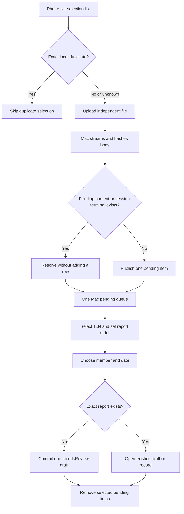
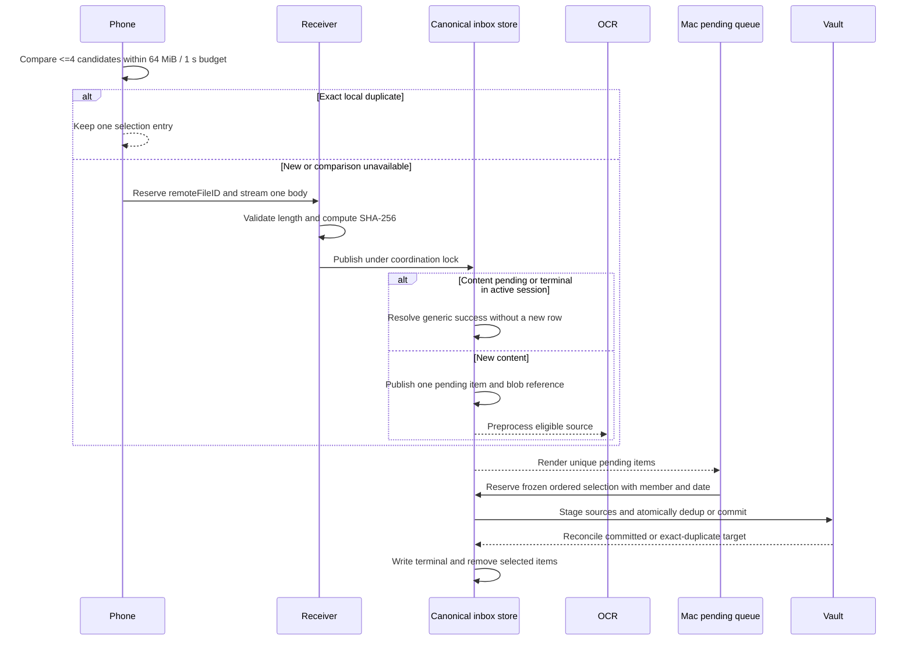
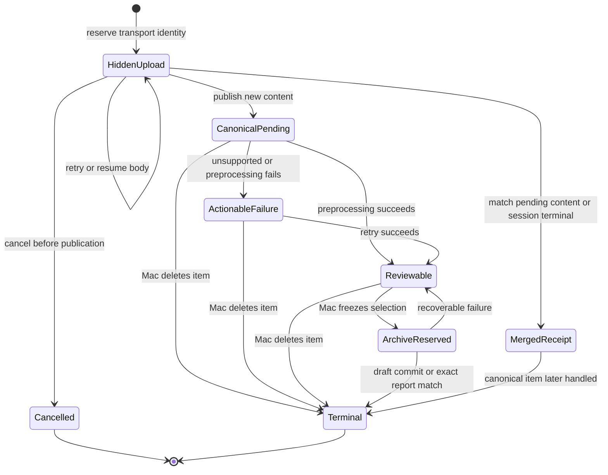

# Kinlogue 无批次手机上传待处理队列 - Plan

## Goal Capsule

- **Objective:** 将当前未发布的 LAN inbox 批次实现直接替换为内容唯一的待确认队列。手机只维护当前会话的文件选择与上传状态；Mac 用户从一个持续队列中单选或多选文件，确定报告顺序、家庭成员和日期，再送入既有待确认流程。
- **Authority order:** 本 Product Contract 定义目标行为；Planning Contract 定义直接替换当前实现的方式；当前代码、测试、`README.md`、`PRIVACY.md` 和专题文档仍是实施前现状的事实来源。
- **Execution profile:** U16–U19 是一个 compile-atomic cutover wave：按依赖顺序改 item/store、手机协议、归档事务和 Mac 队列，但不把任何中间状态作为可编译发布点。U19 完成全图切换后运行聚焦门禁，U20 再删除批次代码并完成安装验收与文档。
- **Stop conditions:** 若服务端无法在并发、响应丢失和重启后保证相同内容只对应一个待处理项，跨 Vault/inbox 故障测试出现重复 draft 或原件丢失，或新实现削弱现有 LAN 信任边界和人工确认门，则停止切换 production composition。
- **Tail ownership:** 执行者负责自动测试、故障矩阵、安装后合成验收、真实手机与 macOS 生命周期矩阵、用户文档和批次死代码清理；只有系统权限提示、真实设备操作或新的产品取舍可留待用户确认。

---

## Product Contract

> **Stable-ID note:** 早期计划中以上传批次为核心的 R5–R7、R11–R17、R19–R20、R23，F1–F4 和 AE1–AE2、AE4–AE7、AE11 已废止。上一版重构中的 R9、R25–R26、R30、R32，F9，AE13、AE20，KTD16–KTD18、KTD22–KTD23、KTD25 和 U9–U15 也因“重复文件合并、手机不排序、未发布版本直接替换”的最新决定而废止。编号不复用；新行为从 R34、F10、AE25、KTD26 和 U16 开始。

### Summary

手机页面是一张扁平的选择与上传列表。用户可以一次选择很多文件，也可以继续追加。重复选择同一个本地文件时，页面先用元数据定位候选，再在明确的候选数、读取量和耗时预算内逐块比较；只有确认字节相同才忽略重复项，预算或能力不足则保留并上传，由 Mac 合并。页面不提供上移、下移、拖拽或任何顺序承诺。

Mac 是内容去重的权威端。完整上传发布时，SHA-256 和长度相同的内容合并到一个 canonical pending item；后到上传只记录指向该 item 的幂等回执，不新增列表行、不移动位置、不覆盖首次接受的展示名。手机端比较失败或无法执行时仍上传，由 Mac 完成最终合并。

Mac 用户可以单选一个待处理项，或多选若干项并在归档确认面确定报告页序，把这次选择作为一份报告，指定家庭成员和报告日期。未命中 exact duplicate 时创建恰好一个新的 `.needsReview` draft；命中时不创建 draft，而是打开既有 draft/record。成员和日期不参与原件身份判断；“相同原件需要归到不同成员或日期”的冲突流程不在本产品场景内。

### Problem Frame

当前实现让手机先决定“哪些文件属于一份报告”，并把这一决定持久化为 batch。实际使用中，手机更适合连续投递原始文件，报告边界、家庭成员、日期和页序则更适合在大屏 Mac 上判断。

批次还放大了重复选择问题：同一原件可以成为多条逻辑文件，Mac 用户需要反复识别和清理。目标状态让“唯一原件的待处理项”成为长期队列单位；报告分组只存在于一次 Mac 归档操作中。

### Key Decisions

- **Content is the pending unit.** (session-settled: user-directed — chosen over keeping one logical row per upload.) 手机可以多次发送同一原件，但 Mac 待处理队列对相同内容只保留一个 canonical item。Governs R34, R36, R38.
- **The phone list has no ordering feature.** (session-settled: user-directed — chosen over preserving phone-side up/down controls.) 手机只负责选择、移除未上传项、上传、查看进度和重试；报告页序只在 Mac 归档确认面处理。Governs R24, R35, R39.
- **Phone dedup is an exact UX optimization; Mac dedup is authoritative.** 手机只在逐块比较证实相等时忽略重复选择。任何无法在手机确认的候选继续上传，并由 Mac 按内容摘要合并。Governs R34–R35.
- **One Mac selection creates at most one new review draft.** (session-settled: user-directed — chosen over one draft per file or one draft per former batch.) 单选和多选走同一路径，多选文件按 Mac 确认的顺序组成一份报告；未命中 R31 时创建恰好一个 draft，命中时打开既有 draft/record。Governs R27–R29, R31.
- **Source content outranks member and date for exact dedup.** (session-settled: user-directed — chosen over adding a conflict path for the same original under different metadata.) 成员和日期是归档输入，不改变报告原件身份；既有 exact report 命中后保留既有归属和日期。Governs R28, R31.
- **Successful handling drains the queue.** (session-settled: user-directed — chosen over retaining a submitted inbox copy.) 新 draft 已耐久提交或命中 exact duplicate 后移除本次选择；失败或可恢复中断时保留。Governs R29, R31.
- **Replace the unpublished implementation directly.** (session-settled: user-directed — chosen over inbox migration, dual-read compatibility and a rollback checkpoint.) 新 schema、协议和 UI 一次性成为唯一实现；旧开发数据不迁移，旧路由不兼容。Governs R33, R37.
- **Trusted temporary LAN boundary remains unchanged.** 普通 HTTP、显式开启、验证码、当前会话可见性和生命周期停止条件保持现状；本重构不扩大手机读取权限。Governs R1–R4, R18, R21–R22.

### Actors

- A1. **Mac user:** 开启或停止接收，查看唯一待处理项，单选或多选，在归档确认面调整报告页序，选择家庭成员和日期，重试预处理或删除待处理项。
- A2. **Phone browser:** 在当前临时会话中验证，选择或追加文件，移除尚未上传的选择项，查看每个文件的上传进度和粗粒度结果，重试失败上传；不设置报告顺序。
- A3. **Kinlogue on Mac:** 独立接收文件，按内容合并重复上传，本地预处理，维护唯一待处理队列，以幂等事务把一次有序选择解析为至多一个新的 `.needsReview` draft，或解析到既有 exact draft/record。

### Requirements

**Receiving session and trust boundary**

- R1. Kinlogue must start LAN receiving only after A1 explicitly requests a temporary session from a ready, unlocked application.
- R2. An active session must present a usable local address, a QR entry path and a short verification code for A2 on the same routable local network.
- R3. Before starting a session, Kinlogue must state that this feature is limited to a trusted private Wi-Fi or LAN and does not guarantee encrypted transport.
- R4. A2 must provide the active verification code before uploading, and an invalid or expired session must reveal no pending item, member, draft or record data.

**Flat phone upload and duplicate handling**

- R8. Kinlogue must accept any regular file type without an App-defined storage-byte ceiling, while clearly separating formats eligible for preprocessing from formats retained only as inert attachments. Object-count, concurrency, framing and decoder-safety limits remain mandatory and must not be described as storage-byte quotas.
- R24. A2 may select many files at once or append more files later, but each retained selection must be reserved, uploaded, retried and completed independently; neither the HTTP contract nor persistent state may require a batch create or complete step.
- R34. After atomic publication, one SHA-256 plus byte-length identity must map to at most one pending item and one physical blob. A later matching upload attaches its receipt to the canonical item without adding, moving or renaming a row.
- R35. The phone must ignore a repeated selection only after a bounded-memory byte comparison confirms equality. Metadata may select comparison candidates, but an unavailable, failed or unequal comparison must retain the new file for upload.
- R36. The same `(sessionID, remoteFileID)` and metadata must replay a successful publish, merge, cancel, archive or delete terminal after response loss, while the same ID with different metadata must conflict. Transfer interruption, disk-full and capacity failures remain retryable attempts under the same transport identity and must not be frozen as permanent terminals.
- R39. A2 may see only current-session file names, progress and generic outcomes. It may remove or cancel an unpublished local entry and retry a failed upload, but a published canonical pending item is controlled from the Mac; new publication and content merge must be externally indistinguishable, and no phone action may delete a row shared by another receipt.
- R40. While a receiving session remains active, archiving or deleting a canonical item must leave a metadata-only content terminal keyed by digest and length. An archive terminal suppresses all matching uploads for the remainder of that session. A delete terminal also records an admission-generation cutoff: only bodies admitted at or before deletion resolve to the terminal, while a genuinely new identity admitted afterward may publish the content again. Terminals may be pruned only after session invalidation and outstanding attempts or operations are reconciled.
- R41. Phone comparison work must use at most four metadata-matched candidates, one active comparison, 64 MiB cumulative reads and one second of monotonic elapsed time per picker action. The comparator must yield between 1 MiB chunks. Candidate/byte/time exhaustion is a budget abort that falls back to upload; user removal of the local entry cancels comparison and body work without fallback or publication.

**Mac pending queue and report assembly**

- R10. Kinlogue must automatically preprocess eligible image and PDF content on the Mac without sending file bytes or OCR output to another service.
- R27. A1 must be able to preview supported content, inspect metadata, retry preprocessing, delete an item, and select one or more reviewable items. Before archive, the Mac selection must have an explicit stable source order; unsupported or failed items remain independently actionable and must not block unrelated reviewable files.
- R28. Archiving a selection must require one active family member and one visible canonical report date, then create exactly one `.needsReview` draft whose ordered sources match the frozen selection only when R31 finds no exact report. The draft must prefill manual date and all OCR candidate-backed review fields coherently, but must not enter the timeline until the existing per-report confirmation succeeds.
- R29. After the draft is durably committed, or after R31 resolves the selection to an existing exact report, all and only the selected pending items must leave the queue and the selection must clear. Validation, disk, member-lifecycle or recoverable commit failure must leave the items available or reserved for deterministic recovery; processing the final items yields the empty state.
- R31. Exact-report deduplication must run only after A1 freezes the selected source set. It compares source digests and lengths against `.needsReview` drafts and confirmed records; order, names, OCR fields, member and date do not change identity. An exact match creates no draft, removes the selected pending items, preserves the existing report metadata and offers A1 a route to the existing draft or record; partial overlap remains distinct.

**Retention, lifecycle, capacity and replacement boundary**

- R18. Manual stop, closing the last primary content window, App exit, Mac lock or sleep, advertised-network-path change or idle timeout must stop receiving and invalidate phone control for that session. Ordinary focus loss must not stop it, and reopening a window must require an explicit new start.
- R21. Kinlogue must limit repeated verification failures and excessive concurrent connection attempts without extending the temporary session or revealing library state.
- R22. Kinlogue must treat every received file as an untrusted inert attachment and must not execute or actively render unsupported content.
- R33. Production Core, Platform API, App state and user-visible copy must contain no upload-batch concept or `/api/batches` route.
- R37. The new inbox schema must replace the unpublished batch schema without a legacy decoder, migration, dual-read, dual-write or rollback build. Encountering an unsupported old development manifest must fail closed without mutation; disposal of pre-release development data remains an out-of-band developer action and no reset path ships in the App or package.
- R38. The sidebar badge and capacity checks must count unique pending contents. The system keeps at most 5,000 canonical pending items, 1,000 transport identities or receipts in the one active session, two active upload bodies and 4 MiB per-upload or 16 MiB aggregate pending memory, and defines a separate per-report source ceiling.

### Key Flows

- F5. **Start a session and upload independent files**
  - **Trigger:** A1 starts LAN receiving and A2 opens the paired page.
  - **Steps:** A2 selects many files or appends more. The page removes byte-confirmed repeat selections within R41's comparison budget, gives every retained entry a stable remote ID and uploads entries independently with at most two concurrent bodies; budget exhaustion falls back to upload.
  - **Outcome:** Completed unique contents appear in the Mac queue without creating a report boundary or phone ordering contract.
  - **Covers:** R1–R4, R8, R18, R21, R24, R35–R36, R38–R41.
- F10. **Merge duplicate uploads into one canonical pending item**
  - **Trigger:** One or more current or concurrent uploads publish bytes already represented by a pending item or by a current-session content terminal.
  - **Steps:** A3 verifies length and SHA-256, keeps the already published matching item as canonical under the manifest lock, or resolves to the existing content terminal after that item was handled. It records metadata-only terminal evidence and discards only unreferenced duplicate staging data.
  - **Outcome:** Mac shows at most one row and one pending count; every phone entry receives the same generic “已保存到 Mac” result regardless of whether a new row was published, an existing row was merged or a handled content terminal was matched.
  - **Covers:** R34, R36, R38–R40.
- F6. **Preprocess and manage the pending queue**
  - **Trigger:** One or more unique files have been received.
  - **Steps:** A3 performs source-local preprocessing. A1 previews or retries supported items and may delete any item with confirmation; unsupported or failed items remain isolated from other ready items.
  - **Outcome:** The queue continuously represents only unique material still awaiting an A1 decision.
  - **Covers:** R10, R22, R27, R29, R38.
- F7. **Assemble one report and send it to confirmation**
  - **Trigger:** A1 selects one or more reviewable items.
  - **Steps:** A1 reviews or reorders sources on the Mac, chooses an active member and visible date, then confirms “作为 1 份报告加入待确认”. A3 freezes the selection, checks exact report identity, stages originals and commits one `.needsReview` draft or resolves an existing destination.
  - **Outcome:** The selected items leave the phone-upload queue; a new or existing report opens in the normal confirmation experience and no timeline record is created early.
  - **Covers:** R27–R29, R31.
- F8. **Stop, retry or cancel**
  - **Trigger:** The session stops, an upload is interrupted, or A1 removes durable material.
  - **Steps:** A3 invalidates network control and cleans unpublished partial bodies. While the session remains active, A2 may cancel an active unpublished body or retry an interrupted/failed attempt under the same transport identity; cancellation stops body consumption, deletes its partial object and publishes no canonical item. A1 can retry preprocessing or delete a durable canonical item.
  - **Outcome:** No invisible receiver, ambiguous partial row or phone-side deletion of shared content remains.
  - **Covers:** R18, R21, R29, R36, R39–R40.



### Acceptance Examples

- AE12. **Covers R24, R35, R38–R39.** Given A2 selects 37 files and later adds 8 more, when upload runs with two concurrent bodies, then every retained entry has an independent status, the phone exposes no batch or sorting action, and a failed file can retry without resending the others.
- AE14. **Covers R27–R29, R31.** Given three reviewable pending items and no exact report, when A1 selects them, sets their Mac-side order, chooses one active member and a visible date, then exactly one `.needsReview` draft contains the three originals in that order, its review state contains the canonical manual date plus OCR-backed defaults, and only those three items disappear.
- AE15. **Covers R27–R29, R31.** Given one reviewable pending item and no exact report, when A1 uses the same archive action, then exactly one one-source `.needsReview` draft is created and the queue becomes empty if no other item exists.
- AE16. **Covers R10, R22, R27.** Given one unsupported file, one preprocessing failure and two reviewable images, when A1 selects only the images, then the images can form a report while the unsupported and failed items remain separately previewable, retryable or deletable and are never actively rendered.
- AE17. **Covers R18, R36, R39.** Given a body is interrupted before atomic publication, when the session stops or the App restarts, then no pending item points to partial bytes; a same-session retry resumes or restarts idempotently, while completed items remain.
- AE18. **Covers R29, R31.** Given the frozen selection has the same source contents as an existing draft or record, when A1 archives it with any order, names, member or date, then no new draft is created, the selected items leave the queue, existing metadata remains authoritative and A1 can open that destination.
- AE19. **Covers R28–R29, R31.** Given failure is injected before staging, after staging, after Vault catalog publication and before inbox cleanup, when the App restarts, then recovery yields exactly one draft or one duplicate terminal, never loses an uncommitted pending item and never creates a second source graph.
- AE21. **Covers R1–R4, R21.** Given an invalid code, expired cookie, wrong Origin or Host, or guessed file ID, when A2 requests any file route, then authentication and authority checks run before identifier lookup and reveal no queue or library state.
- AE22. **Covers R18, R39.** Given pending items and an active receiver, when the Mac locks, sleeps, changes advertised path or closes the last primary window, then phone control stops, pending items remain, focus loss alone does not stop receiving and reopening does not restart it.
- AE23. **Covers R8, R22, R38.** Given a large regular file or active document type, when streaming and filesystem writes remain valid, then no App byte quota rejects it; decoder and object safety still apply, and unsupported content stays inert.
- AE24. **Covers R28–R29.** Given the selected member is archived or the date becomes invalid before commit, when archive revalidates, then no draft is published and all selected items remain available; if the exact target was already committed before the race, recovery completes cleanup instead of duplicating it.
- AE25. **Covers R35.** Given A2 selects the same local file again, when metadata identifies the existing entry and bounded chunk comparison confirms every byte, then the page retains one entry and reports that one duplicate selection was ignored.
- AE26. **Covers R34, R36, R38–R39.** Given two concurrent uploads use different remote IDs and names but contain identical bytes, when both publish, then the first successfully published identity keeps its queue position and display name, Mac shows one pending row and one physical blob, and both phone requests receive byte-for-byte equivalent generic success bodies and headers without a canonical item ID or a published-versus-merged distinction.
- AE27. **Covers R34–R35.** Given two files have the same name, size, modification time and media type but different bytes, when phone comparison or Mac hashing completes, then neither layer merges them and Mac shows two pending items.
- AE28. **Covers R33, R37.** Given an old unpublished batch manifest exists on a development machine, when the new build opens it, then the App returns a typed unsupported-schema failure without migrating, reinterpreting, deleting or otherwise mutating it, and neither the App nor package exposes a reset entry point.
- AE29. **Covers R36.** Given a canonical item was archived or deleted after a successful upload response was lost, when the same session and remote ID retry, then the durable terminal result is replayed without recreating the item; a genuinely new remote identity is evaluated as a new upload.
- AE30. **Covers R40.** Given an upload body is already admitted when another operation archives or deletes the matching canonical item, when the body finishes in the same active session, then publication resolves against the metadata-only content terminal, returns generic success and does not repopulate the queue; the terminal survives until session invalidation and reconciliation.
- AE31. **Covers R35, R41.** Given one picker action has more than four metadata candidates, would read more than 64 MiB or runs longer than one monotonic second, when the comparison budget is reached, then comparison budget-aborts cleanly and the unconfirmed file remains queued for upload so Mac canonicalization remains authoritative; explicit user removal instead cancels the entry without upload.
- AE32. **Covers R36.** Given a body attempt is interrupted or fails from disk-full or admission capacity, when the same transport identity retries after the condition clears, then the attempt revision advances and publication may succeed; only a success, merge, cancel, archive or delete terminal is replayed without consuming a new body.
- AE33. **Covers R29, R31.** Given the same canonical items are submitted for archive concurrently, when the first operation reserves them, then the overlapping operation fails with a mutation conflict and cannot create a second intent. Because one pending item exists per content identity, two disjoint selections cannot have the same report fingerprint; recovery therefore resumes only the single durable intent and creates at most one destination.
- AE34. **Covers R39–R40.** Given A1 deletes an unarchived canonical item, when a matching body admitted before deletion finishes, then it resolves generically without recreating the row; when A2 intentionally selects the same file afterward and receives a new identity beyond the delete cutoff, then it may publish one new canonical row. An archive terminal remains session-wide and continues suppressing later matches.

### Success Criteria

- 手机和 Mac 的新主流程均无批次创建、命名、完成、选择或删除概念。
- 手机仅在预算内逐块确认同一本地文件相等时只保留一项，手机端没有排序入口；无法确认或预算超限时仍上传并由 Mac 端合并。
- 相同内容在 Mac 待处理队列中始终只显示一项，并发、重试和重启不会制造重复行。
- 已归档或删除的内容不会被同一活跃会话中的晚到 body 重新放回队列；手机比较超出预算时退回上传而不是卡住选择操作。
- 单选与多选都走同一归档事务；一次操作最多产生一个 draft。
- 已处理文件自动离开队列，未处理文件不受影响，全部处理后为空。
- 新实现不携带旧 inbox 兼容、迁移或回滚路线，现有 LAN 信任边界、本地 OCR、惰性附件和人工确认门不回退。

### Scope Boundaries

- 不增加账号、云同步、iCloud、CloudKit、遥测、远程历史浏览或后台常驻接收。
- 不为普通 HTTP 增加虚假的“已加密”表述；TLS 或端到端加密不属于本次重构。
- 不自动推断哪些待处理项属于同一报告；分组和页序由 A1 在 Mac 明确选择。
- 不在手机提供排序、报告命名、成员、日期、Mac 历史或 OCR 信息。
- 不为相同原件但不同成员或日期增加冲突、复制或覆盖流程；该输入被产品约束排除。
- 重传不是修改既有报告页序的入口。Mac 选择顺序只用于创建新 draft；命中 exact report 时保留既有 source order，纠正既有报告必须在其独立编辑/确认能力中完成，扩展该能力不属于本重构。
- 不兼容旧 `/api/batches`，不迁移旧 batch manifest，不构建中间回滚包。
- 不批量编辑报告类型、OCR 转录、结果或结论；成员和日期只是归档时预填，仍需逐报告确认。

### Sources

- Current product and privacy contract: `docs/project-overview.md`, `docs/lan-upload.md`, `docs/privacy-and-security.md`, `README.md`, `PRIVACY.md`.
- Current domain and storage: `Sources/KinlogueCore/LAN/LANInboxBatch.swift`, `Sources/KinlogueCore/LAN/LANInboxFile.swift`, `Sources/KinlogueCore/LAN/LANInboxSnapshot.swift`, `Sources/KinloguePlatform/LAN/PlaintextLANInboxStore.swift`.
- Current protocol and phone UI: `Sources/KinloguePlatform/LAN/LANHTTPDTO.swift`, `Sources/KinloguePlatform/LAN/LANHTTPHandler.swift`, `Sources/KinloguePlatform/LAN/LANReceiver.swift`, `Sources/KinloguePlatform/Resources/LANUpload/app.js`.
- Current workflow and App UI: `Sources/KinloguePlatform/LAN/LANBatchPreprocessor.swift`, `Sources/KinloguePlatform/LAN/LANInboxSubmissionCoordinator.swift`, `Sources/KinlogueApp/ViewModels/LANInboxModel.swift`, `Sources/KinlogueApp/Views/LANInboxView.swift`, `Sources/KinlogueApp/Views/LANBatchDetailView.swift`.
- Existing evidence: `Tests/KinloguePlatformTests/LANInboxWorkflowTests.swift`, `Tests/KinloguePlatformTests/LANInboxDeduplicationTests.swift`, `Tests/KinloguePlatformTests/LANPhoneAssetSafetyTests.swift`, `Tests/KinlogueStorageProcessTests/InboxUploadProcessCoordinationTests.swift`, `docs/acceptance/lan-upload-matrix.md`.

---

## Planning Contract

### Current-State Baseline

- 当前未发布实现的 Core、store、HTTP、receiver、phone JavaScript、workflow 和 SwiftUI 都以 batch ID 为主键。`app.js` 还包含批次创建、完成和上移或下移选择项的交互。
- `PlaintextLANInboxStore.swift` 保留内容寻址 blob、manifest generation、进程协调和故障注入等原子存储模式，但不读取或迁移旧 payload。
- `LANItemPreprocessor` 按 item 缓存 OCR，`LANItemPreprocessingGate.shared` 把本机 OCR 串行化，保留 source-local 工作单元。
- `LANReportArchiveCoordinator` 与 `VaultReportSelectionStaging` 负责跨 inbox/Vault 的 intent、staging、catalog commit 和 receipt，并显式携带 Mac 选择的 member/date。
- `ImportReviewModel` 在 `reviewState` 存在时不会再从 candidates 补齐字段。因此归档时若写 manual date，必须同时把 candidate-backed title、organization、report type、results 和 conclusion 写入完整 review state。
- 当前报告 exact dedup 已使用 source digest 和 length。新队列先做 item 级内容合并，归档时仍需在最终 catalog coordination 边界检查整份报告，覆盖已处理后再次上传的原件。

### Key Technical Decisions

- KTD15. **Replace the live batch aggregate with a pending item aggregate.** 新 Core 模型以 `LANInboxItem`、item revision/state、content-addressed `LANInboxBlob`、per-file upload receipt 和 top-level archive operation 为核心。Archive operation 表达 Mac 用户的一次临时选择，不是上传分组。
- KTD19. **Assemble reports from frozen ordered item IDs.** Mac 队列在 canonical publication 时分配单调稳定序号。进入归档确认面时按队列序给出默认页序，并允许 A1 用上移、下移和键盘等价操作调整；冻结 `orderedItemIDs + item revisions + content identities` 后才提交。
- KTD20. **Make archive a durable cross-store transaction.** Top-level archive intent 持有 operation ID、有序 item IDs/revisions、member/date、report fingerprint 和预分配 draft/document/source/attachment IDs。先 reservation，再流式 stage，最后在 Vault catalog coordination 边界原子执行 exact-report dedup 或新 draft commit；随后写 inbox terminal 并移除 items，不能在 dedup 判定前无条件发布 draft。
- KTD21. **Seed a complete review state, not date alone.** App 层用既有 `ReportDateSemantics` 将可见日期规范化后传入 workflow；Platform 用 OCR candidates 构造完整 `ImportDraftDocument.reviewState`，仅 timeline date 标为 `.manual(canonicalDate)`。
- KTD24. **Distinguish the two Mac queues in copy.** 侧栏仍名“手机上传”，内容标题使用“待处理项”，操作明确为“作为 1 份报告加入待确认”；既有“待确认”仅指 `.needsReview` drafts。侧栏徽标显示 canonical pending item count。
- KTD26. **Canonicalize content at atomic publication.** (session-settled: user-directed — chosen over retaining one logical item per upload.) 流式 sink 先验证长度并计算 SHA-256，再在持有 manifest/process coordination lock 时按 `(digest, length)` 查找仍在 inbox 中的 canonical item。没有匹配时为当前内容分配 sequence 并发布；已有匹配时保留已发布 item，只发布 receipt alias，随后按引用关系清理 duplicate staging object。Implements R34, R36, R38.
- KTD27. **Cut directly to one current schema.** (session-settled: user-directed — chosen over migration, dual-read compatibility and a rollback checkpoint.) 删除 legacy decoder、migration fixture、双写、中间发行门以及 App/package 内的 reset 入口。当前 schema 只在 fresh/test roots 上写入；未知旧 manifest 返回 typed unsupported-schema failure，且在返回前不发生任何 mutation。旧开发数据的处置是产品外的开发者操作，不属于此实现。Implements R37.
- KTD28. **Use exact bounded comparison only as a phone prefilter.** (session-settled: user-directed — chosen over phone-side sorting and metadata-only suppression.) `app.js` 用 `(name, size, lastModified, type)` 缩小候选集合，再通过固定大小的 `Blob.slice(...).arrayBuffer()` 逐块比较。浏览器能力不足、读取失败、内容不同或 R41 预算耗尽都保留新 entry；页面删除全部 move/reorder 代码和顺序文案。Implements R35, R41.
- KTD29. **Keep file transport identities separate from content identities.** 每个 retained phone entry 使用随机 `remoteFileID`。文件级 reserve/upload/status API 先完成 pairing、cookie、CSRF、Origin 和 Host 校验，再访问 ID。每个 identity 带单调 attempt revision：传输中断、disk-full 或 capacity failure 清理 partial 并允许同 identity 开启新 revision；success、merge、cancel、archive 和 delete 才写入可重放 terminal。外部 success body、headers 和当前会话状态在新发布、合并现有项或命中 content terminal 时完全一致，不返回 canonical item ID；内部 receipt 才记录 transport identity 与 metadata-only terminal evidence 的关系。Implements R24, R36, R39.
- KTD30. **Run report dedup after the Mac selection is frozen.** (session-settled: user-directed — chosen over member/date conflict handling.) `ReportFingerprint` 继续基于有序无关的 source digest/length 集合，并在最终 Vault catalog coordination 边界覆盖 draft/record。每个 content identity 在队列中只有一个 canonical item，因此相同 fingerprint 必然引用同一组 item；共享 inbox coordination 以 item reservation 直接拒绝重叠并发操作，不保留不可达的 waiter/election 状态。恢复只重放唯一 durable intent；只有新的 draft 或既有 exact destination 已在 Vault 耐久且可导航后才写 terminal 并移除 items。Member/date 不进入 fingerprint，也不产生冲突分支。Implements R29, R31.
- KTD31. **Bound canonical items and metadata-only receipts independently.** 容量策略按 unique pending item 计数。唯一 active session 最多保留 1,000 个 transport identities/receipts；receipt 和 content terminal 只保存不对手机或日志暴露的重放所需元数据，永不持有 blob 引用。Session invalidation 和启动 reconciliation 完成后，只有仍被 store operation 引用的 terminal evidence 可暂留。保留现有 body 并发和 pending-memory admission，在 Mac 归档处保留独立 `maximumSourcesPerReport`。Implements R38–R40.
- KTD32. **Fence late bodies with an active-session content terminal.** Archive/delete 在移除 canonical item 的同一 durable transition 写入 `(digest, length, terminalKind, admissionGenerationCutoff)` terminal。Publish 在同一 coordination lock 内先检查 live canonical item，再检查适用的 terminal：archive terminal 对该 session 后续 identity 全部生效；delete terminal 只拦截 generation 不高于 cutoff 的既有 admitted body，cutoff 后新 identity 可重新发布。命中时丢弃无引用 staging、记录 receipt 并返回相同 generic success。Terminal 在 session invalidation 且 admitted bodies、archive operations 和 retryable attempts reconciliation 完成前不可 prune。Implements R40.
- KTD33. **Bound phone comparison work as well as memory.** 每次 picker action 最多比较四个 metadata candidates、累计读取 64 MiB、使用一个 active comparison，并以 monotonic clock 限制在一秒内。比较按 1 MiB chunk 读取，每块之间让出事件循环并检查 entry 是否已被用户移除。候选/字节/时间上限或 capability failure 触发 budget abort 并回退到正常上传；用户移除触发 user cancellation，不回退上传。Implements R35, R41.

### High-Level Technical Design





**Target state and ownership**

- `KinlogueCore`: canonical item/state/intent invariants、bounded decoding、report-source cardinality；不含文件系统、HTTP、Vision 或旧 schema decoder。
- `KinloguePlatform`: current manifest/blob/derived 原子性、content canonicalization、file HTTP transport、source-local preprocessing、Vault staging 和 archive reconciliation。
- `KinlogueApp`: session lifecycle、pending-item selection、Mac report order、member/date validation、preview/navigation 和 user-facing copy。
- Vault remains the owner of sources after a draft commit. Removing inbox references must never remove Vault-owned originals; receipt/content-terminal evidence never owns a blob, and blob GC runs only after reference accounting proves no inbox item, Vault source or staging reference remains.

### System-Wide Impact

- **Persistence:** Inbox 直接采用新的 current schema。Vault catalog/source format 不变，但 staging API 和 lineage 从 batch 改为 report selection/archive operation。
- **API:** `/api/batches`、batch DTO 和 phone batch runtime 全部删除。Transport ID 仍只在已认证当前 session 内可见，content identity 不暴露给手机。
- **Data lifecycle:** Pending canonical copy 在成功归档后不再保留。Vault draft/record originals 继续遵守既有删除规则；upload receipts 和 active-session content terminals 是有界、metadata-only 的重放证据，不拥有 blob，也不是可浏览历史。
- **Concurrency:** Upload publication、preprocessing 和 archive reservation 使用独立状态。相同内容的并发 publish 只能选出一个 canonical item，重叠 archive selection 只有一个 operation 能完成 reservation，其他操作明确冲突；归档/删除与已 admitted body 的竞争由 active-session content terminal 收敛为不重新入队。
- **Privacy/logging:** 文件字节、OCR 文本、展示名、member/date、token、完整 URL 和私有路径不得进入日志、fixture、截图或验收产物。
- **Documentation:** 实现切换前，现有专题页继续描述 batch-based current state。本计划只描述目标；U20 在代码和验收通过后一次性更新所有 current-capability 文档。

### Sequencing

**Atomic cutover constraint:** U16–U19 是同一开发分支中的逻辑 review/work packets，不是可单独落地、发布或要求编译通过的提交点。实施时按 U16 → U17/U18 → U19 更新完整依赖图，不引入 legacy adapter、双协议或临时迁移层；只有 U19 完成全图切换后才首次运行聚焦编译和测试门禁，U20 负责清理与完整门禁。

1. 建立 current-schema canonical item/store，并用 fresh roots 完成并发、故障和跨进程证明。
2. 在该 store 上替换文件级 HTTP 和 phone assets；同时删除 phone 排序和 batch contract。
3. 把 preprocessing、archive intent、Vault staging 和 report dedup 改到 item selection。
4. 切换 Mac 单列表 UI 和 production composition。
5. 删除所有旧 batch 生产代码与测试构造，完成安装验收、真实设备矩阵和文档更新。

### Risks & Dependencies

- **Concurrent merge race:** 两个相同 body 可同时完成。KTD26 要求在同一 process coordination 临界区选 canonical winner，并以真实跨进程测试证明一个 row 和一个 blob owner graph。
- **Phone false-positive or expensive suppression:** 元数据相同不代表内容相同，浏览器逐块读取也可能拖慢 picker。KTD28/KTD33 只在预算内逐块完全相等时忽略；读取失败或 budget abort 时上传并交给服务端合并，明确的 user cancellation 则终止且不上传。
- **Late-body or response-loss resurrection:** Canonical item 可能在已 admitted body 完成或 phone retry 前被处理。KTD29/KTD32 要求 metadata-only terminal 先于 GC 保留；archive terminal 在剩余 session 内阻止重入队，delete terminal 用 admission cutoff 只围住已开始的竞争而不吞掉后续主动重传。
- **Retry frozen as failure:** Disk-full、capacity 或传输中断若被写成 terminal 会让同 identity 永久无法恢复。KTD29 只终结明确完成/取消状态，失败 attempt 清理 partial 并递增 revision 后重试。
- **Cross-store split brain:** Vault 可能在 inbox cleanup 前提交。KTD20 使用预分配 IDs、不可变 staging descriptor、目标图谱 reconciliation 和幂等 terminal。
- **Review defaults erased by date prefill:** Partial `reviewState` 会隐藏 OCR candidates。KTD21 要求单一 complete-state constructor 和 App 回归测试。
- **Ordering ambiguity:** 手机不表达报告顺序，上传完成也可乱序。KTD19 只把服务端序号作为 Mac 默认值，并在归档确认面提供可访问的明确排序。
- **Old development data:** 没有 migration path。KTD27 对未知 manifest 只返回 typed failure 且零 mutation；产品和 package 不提供 reset，因此任何开发数据处置都在本实现范围外显式完成。
- **Source-count confusion:** 手机可上传很多文件，但一份报告仍受 decoder safety ceiling 约束。Mac 必须显示 selection limit，不得把超限选择拆成隐藏分组。

---

## Implementation Units

### U16. Build the canonical pending-item store

- **Goal:** 让 current schema 以 unique content 为唯一待处理单位，并在并发、响应丢失和重启后保持一个 canonical row。
- **Requirements:** R34, R36–R38, R40; AE26–AE30, AE34; KTD15, KTD26–KTD27, KTD31–KTD32.
- **Dependencies:** 当前 content-addressed blob、manifest generation、文件协调和故障注入模式。
- **Files:**
  - Create `Sources/KinlogueCore/LAN/LANInboxItem.swift` and `Sources/KinlogueCore/LAN/LANArchiveIntent.swift`.
  - Modify `Sources/KinlogueCore/LAN/LANInboxFile.swift`, `Sources/KinlogueCore/LAN/LANInboxProtocols.swift`, `Sources/KinlogueCore/LAN/LANInboxSnapshot.swift` and `Sources/KinloguePlatform/LAN/PlaintextLANInboxStore.swift`.
  - Modify `Sources/KinlogueStorageProcessFixture/KinlogueStorageProcessFixture.swift`.
  - Create `Tests/KinlogueCoreTests/LANInboxItemTests.swift` and `Tests/KinlogueCoreTests/LANArchiveIntentTests.swift`.
  - Modify `Tests/KinloguePlatformTests/PlaintextLANInboxStoreTests.swift`, `LANInboxStoreFaultMatrixTests.swift`, `LANInboxLazyIntegrityTests.swift`, `LANInboxPublicationGuardTests.swift`, `LANInboxDeduplicationTests.swift` and `Tests/KinlogueStorageProcessTests/InboxUploadProcessCoordinationTests.swift`.
- **Approach:** Implement KTD15, KTD26 and KTD32 on a single current snapshot format. Publication first verifies the streamed body, then in one coordination boundary creates the canonical item or records metadata-only terminal evidence for an existing item/content terminal. Unsupported old snapshots return a typed error; no code path decodes, resets or mutates them.
- **Execution note:** Add characterization coverage for the store's current locking and object-GC boundaries, then implement new canonicalization tests first.
- **Test scenarios:**
  - Covers AE26. Two processes publish the same bytes with different IDs and names; one stable canonical item, one blob graph and two receipts survive reopen.
  - Covers AE27. Equal display metadata with different bytes publishes two items.
  - Covers AE29. Same transport identity replays a terminal without recreating a removed item; changed metadata conflicts.
  - Covers AE30. A body admitted before matching content is archived/deleted resolves against the active-session content terminal and cannot repopulate the queue.
  - Covers AE34. Delete cutoff suppresses pre-delete admitted bodies but allows a post-delete new identity to publish; archive terminal stays session-wide.
  - An interrupted body never becomes queue-visible and cleanup cannot remove an object owned by a winner or Vault staging.
  - Receipt/content-terminal evidence remains replayable without owning a blob; once inbox item, Vault and staging references are gone, blob GC still reclaims the object.
  - Capacity counts canonical items, while bounded receipt pruning preserves every still-replayable active-session identity.
  - Covers AE28. An old batch snapshot fails closed with zero filesystem mutation, and production source/package scans expose no reset entry point.
- **Verification:** These scenarios are authored with U16 but run after U19 completes the compile-atomic graph cutover. Core, Platform and real-process suites then prove canonical uniqueness, reference ownership and deterministic reopen against real filesystem locks; no writable path emits or accepts the old payload.

### U17. Replace the phone protocol and selection UI

- **Goal:** 提供无批次、无排序、可追加的文件上传列表，并让服务端 canonical merge 结果正确回到每个当前会话 entry。
- **Requirements:** R1–R4, R8, R18, R21–R24, R33–R36, R38–R41; AE12, AE17, AE21–AE23, AE25–AE27, AE29–AE32, AE34; KTD28–KTD29, KTD31–KTD33.
- **Dependencies:** U16.
- **Files:**
  - Modify `Sources/KinloguePlatform/LAN/LANHTTPDTO.swift`, `LANHTTPHandler.swift`, `LANReceiver.swift`, `LANUploadSink.swift`, `LANInboxAdmissionPolicy.swift` and receiver runtime state.
  - Modify `Sources/KinloguePlatform/Resources/LANUpload/index.html`, `app.js` and `styles.css`.
  - Modify `Tests/KinloguePlatformTests/LANHTTPDTOTests.swift`, `LANHTTPHandlerTests.swift`, `LANReceiverIntegrationTests.swift`, `LANRealSocketBackpressureTests.swift`, `LANUploadSinkTests.swift`, `LANInboxAdmissionPolicyTests.swift`, `LANPhoneAssetSafetyTests.swift` and receiver lifecycle tests.
- **Approach:** Replace batch create/complete with KTD29 file identities, attempt revisions and current-session status. Implement KTD28/KTD33 before enqueueing a selected `File`; remove `moveSelected`, ordinal labels and all phone-side ordering controls. Keep two concurrent streaming bodies, support cancellation only before atomic publication, and let canonicalization happen after authenticated, bounded transport processing.
- **Execution note:** Start with failing phone-asset and production-router tests for repeat selection, real streaming merge and response replay.
- **Test scenarios:**
  - Covers AE25. Re-selecting the same file compares fixed-size chunks and retains one entry with an ignored-duplicate count.
  - Covers AE27. Same metadata but unequal chunk keeps both entries; read failure or missing comparison capability also keeps both.
  - Covers AE31. Candidate count, cumulative bytes, elapsed time, single-comparator and yield/budget-abort behavior all hit exact boundaries; every exhausted path falls back to upload, while explicit user removal cancels without fallback.
  - The rendered page has add, remove-before-upload, progress and retry states but no up/down, drag, ordinal, batch name or complete action.
  - Covers AE26. Different names and remote IDs with equal bodies receive byte-for-byte equivalent generic success bodies/headers for publish versus merge, disclose no canonical ID and create one queue item through the production router; redacted logs also do not distinguish the paths.
  - Covers AE30. A late same-session body matching archived/deleted content returns the same generic success and adds no row.
  - Covers AE34. A fresh post-delete identity may upload the same content into one new row, while post-archive matches remain generic terminal success.
  - Covers AE32. Interruption, disk-full and capacity failure remove partials and allow a higher attempt revision under the same identity; success/merge/cancel/archive/delete terminals replay without reading another body.
  - Cancelling an active unpublished body stops consumption, deletes its partial and creates no item; after publication, phone cancellation is unavailable and cannot delete shared content.
  - Covers AE21. Pairing/poll and body routes enforce their admission matrix; authentication, CSRF, Origin and Host checks run before ID/receipt/content lookup or sink creation, rejected traffic neither consumes body nor refreshes idle lifetime.
  - Fragmented and combined frames, response loss, backpressure, stop/restart, network change and 1,000 current-session transport identities remain bounded.
- **Verification:** These scenarios are authored with U17 but run after U19 completes the compile-atomic graph cutover. Real-socket, sink, lifecycle and phone-asset tests then exercise the production router; static source checks find no `/api/batches`, batch copy or phone sorting behavior.

### U18. Refactor preprocessing and durable report archive

- **Goal:** 将一个 Mac 有序 item selection 转为至多一个可恢复的 `.needsReview` draft，并在成功或 exact match 后只清理所选 canonical items。
- **Requirements:** R10, R27–R29, R31, R34; AE14–AE19, AE24, AE33; KTD19–KTD21, KTD30.
- **Dependencies:** U16.
- **Files:**
  - Replace `Sources/KinloguePlatform/LAN/LANBatchPreprocessor.swift` with item-oriented naming and APIs while preserving `LANPreprocessedSourceDocument` cache behavior.
  - Modify `Sources/KinloguePlatform/LAN/LANInboxWorkflow.swift` and `Sources/KinloguePlatform/LAN/LANInboxSubmissionCoordinator.swift`.
  - Rename or refactor `Sources/KinloguePlatform/Import/VaultBatchDraftStaging.swift` and `PlaintextVault.commitStagedBatchDraft` call sites to report-selection terminology.
  - Modify `Tests/KinloguePlatformTests/LANInboxWorkflowTests.swift`, `LANInboxDeduplicationTests.swift` and related Vault staging and fault tests.
- **Approach:** Fetch and preprocess by canonical item ID. Freeze explicit Mac order and revisions, validate all items and archive inputs, construct a complete candidate-backed review state, then run KTD20 and KTD30. Preserve item-local derived artifacts across selection reorder and retry.
- **Execution note:** Implement the archive state machine test-first at every cross-store commit boundary.
- **Test scenarios:**
  - Covers AE14–AE15. When no exact report exists, one item creates one-source draft and N items create one ordered draft.
  - Changing Mac report order does not rerun OCR, and selected canonical contents cannot repeat inside one selection.
  - Covers AE18. Exact content match ignores member, date, name and order, creates no draft and drains the selection.
  - Covers AE33. Concurrent attempts over the same canonical items yield one durable intent and explicit overlap conflicts; restart resumes that intent without waiter or election state.
  - Covers AE19. Crashes at intent, stage, catalog and inbox boundaries recover exactly once.
  - Covers AE24. Member or date invalidation preserves items unless the preallocated target already committed and only cleanup remains.
- **Verification:** These scenarios are authored with U18 but run after U19 completes the compile-atomic graph cutover. Workflow, Vault staging, fault and dedup tests then assert the final Vault graph and inbox references rather than callback counts; no success path requires a batch ID.

### U19. Replace the Mac batch browser with one pending queue

- **Goal:** 交付单列表操作、Mac 端报告排序、成员和日期归档，以及明确的 empty/loading/failure 状态。
- **Requirements:** R27–R29, R31, R33, R38; AE14–AE16, AE18, AE24; KTD19, KTD21, KTD24.
- **Dependencies:** U16–U18.
- **Files:**
  - Modify `Sources/KinlogueApp/App/AppComposition.swift`, `Sources/KinlogueApp/App/LANInboxServices.swift`, `Sources/KinlogueApp/ViewModels/LANInboxModel.swift`, `Sources/KinlogueApp/Views/LANInboxView.swift`, `Sources/KinlogueApp/Views/LANInboxFileRow.swift`, `Sources/KinlogueApp/Views/AppShellView.swift` and `Sources/KinlogueApp/Views/MemberSidebarView.swift`.
  - Delete or replace `Sources/KinlogueApp/Views/LANBatchDetailView.swift` with item preview and ordered-selection summary components.
  - Modify `Sources/KinlogueApp/ViewModels/ImportReviewModel.swift` only if a shared complete-review-state constructor cannot remain below the App boundary.
  - Modify `Tests/KinlogueAppTests/LANInboxModelTests.swift`, `LANInboxViewSafetyTests.swift`, `KinlogueThemeSourceTests.swift` and relevant `ImportReviewModelTests.swift`.
- **Approach:** Bind production composition and the main list to the new item-level services and canonical item IDs, derive sidebar count from unique items and keep an ordered archive selection separate from the raw selection set. The archive confirmation surface owns source up/down controls, active member, visible date, source ceiling and one primary action; destructive item deletion requires confirmation and archive loading disables conflicting actions. This is the point where the entire production dependency graph stops referencing the batch implementation.
- **Test scenarios:**
  - Selection survives benign refresh but drops deleted or revision-invalid items, and duplicate receipt changes never add or reorder rows.
  - Single and multi actions show correct labels, count, date/member validation and report-source ceiling.
  - Queue order is the initial report order; up/down buttons, keyboard commands and VoiceOver expose equivalent Mac-only reordering.
  - Unsupported and failed rows do not block selection of other reviewable items; item deletion is confirmed and cannot run during archive reservation.
  - A successful final selection shows an empty state; load and archive failures retain actionable rows and do not navigate early.
  - Exact duplicate navigation has only draft or record destinations and no inbox-batch case.
- **Verification:** U19 completes the compile-atomic graph cutover and triggers the first focused compile/test pass. App model tests use the real workflow adapter where cross-layer semantics matter; source safety tests find no batch user copy, phone-order dependency, hidden auto-submit or direct timeline creation.

### U20. Remove obsolete batch surfaces, run acceptance and update documentation

- **Goal:** 在 U19 已切换 production composition 后，删除所有旧 batch 生产表面，并让 current-capability 文档与可复核验收一致。
- **Requirements:** All retained and new requirements; AE12, AE14–AE19, AE21–AE34; KTD15, KTD19–KTD21, KTD24, KTD26–KTD33.
- **Dependencies:** U16–U19.
- **Files:**
  - Modify `Sources/KinlogueApp/App/InstalledLANAcceptanceProbe.swift`, `scripts/run-acceptance.sh` and package/privacy verification fixtures.
  - Modify `docs/project-overview.md`, `docs/architecture.md`, `docs/domain-and-data-model.md`, `docs/storage.md`, `docs/lan-upload.md`, `docs/privacy-and-security.md`, `docs/testing-and-release.md`, `docs/acceptance/lan-upload-matrix.md`, `docs/index.md`, `docs/log.md`, `README.md` and `PRIVACY.md`.
  - Delete obsolete production batch source files, DTOs, routes, assets, test helpers and names after equivalent item coverage exists.
- **Approach:** After the U19 production graph passes its focused gates, delete obsolete batch implementation and update installed acceptance to “phone flat selection and upload → canonical Mac queue → ordered selection with member/date → one dated draft or exact match → selected items drained”. Run the full automation and real-device matrix before changing current-capability claims.
- **Test scenarios:**
  - iOS Safari and Android Chrome cover append, repeated selection, comparison-budget fallback, equal metadata with unequal bytes, cancel, retry, response loss and one generic success outcome.
  - macOS 14 and 15 cover start/stop, lock/sleep, path change, last-window lifecycle, single/multi archive, empty queue and item deletion.
  - Packaged-build acceptance covers concurrent and late identical uploads, canonical count, exact report match, disk-full retry recovery, unsupported inert files and current-schema reopen.
  - An unsupported old development manifest fails closed with zero mutation; production App/package exposes no reset path.
  - Privacy scans and logs contain no file content, names, OCR text, member/date, secrets or private paths.
- **Verification:** Every gate in the Verification Contract passes where prerequisites exist; acceptance records distinguish current-Mac automation, installed synthetic evidence and unexecuted/manual device rows.

---

## Verification Contract

### Automated Gates

U16–U19 are one compile-atomic cutover wave. Author focused coverage with each logical unit, but first run those suites only after U19 completes all callers and the package graph compiles; then run the complete gates from a clean build at U20:

```sh
swift build --disable-sandbox
scripts/test.sh
scripts/privacy-guard.sh
swift package dump-package > /tmp/kinlogue-package.json
scripts/verify-package-graph.sh /tmp/kinlogue-package.json
scripts/verify-app.sh
scripts/build-acceptance-app.sh
scripts/run-acceptance.sh
```

- After U19, run the U16-focused Core, Platform store, fault and storage-process tests.
- After U19, run the U17-focused phone-asset, production-router, real-socket, backpressure and session lifecycle tests.
- After U19, run the U18-focused workflow, Vault staging, report dedup and every declared cross-store crash boundary.
- After U19, run App/ViewModel/source-safety tests; manual keyboard and VoiceOver remain U20 acceptance work.
- U20 repeats all gates and records environment, command and result without promoting current-Mac results to untested OS or device claims.

### Duplicate and Fault Matrix

- Compare same local file twice, same metadata with different bytes, same bytes with different metadata, comparison failure and comparison-unavailable fallback; hit the exact candidate, byte, elapsed-time, single-comparator and cancellation boundaries and assert budget exhaustion uploads.
- Publish equal bodies sequentially, concurrently and across processes; assert one canonical item, one blob ownership graph, stable first name and sequence, and metadata-only receipt evidence for every transport identity.
- Compare publish-new, merge-existing and match-content-terminal responses; assert byte-for-byte equivalent externally visible bodies/headers/current-session states, no canonical ID and no path-distinguishing log.
- Replay before and after canonical item archive or deletion, including a body admitted before the drain; assert active-session terminal fencing, no resurrection, stale writer overwrite or identifier information leak.
- After delete, admit a fresh identity with matching content and assert one new row; after archive, admit the same fresh identity and assert session-wide terminal resolution with no row.
- Fail attempts by interruption, disk-full and capacity, then retry the same identity at a higher revision; assert partial cleanup and eventual publish, while success/merge/cancel/archive/delete terminals replay without another body.
- Inject failure before body publication, after blob sync, before manifest replace, after Vault catalog commit and before inbox cleanup; assert one durable owner and at most one draft.
- Race two archive attempts over the same canonical items; assert one reservation wins, the overlapping attempt conflicts, restart resumes the single intent, and no item drains before a durable navigable destination exists.
- Open current schema repeatedly and open an unsupported old schema once; assert byte-stable current reopen, zero mutation of unsupported data and no production reset entry point.

### Manual and Installed-App Gates

- Test iOS Safari and Android Chrome with many selections, repeated selection, comparison-budget fallback, append, page reload, active-upload cancel, response loss, per-file retry and generic success results; verify no ordering controls appear.
- Test macOS 14 and 15 lifecycle, private-network permission, last-window close/reopen, lock/sleep and advertised-path changes.
- Verify single selection, multi-selection Mac ordering, visible member/date, queue drain, exact-match navigation, empty/loading/failure states, keyboard and VoiceOver.
- Verify two files with identical display metadata but different bytes remain separate, while identical contents under different names merge into one row.
- Verify the App never mutates an unsupported old development inbox and exposes no user or package reset path.

### Documentation Gate

- Before code ships, this plan and its log/index entries are the only future-facing documents; existing feature docs continue to describe the current batch implementation.
- At U20, update every current-capability and retention statement together. Replace batch language with canonical pending-item lifecycle and state that successful archive removes the inbox reference while Vault-owned originals remain.
- `rg -n "LANInboxBatch|LANBatch|/api/batches|批次" Sources Tests scripts README.md PRIVACY.md docs` may retain occurrences only in dated historical plans or log records. Production code, active tests, current docs and acceptance fields must have none.

---

## Definition of Done

- [ ] Product: 手机只有无排序的文件选择与上传列表，Mac 只有一个 content-unique 待处理队列；单选或多选按 Mac 确认的顺序、成员和日期生成至多一份待确认报告。
- [ ] Duplicate handling: 手机只在候选、读取量、耗时和并发预算内忽略逐块确认相等的重复选择，超限时上传；服务端在并发、晚到 body、重试、响应丢失、跨进程和重启后仍只保留一个 canonical item 和 metadata-only receipts/terminals。
- [ ] Queue lifecycle: 成功或 exact report match 只移除所选项，失败保留；处理最后一项后显示 empty state，重复 receipt 不增加计数或改变顺序。
- [ ] Confirmation boundary: 归档只创建 `.needsReview` draft，完整 review state 保留 OCR 默认值和 manual date，未人工确认前不进入时间线。
- [ ] Persistence: 只有 current schema 可读写；unsupported old data fail closed、零 mutation 且无 App/package reset path，故障恢复不丢原件、不复活已处理项、不复制 draft；receipt/content terminal 不持有 blob。
- [ ] Protocol: 新生产路由和 phone assets 无 batch 或 sorting contract；publish/merge/terminal 命中对手机完全同形，per-file cancel/retry/receipt、认证、backpressure、资源边界和 session 生命周期均有真实链路测试。
- [ ] Privacy and safety: 无内容日志、无真实资料 fixture、普通 HTTP 警示不变、手机看不到成员/历史/OCR、unsupported 内容保持惰性。
- [ ] Verification: 当前 Mac 自动化、安装后合成验收与实际执行的真实设备矩阵分别记录；未执行项保持明确，不以低层测试替代。
- [ ] Documentation: `README.md`、`PRIVACY.md`、专题页、索引、日志和 acceptance matrix 与最终代码一致。
- [ ] Cleanup: 生产代码、活跃测试、路由、UI 文案和验收字段中没有 batch、legacy migration、dual-read、rollback checkpoint 或 phone sorting 残留，试验性和废弃实现已从最终 diff 删除。
