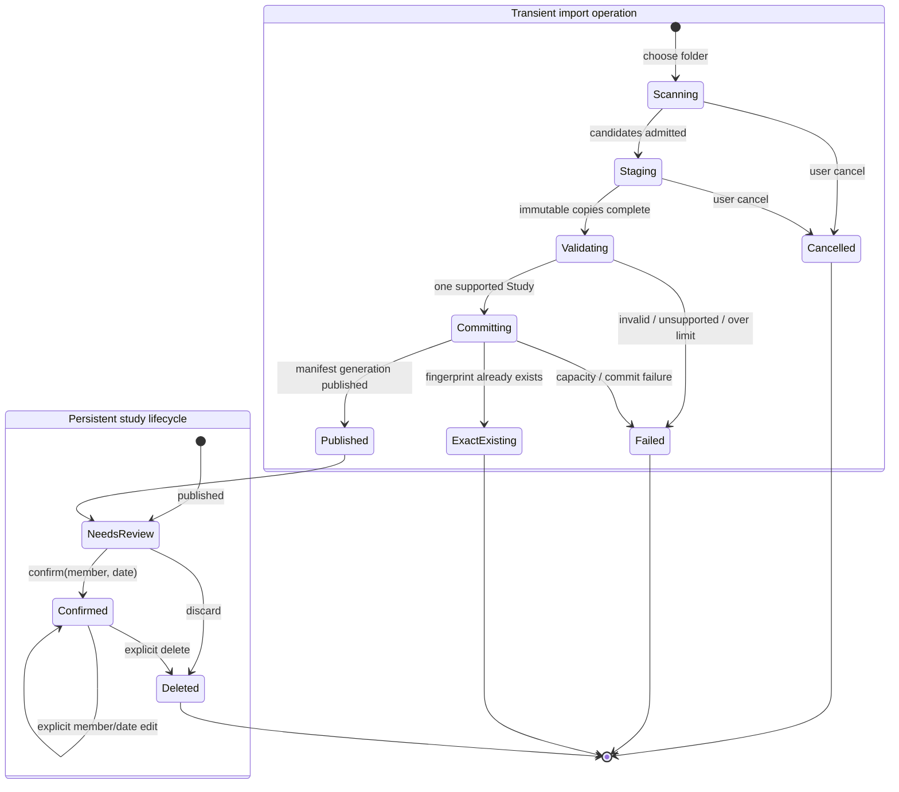

# Kinlogue DICOM MRI 二维查看器 - Plan

## Goal Capsule

- **Objective:** 在 Kinlogue macOS App 中以一次检查为单位安全导入本机 DICOM 文件夹，基于 DICOM-Swift 1.3.3 查看经典单帧、未压缩 MR 序列，并提供切片浏览、窗宽窗位、缩放、平移和有限非身份元数据。
- **Authority order:** 本 Product Contract 定义目标行为；Planning Contract 定义实现方式；当前代码、测试、`README.md`、`PRIVACY.md` 和专题文档仍是实施前现状的事实来源。
- **Execution profile:** 先通过依赖与隐私硬化门禁，再落地 catalog v3 和独立 DICOM aggregate；随后完成文件级原子导入、按需解码、确认流程和二维 Viewer。U1 或 U2 的停止条件失败时，不得继续把 DICOM 能力接入 production composition。
- **Stop conditions:** DICOM-Swift 的可达日志会泄漏路径、文件名、UID 或 DICOM 自由文本；畸形 Part 10 输入能逃出独立解码 Helper、超时后继续工作或越过统一资源预算；主 App link map/Mach-O 出现 `DicomCore`/DICOM 网络实现，Helper 获得网络 entitlement/Vault 根权限或运行时出现 socket 活动；catalog v3 无法通过 successor/rollback 数据保全；跨故障测试出现可见半检查、悬空引用或原件丢失；合成像素门禁无法证明显示变换正确。任何一项触发都返回依赖/隔离架构决策，不静默扩大实现。
- **Tail ownership:** 执行者负责代码、合成 fixture、包资源、依赖许可、迁移/回滚、自动化、安装验收、文档和死代码清理。私有 MRI 样本、真实设备操作、VoiceOver 人工检查和独立可信 Viewer 的视觉比对只能作为仓库外人工门禁，不得进入 Git 或验收产物。

---

## Product Contract

### Summary

Mac 用户从“影像”入口选择一个文件夹。Kinlogue 递归扫描普通文件，识别一个 DICOM Study，将可查看的经典单帧 MR Image 实例按 Series 分组，把有效但非图像的 DICOM 对象作为不可主动渲染的原件保留，并在一次 Vault generation 中发布整个检查。导入完成后，用户先确认家庭成员和有效日期；确认前可在 review 中查看，确认后才进入独立影像资料库。

Viewer 展示一个 Series 的二维切片，支持按空间几何排序后的切片导航、窗宽窗位、缩放、平移、适合窗口和重置。首版不进入报告时间线、OCR、搜索或比较，也不提供 MPR、MIP、测量、全量 tag inspector、SR 展示或医学解释。

### Problem Frame

当前导入链路只支持单个 PDF 或 ImageIO 图像。`ValidatedImportedFile` 持有完整 `Data`，`VaultImportDraftStore` 把一份原件绑定到报告/OCR 语义，通用原件 Viewer 又会把整个 attachment 读入内存。这些假设不适用于包含数百实例、总体积可达数百 MiB 的 DICOM 检查，也不能表达 Study → Series → Instance 的结构、空间排序和按切片解码。

DICOM 还把患者身份、设备信息、自由文本和像素放在同一容器中。导入器必须把文件视为不可信附件，持久化严格 allowlist 的查看索引，避免第三方 decoder 日志和错误穿透，并明确区分“能够在本机查看”与“诊断级软件或医学结论”。

### Actors

- A1. **Mac 用户:** 选择一个检查文件夹，查看预检结果，取消或确认导入，指定家庭成员与有效日期，浏览或删除检查。
- A2. **Kinlogue import pipeline:** 有界扫描、分类、验证、摘要、暂存和原子发布；只输出聚合状态和可操作错误。
- A3. **Kinlogue Viewer:** 从已验证 Vault 对象按需解码一个切片，应用显示变换，隔离过期请求并维护有界内存缓存。

### Requirements

**Directory intake and classification**

- R1. Kinlogue must import one user-selected directory as one examination, recurse to a maximum depth of 16, inspect at most 10,000 directory entries, accept regular files only through descriptor-relative no-follow traversal, and keep the security-scoped/root-bound source lease until every admitted file is copied to opaque owned staging or aborts. The decoder must never receive a user source path.
- R2. A selection must contain at least one valid DICOM object and exactly one `StudyInstanceUID`. Ordinary non-DICOM files are ignored and reported only by aggregate count; mixed studies fail before publication.
- R3. The MVP accepts DICOM Part 10 files only. A decoder-independent envelope check must validate preamble/meta-header framing, bounded lengths and checked arithmetic before DICOM-Swift sees the opaque staged copy. A viewable image instance must be classic single-frame MR Image Storage encoded as Explicit VR Little Endian (`1.2.840.10008.1.2.1`); another image SOP class/transfer syntax, multiple frames, malformed required tags or invalid pixel length fails the whole import before publication.
- R4. Valid non-image DICOM objects, including SR, must be retained as inert original attachments and indexed as not viewable. They must not appear as image Series and must not be parsed into medical findings.
- R5. One import must enforce at most 2,000 DICOM objects, 2 GiB unique source bytes, 100 MiB per object, 8,192 × 8,192 pixels per frame and 128 MiB decoded sample bytes. Catalog-wide limits are 256 studies, 4,096 Series and 10,000 retained DICOM objects while also respecting the existing 20,000-object, 64 MiB manifest and 16 MiB per-index limits. Admission reconciles owned orphan staging first, bounds the worker queue to two metadata/decode workers and eight open source/staging descriptors, and checks capacity before staging and again under the final catalog lock. Required free space is at least `2 × unique staged bytes + 256 MiB`; failure leaves zero catalog mutation.
- R6. A recognized DICOM image that fails validation, an unsupported image, a same-SOP-UID/different-content conflict or a resource-limit violation must abort the full examination. Exact duplicate files with the same SOP UID and verified digest/length may collapse to one instance and increment only an aggregate ignored-duplicate count.

**Study identity, review and persistence**

- R7. DICOM must use a dedicated `DICOMStudy` aggregate and closed state type, not `ImportDraft`, `HealthRecord`, OCR documents or ordinary original navigation. Durable `needsReview` carries no confirmed ownership; `confirmed(memberID,effectiveDate)` requires an existing active member and valid date. Scan/validate/stage/commit progress is a separate transient operation state and is recoverable only through owned staging artifacts.
- R8. A newly published study remains `needsReview` until A1 chooses an active family member and confirms a visible effective date. Review may open the Viewer; only `confirmed` studies appear in the normal Imaging library. A later explicit metadata edit may reassign member/date atomically but cannot change study ID, fingerprint, index or attachments; exact re-import cannot downgrade or overwrite confirmed metadata.
- R9. The MVP must not add DICOM content to the report timeline, OCR, search, record comparison or clinical inference. The Imaging library is a separate navigation destination that can filter by active family member.
- R10. Every original DICOM object must remain an immutable `.attachment`. One self-describing, independently versioned `.record` index per study stores only grouping/order/render fields. Catalog v3 is the reachability/deletion authority for the study header, index reference, fingerprint and attachment ID set; the index is the canonical Series/instance order authority. Commit, reopen, migration and rollback must prove that both attachment sets are exactly equal, every instance maps to one declared attachment and the fingerprint recomputes from that graph.
- R11. Raw Study/Series/SOP UIDs and acquisition date are transient importer inputs and must not be copied into the index. The index may contain local opaque IDs, domain-separated vault-local UID digests strictly for conflict detection, fixed SOP class/transfer syntax/modality enums, numeric Series/instance identifiers, geometry, dimensions, pixel representation, photometric interpretation, rescale and window parameters. The digest is correlation minimization, not encryption. Patient names, birth dates, accession numbers, institution/physician/device free text, comments and broad tag dumps must not enter the index or UI; the user-confirmed effective date is the only persisted study date.
- R12. Study identity uses a versioned, unambiguous, order-independent fingerprint over every unique retained DICOM object after exact duplicate collapse, including inert non-image objects; ignored duplicate count and ordinary non-DICOM files do not participate. Re-importing that identity resolves to the existing study without changing its state or metadata. Study deletion removes only last-owned index/attachments. A member with confirmed studies cannot be deleted until those studies are explicitly reassigned or deleted; no implicit cascade removes imaging. Vault close/destroy or member/study switch cancels decode work and clears sensitive caches.
- R13. Catalog v3 must migrate v1/v2 without changing existing logical identities or content, reject newer/invalid versions before mutation and have a clean-source preparatory rollback artifact that can read/write v3 and preserve DICOM roots before the Viewer candidate is considered releasable. Historical v2 downgrade is unsupported and must fail closed; every mutation rechecks on-disk version/generation under coordination so a stale v2 writer cannot overwrite v3.

**Image ordering and display correctness**

- R14. Import-time Series grouping uses transient DICOM UIDs and persists local opaque grouping IDs plus ordering provenance/policy version. Slice order uses the projection of `ImagePositionPatient` onto the normal derived from `ImageOrientationPatient`; `InstanceNumber` and then an opaque stable content identifier are deterministic warned fallbacks. Reopen validates the persisted order and never silently reorders an old study under a changed tolerance/algorithm; file name and path never affect identity or ordering.
- R15. A viewable Series must have internally consistent rows, columns, samples, bit layout and approximately consistent orientation. Geometry ambiguity or incompatible frames must produce an actionable Series/study validation failure rather than a silently wrong stack.
- R16. Pixel presentation must correctly honor Bits Allocated/Stored, High Bit, signed/unsigned Pixel Representation, Rescale Slope/Intercept, MONOCHROME1 inversion and finite Window Center/Width. When valid W/L metadata is absent, a deterministic robust range derived from decoded pixels becomes the displayed default.
- R17. Slice decoding must be on demand under one 384 MiB DICOM-owned memory reservation covering mapped/source bytes, decoded samples, transform output, current render buffer, GPU upload, active work, prefetch and cache. Reusable canonical-intensity cache is at most 32 slices or 192 MiB; W/L history is never a cache key and only the current replaceable render buffer is retained. The scheduler permits one foreground decode plus at most one discardable prefetch; a predicted working set above 64 MiB disables prefetch and serializes work. Request generation, vault root/session token and instance identity prevent stale repaint; memory pressure/lifecycle events evict and release reservations.
- R18. The Viewer must offer a Series list, current/total slice indicator, slider, arrow-key navigation, primary drag for W/L, Space-drag or secondary drag for pan, pinch or Command-scroll for zoom, and explicit Fit and Reset actions. Gesture mode and current W/L/zoom must remain visible or discoverable without relying on color alone. Selecting another Series or slice immediately clears the prior pixel buffer and presents a labeled loading state. A slice-local failure keeps navigation available, presents a stable non-sensitive error with a focusable Retry action, and may update the canvas only if the retry still matches the current request generation; loading and failure transitions are announced to assistive technology.
- R19. The Viewer displays only a limited non-free-text summary: user-confirmed date/member context, modality, stable Series ordinal/number, dimensions, slice count, current slice ordinal and viewability/warning state. Internal UIDs and source paths are not user-facing in the MVP.

**Privacy, errors and verification**

- R20. User-facing and diagnostic errors may include stable Kinlogue error code, phase, counts and opaque IDs, but never original path, file name, DICOM UID, patient tag value, decoder free text or pixels. DICOM-Swift errors and types must not cross the Platform adapter.
- R21. DICOM pixels may contain burned-in identifiers. Kinlogue must preserve original bytes but must not OCR, search, index or automatically export pixels, and must not create persistent previews or screenshots in the MVP. Plaintext staging lives only inside the bound Vault container on the same controlled volume, uses opaque private-permission names, is excluded from backup/indexing, and follows ownership-checked restart cleanup. A durable opaque import journal records each promoted object before publication. Idempotent reconciliation runs under the Vault lifecycle lock at startup and before the next import, compares the current catalog reachability set before unlinking, preserves objects adopted by another transaction, retries failed unlinks and exposes only aggregate cleanup status. Deletion is ordinary logical-unreachability plus unlink, never described as secure erasure.
- R22. DICOM-Swift 1.3.3 and resolved transitive dependencies must be exact and auditable, and only the separately signed `KinlogueDICOMDecoderHelper` XPC service may depend on/import `DicomCore`. The main App, Core and Platform Mach-O/source/dependency graph must contain no `DicomCore` or DICOMweb/DIMSE/SCP/JPIP implementation. The Helper must use its own App Sandbox profile with no inherited or explicit network entitlement and no Vault-root access; it receives one read-only descriptor, copies it to one private opaque per-request file, exposes only bounded length-framed DTOs, and exits or is invalidated after the request. The Helper's source/call allowlist permits only the per-file decoder even though exact upstream contributes inert network symbols to its own Mach-O; runtime canaries must prove no listener/outbound socket. Required resource bundles and licenses remain exact. Failure triggers the stop condition rather than an in-process fallback.
- R23. Tests and documentation use only generated, identity-free fixtures. A private MRI study may be used for local manual comparison, but its path, names, UIDs, tags, pixels, screenshots and sample-derived report data must not enter Git, logs, docs, `dist/` or acceptance artifacts.
- R24. Keyboard-only and VoiceOver users must be able to select a Series, move slices, inspect slice position, reset the view and understand loading, warning and failure states. The image must have a non-diagnostic accessibility description without reading DICOM free text.

### Key Flows

- F1. **Import one examination directory**
  - **Trigger:** A1 chooses “导入 DICOM 检查” and selects a directory.
  - **Steps:** A2 acquires the scoped directory, performs bounded descriptor-relative admission, copies candidates once into opaque immutable staging, then runs the envelope/decoder/classification/hash/index checks only against staged bytes. It presents aggregate Series/image/non-image/ignored counts and resource failures before the catalog commit.
  - **Outcome:** One atomic catalog generation publishes a `needsReview` study, or no visible study/reference changes.
  - **Covers:** R1–R7, R10–R11, R20–R23.
- F2. **Review and confirm the study**
  - **Trigger:** F1 publishes a new study or re-import resolves an existing one.
  - **Steps:** A1 may inspect viewable Series, chooses an active member and date, then confirms. An exact re-import routes to the existing review/library destination.
  - **Outcome:** A new study becomes `confirmed` exactly once and appears only in Imaging, or the existing destination opens without duplication.
  - **Covers:** R7–R13, R19.
- F3. **Browse a 2D Series**
  - **Trigger:** A1 opens a study from review or Imaging and selects a viewable Series.
  - **Steps:** A3 orders slices by R14, decodes the requested frame under R15–R17, applies R16, then accepts R18 controls while cancelling stale work.
  - **Outcome:** The requested slice and limited metadata are rendered without loading the whole study or leaking decoder/path details.
  - **Covers:** R14–R21, R24.
- F4. **Cancel, fail and recover import**
  - **Trigger:** A1 cancels, disk capacity changes, validation fails, a write fault occurs or the App restarts during F1.
  - **Steps:** A2 stops scanning/copying, leaves the old catalog authoritative and reconciles owned staging by opaque import ID.
  - **Outcome:** No partial study is visible; no committed attachment is deleted; recoverable staging is cleaned without consulting display names.
  - **Covers:** R1–R7, R10, R13, R20, R23.
- F5. **Close or delete sensitive imaging state**
  - **Trigger:** A1 closes/switches the Viewer, deletes a study/member or destroys the Vault.
  - **Steps:** The App cancels requests, clears caches, validates ownership and atomically removes logical roots before last-reference object cleanup.
  - **Outcome:** No stale pixels repaint, shared objects survive, and deleted last-owned originals become unreachable and are cleaned under existing Vault rules.
  - **Covers:** R12, R17, R20–R21, R24.

### Acceptance Examples

- AE1. **Covers R1–R5, R7, R10.** Given a generated identity-free classic MR study with three Series and one valid SR object, when A1 imports its directory, then exactly one `needsReview` study, all unique originals and one bounded index survive reopen; the three image Series are viewable and SR is retained but not rendered.
- AE2. **Covers R2, R6, R20.** Given valid objects from two Study UIDs, when preflight completes, then import fails with a mixed-study code and aggregate counts, while catalog generation and reachable objects remain unchanged and no UID/path is logged.
- AE3. **Covers R3, R6.** Given one compressed, multi-frame or unsupported image among otherwise supported MR images, when preflight runs, then the whole examination fails before staging publication and no partial Series appears.
- AE4. **Covers R4, R9, R21.** Given a valid SR object containing structured medical content, when the study is reviewed, then the object is retained only as an inert attachment, no SR text enters index/search/timeline and the Viewer reports one aggregate unsupported object.
- AE5. **Covers R5–R6, R12.** Given duplicate files with identical SOP UID, digest and length, when import runs, then one instance is indexed. Given the same SOP UID with different bytes, import fails with no mutation.
- AE6. **Covers R1, R5, R7, R10, R13.** Given source replacement/growth/truncation/symlink swap, cancellation, disk-full or an injected fault at every staging/object/index/manifest/cleanup boundary, when the App reopens, then either the old catalog or one complete study backed by the exact staged bytes is visible. Cancellation enters `cancelling` within 250 ms and stops new reads/writes within one second for a 100 MiB source; cleanup may leave only an owned unreachable orphan and never deletes an object another transaction adopted.
- AE7. **Covers R8–R9.** Given a new study without member/date confirmation, when the normal library loads, then it is absent from Imaging, timeline, search and comparison but available in review. After confirmation it appears once in Imaging under the selected member.
- AE8. **Covers R10, R12.** Given an exact complete re-import, when the fingerprint is checked at the catalog coordination boundary, then no new study or attachment is published and A1 can open the existing destination.
- AE9. **Covers R10, R12–R13.** Given catalog v2 data, when the v3 migrator runs across every fault boundary, then existing records/drafts/attachments and identities are preserved. A stale process opened on v2 cannot overwrite a later v3 generation. Given a Viewer candidate writes a DICOM study, the exact preparatory v3 build reopens and preserves state, fingerprint, index/attachment closure and digests through an unrelated write; a historical v2 build refuses the Vault without mutation.
- AE10. **Covers R14–R16.** Given shuffled generated slices with valid oblique geometry, when the Series opens, then order matches normal-vector projection rather than file name. Removing geometry produces the deterministic warned Instance Number fallback.
- AE11. **Covers R15–R16.** Generated signed and unsigned fixtures prove Bits Stored/High Bit masking, rescale, MONOCHROME1 inversion, explicit W/L and missing-W/L fallback against exact expected grayscale output; inconsistent geometry or pixel layout fails rather than rendering.
- AE12. **Covers R17–R18.** Given 30 slice selections per second, continuous W/L drag and immediate Series switching, when older decodes complete later, then the queue retains only the newest foreground request plus one allowed prefetch, only the newest vault/study/Series/slice request updates the canvas and no W/L history is cached. On the current Mac, input handling performs under 8 ms main-thread work, cached W/L/slice update p95 is under 16 ms and uncached representative foreground slice p95 is under 150 ms.
- AE13. **Covers R17, R20–R21.** Given Viewer close, memory pressure, Vault close or destroy during decode, when lifecycle handling completes, then active tasks are cancelled, cached pixels are released and later callbacks cannot expose a path, decoder error or stale image.
- AE14. **Covers R18–R19, R24.** Given keyboard-only and VoiceOver operation, when A1 selects Series, changes slices/W/L/zoom, pans, fits and resets, then every action has an accessible control/state description and no patient/free-text DICOM tag is announced.
- AE15. **Covers R22–R23.** Given a clean release build, when dependency/source/call allowlists, both link maps/Mach-O files, XPC bundle resources/signatures, notices, entitlements, socket monitor, unified-log canary and privacy scans run, then exact approved revisions/resources are present; only the Helper contains `DicomCore`; the main App contains no DICOM network implementation; the Helper has no network entitlement, Vault-root authority or runtime socket activity; and no synthetic canary or private sample material appears in logs/artifacts.

### Success Criteria and Scope Boundaries

- All AE1–AE15 automated portions pass with generated fixtures on the current Mac; full bundle and installed synthetic acceptance also pass.
- A private local sample can open every supported image Series and visually match the same slice/W/L in an independent trusted Viewer. This is manual compatibility evidence only, not a committed artifact or diagnostic validation.
- Explicitly out of scope: compressed transfer syntaxes, Enhanced/multi-frame MR, color images, DICOMDIR semantics, PACS/DICOMweb/DIMSE/network retrieval, SR rendering, metadata inspector, annotations, measurements, export, MPR/MIP/3D, automatic clinical interpretation and report timeline/search/comparison integration.

---

## Planning Contract

### Context & Research

**Current repo patterns**

- `Sources/KinlogueCore/Import/ImportWorkflow.swift`, `Sources/KinloguePlatform/Import/ImportedFileValidator.swift` and `VaultImportDraftStore.swift` are single-report/OCR paths that retain full source `Data`; they are reference points for validation/error style, not DICOM extension points.
- `Sources/KinloguePlatform/Import/VaultReportSelectionStaging.swift` and `PlaintextVault.commitStagedReportSelection` already prove descriptor-backed verified copy plus manifest-last publication without aggregating originals in memory. DICOM import generalizes this pattern.
- `VaultCatalog.reachableObjectReferences`, `VaultCatalogDeletion` and `PlaintextVaultCatalogMigrator` own object reachability, deletion and version transitions. A new catalog root requires v3; silently adding an optional v2 field would let older writers discard DICOM reachability.
- `OriginalDocumentPayload` and `OrderedOriginalDocumentView` eagerly read/render ordinary originals and must not receive DICOM studies. New App service DTOs keep opaque IDs and pixels separate from Vault URLs and Helper-private DicomCore types.
- Release scripts currently allow one direct dependency and one Kinlogue resource bundle. DICOM-Swift adds exact package graph, notice and resource-bundle obligations that must be verified before UI work.

**DICOM-Swift 1.3.3 findings**

- The exact tag exposes `DicomCore`, depends on ZIPFoundation, bundles its dictionary/Metal resources and contains more protocol surface than the local file Viewer needs.
- `DCMDecoder(contentsOf:)` is the intended low-level file entry and supports lazy pixel access. `StudyDataService` and whole-series loaders are rejected because they can log full paths, fan out unbounded tasks or retain an entire volume.
- The decoder owns its logger and does not accept a Kinlogue log sink. U1 must prove the narrow call path cannot emit source-derived values; the wrapper may map errors, but wrapping alone cannot sanitize an OSLog already emitted by the dependency.
- A 2026-08-07 minimum release consumer proved that exact 1.3.3 still links Network/CFNetwork plus SCP/DIMSE/DICOMweb symbols even when it calls only `DCMDecoder`. The user therefore approved keeping the official exact package behind a separately sandboxed Helper rather than linking it into the main App or maintaining a fork.
- A local read-only probe of the private sample established feasibility for its supported single-frame Explicit VR Little Endian images. That probe is not proof of display correctness, broad DICOM compatibility or release privacy.

**Standard grounding**

- DICOM PS3.3 defines Image Orientation (Patient) as the first row and column direction cosines and Image Position (Patient) as the first voxel position; KTD5 uses their cross product and position projection for slice order.
- DICOM PS3.5 defines transfer syntax encoding. The MVP allowlist is intentionally narrower than the standard and decoder capability: only R3's Explicit VR Little Endian classic MR images are viewable.
- No prior DICOM institutional learning exists in `docs/solutions/`; implementation should capture verified dependency, fixture and failure lessons after completion without copying private sample data.

### Key Technical Decisions

- KTD1. **Pin the exact upstream DICOM-Swift 1.3.3 package and expose only Kinlogue-owned contracts.** (session-settled: user-approved — chosen over wholesale OpenDicomViewer integration and DICOMHERO because the selected package fits the native Swift/offline architecture while keeping a replaceable boundary.) Only the separate `KinlogueDICOMDecoderHelper` target imports `DicomCore`; `KinloguePlatform` talks to a Foundation-only `KinlogueDICOMIPC` contract, while Core and App receive bounded Kinlogue DTOs and error codes. Governs R3, R16, R20, R22.
- KTD2. **Isolate exact upstream parsing in a separately sandboxed, no-network Helper.** (session-settled: user-approved on 2026-08-07 after the minimum release consumer proved that direct main-process linkage retains SCP/DIMSE/DICOMweb code.) Before schema/UI implementation, build and separately sign an XPC service with its own App Sandbox entitlements, no inherited/network capability and no Vault-root access. The main process performs the decoder-independent Part 10 envelope, passes one read-only descriptor plus a length-framed bounded request, validates a bounded response and invalidates the per-request connection on completion/timeout/cancellation; the Helper copies only that descriptor into a private opaque request file, calls `DCMDecoder(contentsOf:)`, maps all results/errors and removes the copy. Mutation tests kill/crash/hang the Helper without crashing or granting it access to unrelated Vault objects. Main App link/source/dependency scans must contain no `DicomCore` or DICOM network implementation; Helper scans allow exact-upstream inert symbols but forbid their construction/call paths, network entitlements and runtime sockets. Do not use `StudyDataService`, DICOM CLI validation, DICOMweb, DIMSE, SCP, JPIP or full-series loaders. Failure never falls back to in-process parsing or weakens `PRIVACY.md`. Governs R3, R5, R20, R22–R23.
- KTD3. **Introduce a dedicated catalog v3 DICOM root with one closed graph.** `VaultCatalog.dicomStudies` contains bounded study headers, closed state/member/date, versioned fingerprint, self-describing/versioned index object ID and the authoritative attachment ID set. `DICOMStudyIndex` is the order authority and its instance references must equal that set exactly; originals stay `.attachment`. Every mutation rechecks on-disk version/generation. A v3 preparatory build is immutably archived before UI publication; historical v2 downgrade is forbidden. Chosen over report/OCR reuse or an optional v2 field an older writer could strip. Governs R7–R13.
- KTD4. **Stage once, then derive every durable fact from immutable bytes.** Bounded descriptor-relative traversal first copies each admitted regular file to private opaque staging while hashing under a fixed two-worker/eight-descriptor budget. Only staged copies enter Part 10/decoder validation, classification and index construction; source-path previews are non-authoritative and omitted. Capacity is checked before staging and at the final lock, with at most three full reads, two Vault writes and `2 × uniqueBytes + 256 MiB` peak added disk. Objects/index are written before the manifest; a durable opaque import journal records every promoted object before publication. Lifecycle-locked startup/pre-import reconciliation consults current catalog reachability, preserves objects adopted by another transaction and retries failed unlinks, so a failed cleanup leaves only a bounded, discoverable orphan for the next successful reconciliation. Governs R1–R6, R10, R21, R23.
- KTD5. **Persist versioned canonical display order at import time.** For each consistent Series, normalize orientation, derive the slice normal from the row/column cross product and sort by position projection with tolerance. Persist local opaque IDs, result, policy version and warning provenance—not raw UIDs; use Instance Number then opaque content identity only when geometry is unavailable. Reopen validates rather than silently recomputes; algorithm changes require an explicit index migration. Governs R11, R14–R15.
- KTD6. **Keep display transforms Kinlogue-owned, deterministic and testable outside SwiftUI.** DICOM-Swift extracts bounded raw samples and tags only. Kinlogue pure transformers own Bits Stored/High Bit, signedness, rescale, window and MONOCHROME inversion, then return an immutable single-channel buffer plus non-sensitive state. Exact synthetic pixel expectations, not screenshots, are the authority; unified checked byte accounting reserves source/raw/transform/render/texture work before allocation. Governs R15–R17, R21.
- KTD7. **Decode one requested slice under a short, ordered Vault lifecycle lease.** Lock order is lifecycle → catalog mutation/open validation → slice cache, never the reverse. The lease revalidates root/session generation and object digest, then initializes the decoder and extracts an owned bounded raw snapshot; decoder, URL and mapped data cannot escape. Catalog coordination is released before transform/render work. Cache keys include vault root/session token plus content identity; one foreground request preempts a disposable prefetch, canonical intensity is reusable and only the current W/L render survives. Destroy fences new leases, cancels work and waits for active open/map sections before cleanup. Governs R12, R17, R20–R21.
- KTD8. **Keep imaging review/library separate from reports.** Import publishes `needsReview`; member/date confirmation changes only the DICOM aggregate; confirmed studies appear in a dedicated Imaging destination. No adapter fabricates a `HealthRecord`, OCR document or report source. Governs R7–R9, R19.
- KTD9. **Use versioned content identity for idempotence and transient UIDs for validation.** Fingerprint v1 encodes a domain/version, unique retained-object count and length-framed sorted digest/length pairs after duplicate collapse; it includes images and inert objects and excludes ignored files/counts. Raw UIDs group/validate only while importing; vault-local domain-separated UID digests detect later conflicts without duplicating raw identifiers. Equal UID with unequal bytes is a conflict. Governs R2, R6, R10–R12.
- KTD10. **Treat privacy-safe output as part of decoder correctness.** The adapter maps every dependency failure to a fixed Kinlogue code before App presentation; logs contain only allowlisted phase/code/count fields. Persistent pixels/thumbnails, free-text tag display and sample screenshots remain absent. Governs R11, R19–R23.

### High-Level Technical Design

The diagrams communicate ownership and sequencing, not exact Swift APIs.

```mermaid
flowchart LR
  Folder["Security-scoped examination folder"] --> Scan["Descriptor-relative bounded admission"]
  Scan --> Stage["Opaque immutable staging"]
  Stage --> Envelope["Part 10 envelope + bounded request"]
  Envelope --> InspectHelper["No-network sandboxed decoder Helper"]
  InspectHelper --> Adapter["Validated Kinlogue DTO"]
  Adapter --> Preflight{"One supported Study?"}
  Preflight -->|"No"| Failure["Aggregate typed failure; zero catalog mutation"]
  Preflight -->|"Yes"| Commit["Objects/index then atomic catalog v3 manifest"]
  Commit --> Review["DICOM study needs review"]
  Review --> Confirm["Confirm member + effective date"]
  Confirm --> Imaging["Dedicated Imaging library"]
  Review --> Viewer["2D Series Viewer"]
  Imaging --> Viewer
  Viewer --> Slice["On-demand slice service"]
  Slice --> Vault["Short verified Vault lease"]
  Vault --> Decode["Read-only descriptor + Helper client"]
  Decode --> SliceHelper["Same sandboxed Helper"]
  SliceHelper --> Transform["Kinlogue pixel transformer"]
  Transform --> Cache["Bounded canonical buffer/cache"]
  Cache --> Viewer
```

### System-Wide Impact

- **Domain/schema:** `VaultCatalog.currentFormatVersion` advances to 3 and gains a bounded closed-state DICOM aggregate. Catalog attachment IDs own reachability/deletion; the self-described/versioned index owns order and must close over exactly the same set. `reachableObjectReferences`, member dependency and inventory include index/attachments.
- **Migration/rollback:** v1/v2 migrate to v3 with existing data preserved. A clean-source catalog-v3 preparatory artifact is installed, verified and immutably archived before study-writing UI; successor → exact preparatory rollback → successor rehearsal compares full graph/digests. Historical v2 downgrade fails closed.
- **Import/filesystem:** Folder selection adds descriptor-relative admission and private same-volume staging. The decoder sees only opaque immutable staging. Display names never form paths. Manifest-last gives logical atomicity; cleanup runs after reachability checks and may defer orphan reclamation without undoing a committed catalog.
- **Decoder boundary:** `DicomCore` is Helper-only. A Foundation-only shared IPC contract contains bounded request/response/error DTOs; its messages never carry source paths, DICOM free text or raw dependency errors. The main App passes a single verified read-only descriptor, and the Helper has no Vault-root or network authority. The XPC bundle, exact transitive revisions and resource bundles enter build/sign/verification allowlists.
- **App state:** Three ports separate import command/progress, lightweight study library/query and bounded slice provider. `AppSnapshot` carries summaries only—never the index attachment set or pixels. Existing report draft, timeline, search and comparison behavior stays unchanged.
- **Concurrency/performance:** Import uses a two-worker/eight-descriptor bounded queue and records read/write amplification. Lifecycle → mutation/open → cache is the only lock order; no async transform/UI await occurs under catalog coordination. Slice work uses one global memory reservation, one foreground decode and one disposable prefetch; App view models use `@MainActor`, request generations and cancellation.
- **Failure propagation:** Preflight errors are examination-wide; Viewer decode errors are slice/Series-local and retryable without catalog mutation. All dependency errors are mapped before presentation/logging.
- **Privacy:** Original DICOM keeps full source metadata and burned-in pixels as an inert local attachment; the index and UI deliberately expose less. No automatic OCR/export/persistent preview is introduced.
- **Release:** Package graph, notices, resource copy/signing, privacy scan, release executable scan, synthetic installed acceptance and current docs must all change together.

### Sequencing

1. U1 proves the settled dependency can meet package, logging and no-network-client boundaries; stop if it cannot.
2. U2 introduces the independent model and catalog v3 with a preparatory rollback checkpoint before any DICOM study is created by production UI.
3. U3 implements scan → preflight → stage → atomic publish and durable lifecycle using generated fixtures.
4. U4 implements verified on-demand pixel access, canonical sorting/display transforms and memory/cancellation bounds while U5 can independently expose import/review/confirmation/library on U3.
5. U5 exposes study review, confirmation, library, idempotence and deletion through real App service seams without taking a slice-provider dependency.
6. U6 joins the completed U4 slice provider and U5 product flows into the accessible two-dimensional Viewer.
7. U7 runs the full synthetic/release/privacy matrices, performs private manual compatibility checks outside artifacts and updates current-capability documentation only after evidence exists.

### Risks & Dependencies

- **Uncontrollable dependency logs:** `DCMDecoder` owns a logger. KTD2 tests the exact reachable path with path/UID/tag canaries; any leak blocks production integration rather than relying on wrapper redaction after emission.
- **Hostile parser before Kinlogue metadata limits:** Malformed lengths/sequences can attack before high-level checks. KTD2 admits only bounded Part 10 envelopes, contains exact 1.3.3 in a per-request Helper and requires crash/timeout/cancellation to invalidate that process without exposing unrelated Vault data; a throwing API alone is not isolation.
- **Unused network code in exact upstream:** DicomCore contains protocols outside this feature and a minimum release consumer proved they remain linked. KTD2 keeps them out of the main App, gives the Helper no network entitlement, forbids network object construction in the call/source allowlist and requires zero runtime socket activity.
- **Schema downgrade data loss:** An older catalog writer could drop unknown DICOM roots. KTD3 requires v3 and a preparatory compatible rollback artifact before the feature candidate.
- **Large examination memory/disk pressure:** A private sample is much larger than current single-file imports. KTD4 streams originals, R5 bounds the selection and checks temporary headroom, and KTD7 limits slice memory independently.
- **Source-directory TOCTOU:** Files and parent components can change while importing. R1/KTD4 take one no-follow descriptor-backed snapshot into opaque staging; all durable metadata and bytes derive from that snapshot, never a later path reopen.
- **Wrong anatomical order:** File names and Instance Number can be misleading. KTD5 uses patient geometry, persists warning provenance and rejects inconsistent viewable stacks.
- **Wrong grayscale presentation:** Signed/high-bit/rescale/window/inversion mistakes can produce plausible but false images. KTD6 makes generated exact pixel tests a release blocker and keeps a trusted-Viewer manual comparison as additional, non-diagnostic evidence.
- **Identity leakage through metadata or pixels:** Free-text tags and burned-in annotations remain in originals. R11/R19 expose only an allowlist; R21 prevents OCR/search/persistent previews; R23 prevents real sample material in artifacts.
- **Cross-operation races:** Import commit, exact re-import, deletion and Vault destroy can overlap. U3/U5 require real service and fault tests around the same catalog coordination and lifecycle fencing used by current Vault operations.
- **Plaintext remnants:** Staging can outlive a crash and ordinary unlink is not secure erasure. R21 confines/excludes/index-protects staging, recovery cleans only proven ownership, and docs retain the current plaintext/backup limitation.
- **Scope creep toward diagnostic software:** Viewer language, docs and acceptance must say local review aid, not diagnosis. Measurements, MPR/MIP, interpretations and medical conclusions stay out of the code and UI.

### Resolved During Planning

- The MVP uses a dedicated Imaging library and confirmation flow; it does not add studies to the existing report timeline/search/comparison.
- The persistent shape is catalog v3 plus one self-described/versioned `.record` study index and ordinary `.attachment` originals, not report/OCR reuse; catalog/index attachment sets must close exactly.
- Only classic single-frame MR Image Storage with Explicit VR Little Endian is viewable; other image formats fail the examination, while valid non-image objects remain inert.
- Folder selection containing multiple Study UIDs fails as one actionable error instead of silently splitting into several imports.
- Series descriptions and other DICOM free text are omitted from the first UI even if useful; stable ordinals/numeric fields provide navigation without copying avoidable identity-bearing text.
- Raw DICOM UIDs and acquisition dates are not duplicated into the index. Import uses them transiently, persists local IDs plus narrowly scoped domain-separated conflict digests, and stores only the user-confirmed effective date.
- Exact upstream DICOM-Swift 1.3.3 is linked only into a separately sandboxed XPC Helper; the main App never imports or links `DicomCore`, and the Helper receives one read-only descriptor without Vault-root or network authority.

### Deferred Beyond This Plan

- Expanding the transfer syntax/SOP allowlist requires a new compatibility and privacy matrix; it is not an implementation-time toggle.
- Unified timeline placement, DICOM search, safe metadata inspection, SR presentation, export and diagnostic-style tools require separate product decisions.
- A future move from the approved exact-upstream Helper to a maintained fork or another decoder returns to planning and explicit user approval.

---

## Implementation Units

### U1. Prove and package the DICOM-Swift 1.3.3 boundary

- **Goal:** Satisfy KTD1–KTD2 before persistence or UI depends on the Helper contract.
- **Requirements:** R3, R5, R20, R22–R23; AE15.
- **Dependencies:** Exact DICOM-Swift 1.3.3 tag, current Swift 6/macOS 14 package and release scripts.
- **Files:**
  - Modify `Package.swift`, `Package.resolved` and `THIRD_PARTY_NOTICES.md`.
  - Create the Foundation-only `Sources/KinlogueDICOMIPC/` contract, `Sources/KinlogueDICOMDecoderHelper/` service implementation and Helper `Info.plist`/entitlements under `packaging/`.
  - Create `Sources/KinloguePlatform/DICOM/DICOMDecoderAdapter.swift` as an XPC client that never imports `DicomCore`.
  - Create a non-product `KinlogueDICOMTestSupport` target under `Sources/KinlogueDICOMTestSupport/` and `Tests/KinloguePlatformTests/DICOMDecoderAdapterTests.swift`; later test/fixture-generator targets may depend on it, production targets may not.
  - Modify `Sources/KinloguePlatform/KinloguePlatform.swift`, `Tests/KinlogueCoreTests/ModuleBoundaryTests.swift`, `Tests/KinloguePlatformTests/ModuleBoundaryTests.swift`, `Tests/KinlogueAppTests/PackageGraphVerifierTests.swift` and `Tests/KinloguePlatformTests/LANPhoneAssetSafetyTests.swift`.
  - Modify `scripts/verify-package-graph.sh`, `scripts/build-app.sh`, `scripts/verify-app.sh` and privacy/release scan helpers.
- **Approach:** Add the exact dependency and make only `KinlogueDICOMDecoderHelper` depend on `DicomCore`; the App reaches it through `KinloguePlatform → KinlogueDICOMIPC`. Build a decoder-independent Part 10 envelope and length-framed DTO contract, package/sign the executable as an embedded XPC service with a distinct no-network sandbox profile, and pass only a read-only descriptor that the Helper copies to one private opaque request file. Inspect exact resolved source, both link maps/Mach-O files, call/source allowlists, entitlements and runtime sockets; copy/sign/verify DicomCore/ZIPFoundation resources and notices inside the XPC bundle. Mutation/fuzz canaries cover parser time/memory/crash, connection invalidation, logs and sockets. The package graph proves DicomCore and fixture support are unreachable from the main App product except through the bounded IPC client.
- **Execution note:** Author failing dependency graph, bundle, canary and adapter tests before changing production composition. Do not proceed to U2 until the full U1 gate passes.
- **Test scenarios:**
  - An identity-free Explicit VR Little Endian MR fixture initializes and exposes required raw tags/sample bytes through a replaceable Kinlogue contract; full display transforms remain U4 responsibility.
  - Corrupt/truncated/oversized and mutated element-length/SQ/delimiter/offset fixtures return fixed codes within declared time/memory bounds; a forced Helper crash/hang/oversized reply invalidates the request and leaves the main App alive without an in-process fallback.
  - Canary strings do not appear in captured unified logs, test output or built artifacts after every reachable failure path.
  - Core/Platform/App source scans and the main App Mach-O cannot import/link `DicomCore`; only the Helper may do so, and the IPC/adapter surface contains no URL/path-bearing value.
  - The package graph locks DICOM-Swift and all transitive revisions; unreviewed graph drift fails.
  - The signed App contains exactly one separately signed XPC service with the approved resources/notices; the main executable contains no `DicomCore`/DICOM network code; the Helper entitlement has no network or inherited capability, cannot read an unrelated Vault canary, and creates no listener/outbound socket even when network-like tags are present.
- **Verification:** A clean build and focused tests prove local decoding, XPC framing, descriptor-only access, crash/timeout isolation and resource loading. Package/release/privacy gates must pass for both the main App and Helper; partial success or in-process fallback is not enough.

### U2. Add the DICOM aggregate and catalog v3 compatibility checkpoint

- **Goal:** Give DICOM studies a bounded, independently owned persistent graph with tested v1/v2 migration and rollback safety.
- **Requirements:** R7–R13, R20, R23; AE5–AE9.
- **Dependencies:** U1.
- **Files:**
  - Create `Sources/KinlogueCore/Domain/DICOMStudy.swift` and `Sources/KinlogueCore/Domain/DICOMStudyIndex.swift`.
  - Modify `Sources/KinlogueCore/Domain/VaultCatalog.swift`, `VaultCatalogDeletion.swift`, `BoundedDecoding.swift` and `Sources/KinlogueCore/Storage/VaultProtocols.swift`.
  - Modify `Sources/KinloguePlatform/Storage/PlaintextVault.swift`, `PlaintextVaultCatalogMigrator.swift` and resource policies.
  - Modify `packaging/Info.plist`, package metadata, `scripts/verify-app.sh`, rollback archive/verifier scripts and acceptance drivers; add v3-specific installed acceptance rather than overwriting historical v2 evidence.
  - Create `Tests/KinlogueCoreTests/DICOMStudyTests.swift`, `DICOMStudyIndexTests.swift` and v3 deletion/reference tests.
  - Modify `Tests/KinlogueCoreTests/VaultCatalogDeletionTests.swift`, `Tests/KinloguePlatformTests/PlaintextVaultCatalogMigrationTests.swift`, `PlaintextVaultTests.swift`, `Tests/KinlogueStorageProcessTests/CatalogProcessCoordinationTests.swift` and rollback script safety tests.
- **Approach:** Implement KTD3/KTD9 with strict custom decoding, closed state-dependent fields, self-described index/policy/fingerprint versions and catalog-wide cardinality/encoded-size bounds. Catalog owns reachability; index order/reference mapping must close over exactly the same attachment set and recomputable fingerprint. Advance the writer to v3, migrate v1/v2 under manifest-last recovery, then install, verify and immutably archive the preparatory v3 artifact before any Viewer candidate can publish a study.
- **Execution note:** Start with malformed v3 decoding, v2 preservation and deletion ownership tests. Do not let App UI create a study in this unit.
- **Test scenarios:**
  - Missing/oversized/deep arrays, duplicate IDs, invalid numeric ranges, broken/extra/wrong-kind attachment/index references, metadata/digest mismatch and unsupported format versions fail before mutation or display.
  - `needsReview` cannot carry confirmed fields; `confirmed` always carries an existing member/date. Reconfirm/edit preserves study identity and content; exact re-import cannot downgrade confirmed state.
  - v1 and v2 fixtures migrate to v3 while preserving existing member/draft/record/attachment logical identity, OCR provenance and unknown allowed subtrees.
  - DICOM index `.record` references and all study attachments appear in the canonical reachable set; unrelated ordinary attachments remain unaffected.
  - Study deletion and member dependency handling preserve shared references and remove only last-owned objects.
  - Every migration fault boundary reopens as complete old or complete v3 state with no orphan referenced by the catalog; fingerprint/order policy versions remain unchanged.
  - A stale process opened on v2 cannot write over a later v3 generation; historical v2 reinstall fails closed, while the exact preparatory v3 bundle preserves a successor-created full graph/digests through reinstall and ordinary write.
  - Single and accumulated studies at catalog/manifest/object/index boundaries—including two concurrent individually admissible commits whose sum is not—produce one valid generation or a pre-object-write refusal.
- **Verification:** Core validation, storage, real-process coordination and installed catalog compatibility suites prove the new root is bounded, atomic and rollback-preserving before U3 can publish real studies.

### U3. Implement bounded folder import and atomic study publication

- **Goal:** Turn one security-scoped directory into one complete `needsReview` study without loading or publishing the examination piecemeal.
- **Requirements:** R1–R13, R20–R23; AE1–AE8.
- **Dependencies:** U1–U2.
- **Files:**
  - Create `Sources/KinlogueCore/DICOM/DICOMImportState.swift` and `DICOMImportPolicy.swift`.
  - Create `Sources/KinloguePlatform/DICOM/DICOMFolderScanner.swift`, `DICOMStudyIndexer.swift`, `DICOMImportWorkflow.swift`, `VaultDICOMStudyStaging.swift` and `VaultDICOMImportJournal.swift`.
  - Modify `Sources/KinloguePlatform/Storage/PlaintextVault.swift`, `PlaintextVaultLayout.swift`, `PlaintextVaultCatalogMigrator.swift` and object resource policies.
  - Create `Tests/KinloguePlatformTests/DICOMFolderScannerTests.swift`, `DICOMStudyIndexerTests.swift` and `DICOMImportWorkflowIntegrationTests.swift`.
  - Modify `Tests/KinloguePlatformTests/PlaintextVaultTests.swift`, vault fault matrices and `Tests/KinlogueStorageProcessTests/CatalogProcessCoordinationTests.swift`.
- **Approach:** Implement KTD4/KTD9 as a transient state machine. Descriptor-relative admission performs only safe envelope/size sniffing, then copies each candidate once to private same-volume opaque staging. Actual decoder initialization, classification, digest and bounded index derive only from immutable staged bytes—not the dependency's shallow validator or source URL. The final lock rechecks global capacity, graph/fingerprint/idempotence and writes objects/index before manifest, recording every promoted object in the durable opaque import journal first. Startup and pre-import reconciliation run idempotently under the lifecycle lock, compare current catalog reachability before unlinking, preserve objects another transaction adopted and retain aggregate-only retry status.
- **Execution note:** Generate all DICOM fixtures in tests; never copy the private sample or its derived metadata into the workspace.
- **Test scenarios:**
  - Covers AE1–AE5 across nested directories, ignored ordinary files, exact duplicate instances, valid SR retention, mixed Study UIDs, corrupt image, unsupported syntax/SOP/multi-frame and UID/content conflict.
  - Symlinks, special files, parent/file replacement, rename/delete/growth/truncation during copy and scope loss cannot escape the directory, send a source path to the decoder or create metadata/attachment byte skew.
  - Entry/depth/object/byte/frame/dimension/global catalog limits and both capacity checks fail with stable aggregate errors; measured peak added disk remains within `2 × uniqueBytes + 256 MiB`.
  - Two workers, eight descriptors and a fixed queue hold across the maximum candidate set. Cancellation and every copy/object/journal/index/manifest/directory-sync/cleanup fault satisfy AE6 and record at most three reads/two Vault writes per unique object; the next successful reconciliation removes every journal-owned, non-adopted orphan while preserving any currently reachable object.
  - Concurrent exact imports publish one study; different studies commit independently; deletion/destroy racing import converges without resurrecting roots.
  - Reopen no longer depends on the source folder and detects any tampered Vault attachment/index before decode.
- **Verification:** Platform integration and real-process tests observe one old/new catalog transition, staged-byte/index equality, peak queue/worker/descriptor/read/write/disk bounds and cancellation latency during a multi-hundred-file generated stress study, with zero path/log canary leakage.

### U4. Build geometry ordering and the on-demand slice service

- **Goal:** Decode and present one correct requested slice from verified Vault objects under fixed resource and lifecycle bounds.
- **Requirements:** R12, R14–R17, R20–R23; AE10–AE13.
- **Dependencies:** U1–U3.
- **Files:**
  - Create `Sources/KinloguePlatform/DICOM/DICOMSeriesGeometry.swift`, `DICOMSliceService.swift`, `DICOMSliceCache.swift` and display-transform helpers.
  - Modify `Sources/KinloguePlatform/DICOM/DICOMDecoderAdapter.swift` and internal verified-object access in `Sources/KinloguePlatform/Storage/PlaintextVault.swift`.
  - Create `Tests/KinloguePlatformTests/DICOMSeriesGeometryTests.swift`, `DICOMDisplayTransformTests.swift`, `DICOMSliceServiceTests.swift` and lifecycle/cache tests.
- **Approach:** Implement KTD5–KTD7. Persist versioned canonical order during import and validate—not silently recompute—it on open. Under the fixed lock order, a short verified-object lease produces an owned raw-sample snapshot and then releases catalog coordination before Kinlogue pure transform/render work. A global byte reservation covers decoder/source/raw/render/texture/cache allocations; cache keys include vault token/content identity, canonical intensity is reusable and each Viewer has only one replaceable W/L render. Foreground work preempts one disposable prefetch.
- **Execution note:** Exact pixel and order tests come before App rendering. Characterize decoder cancellation boundaries and bound any non-cancellable synchronous work by per-frame limits.
- **Test scenarios:**
  - Oblique/shuffled geometry, floating-point tolerance, reversed positions, missing geometry fallback and inconsistent orientation satisfy AE10.
  - Unsigned/signed, High Bit/Bits Stored, rescale, MONOCHROME1/2, explicit/missing W/L and non-finite metadata satisfy AE11.
  - Rapid requests, Series/study switch, decode failure, cancellation and late completion satisfy AE12 without stale results.
  - Cache count/byte/global reservation limits, checked multiplication, dynamic prefetch disable, LRU eviction, memory pressure, close/destroy and tampered object handling satisfy AE13.
  - Representative study scrolls three complete passes with current-Mac RSS increase at most 320 MiB; close returns within baseline + 32 MiB in five seconds. A maximum frame stays under 512 MiB RSS increase or is rejected before a second full-buffer allocation.
  - Controlled pauses across lifecycle, catalog open, cache, import/delete and destroy prove the lock order has no deadlock or lease crossing the destroy fence.
  - Returned errors/pixel DTOs contain no path, UID, decoder text or persistent preview; DicomCore types remain Helper-private.
- **Verification:** Deterministic generated expected values prove transform correctness; concurrency/lifecycle tests prove bounded work and stale-result exclusion without SwiftUI.

### U5. Add Imaging import, review, confirmation and library flows

- **Goal:** Expose the durable study lifecycle through the real App service seam while keeping report/OCR behavior unchanged.
- **Requirements:** R7–R13, R19–R24; AE6–AE9, AE14.
- **Dependencies:** U3. U4 may proceed in parallel; Viewer wiring waits for U6.
- **Files:**
  - Modify `Sources/KinlogueApp/App/AppServices.swift`, `AppComposition.swift`, `AppModel.swift` and `LibraryLifecycleCoordinator.swift`.
  - Create `Sources/KinlogueApp/ViewModels/DICOMImportModel.swift`, `DICOMStudyReviewModel.swift` and `DICOMLibraryModel.swift`.
  - Create `Sources/KinlogueApp/Views/DICOMImportSheet.swift`, `DICOMStudyReviewView.swift` and `DICOMLibraryView.swift`.
  - Modify `Sources/KinlogueApp/Views/AppShellView.swift` and `MemberSidebarView.swift`.
  - Create/modify matching `Tests/KinlogueAppTests/DICOMImportModelTests.swift`, `DICOMStudyReviewModelTests.swift`, `DICOMLibraryModelTests.swift`, `LiveAppServiceTests.swift`, `AppModelTests.swift` and lifecycle tests.
- **Approach:** Implement KTD8 with separate import command/progress, lightweight study query/library and later slice-provider ports. `AppSnapshot` carries summaries only. Add a folder importer, progress/cancel sheet, review destination and confirmed Imaging destination; Viewer entry is wired in U6. Confirmation/edit/deletion use Core domain transitions and opaque IDs. Keep all DICOM branches out of `OriginalDocumentPayload`, `ImportReviewModel`, timeline and comparison models.
- **Execution note:** Drive the real `LiveAppService` against a temporary Vault in integration tests; mocks alone cannot prove state transitions and reachability.
- **Test scenarios:**
  - Successful import shows aggregate counts and review; cancel/failure leaves the prior snapshot and offers a safe retry.
  - Confirmation requires an active member and valid visible date, is idempotent and moves the study from review to member-filtered Imaging exactly once.
  - Exact re-import opens the existing review/confirmed destination without a second study or copied originals.
  - Timeline/search/comparison snapshots and counts remain unchanged before and after DICOM confirmation.
  - A member with confirmed studies reports dependency count and cannot be deleted until explicit study reassignment/deletion; concurrent confirm/edit/study delete/member delete linearizes to one valid generation without cascade.
  - Vault switch/close/destroy and concurrent snapshot refresh leave no stale navigation or loaded index/pixels in the lightweight snapshot.
  - Empty, loading, unsupported-object summary, recoverable Viewer error and destructive confirmation states have keyboard/VoiceOver identifiers and non-sensitive copy.
- **Verification:** App model and real-service tests prove F1/F2/F4/F5, separate navigation and no report/OCR regression before the Viewer UI is composed.

### U6. Build the accessible 2D Series Viewer

- **Goal:** Provide the scoped slice/WL/zoom/pan experience on U4's bounded service without UI-level decoder or Vault access.
- **Requirements:** R14–R21, R24; AE10–AE14.
- **Dependencies:** U4–U5.
- **Files:**
  - Create `Sources/KinlogueApp/ViewModels/DICOMStudyViewerModel.swift`.
  - Create `Sources/KinlogueApp/Views/DICOMStudyViewer.swift`, `DICOMImageCanvas.swift` and `DICOMViewerControls.swift`.
  - Create `Tests/KinlogueAppTests/DICOMStudyViewerModelTests.swift`, `DICOMViewerLayoutTests.swift`, interaction benchmark tests and Viewer source-safety tests.
  - Modify `Sources/KinlogueApp/Views/DICOMStudyReviewView.swift`, `DICOMLibraryView.swift` and relevant design-system tokens only where existing semantics do not cover imaging.
- **Approach:** Bind one `@MainActor` Viewer model to the opaque slice service. Keep Series/slice selection, W/L, pan and zoom as explicit state; every async request carries study/Series/instance plus generation. Render immutable buffers on the canvas, use R18's non-conflicting input map and expose Fit/Reset plus keyboard equivalents. Never read tags or attachment URLs in the View.
- **Execution note:** Write model race/gesture-state tests first, then layout/source safety tests; visual polish follows only after pixel correctness gates remain green.
- **Test scenarios:**
  - Series selection loads the persisted first slice, slider/arrows/scroll select exact ordinals and late prior-Series results are ignored.
  - Primary drag changes finite W/L without adding render-cache variants, Space/secondary drag pans, pinch/Command-scroll zooms around a stable anchor, and Fit/Reset restore deterministic state.
  - Loading, empty, fallback-order warning and unsupported-object count retain controls without displaying stale pixels. A new selection clears the prior buffer, and a slice-local failure shows a stable focusable Retry action; only a retry for the current generation may repaint, while loading/failure transitions are announced to VoiceOver.
  - Window resize and narrow layouts preserve canvas/controls without clipping; keyboard focus order and VoiceOver labels satisfy AE14.
  - Close/reopen, member/study switch and memory pressure clear transient state and trigger U4 eviction.
  - Main-thread input, cached W/L/slice and uncached foreground slice meet AE12's current-Mac p95 targets without UI-thread file I/O or decode.
- **Verification:** Model/layout/safety suites plus a current-Mac manual keyboard/VoiceOver and trackpad pass demonstrate F3. Screenshot approval is never based on the private sample.

### U7. Complete release, privacy, acceptance and current-capability documentation

- **Goal:** Prove the finished feature as an installed local-only capability and update user/project claims without overstating compatibility or diagnostic value.
- **Requirements:** R1–R24; AE1–AE15.
- **Dependencies:** U1–U6.
- **Files:**
  - Modify `Package.swift` to declare `KinlogueDICOMAcceptanceFixtureGenerator` and its test-support dependency without adding either target to the production product.
  - Add a non-product `KinlogueDICOMAcceptanceFixtureGenerator` executable that reuses `KinlogueDICOMTestSupport`; feed its generated folder to the installed production App without linking fixture generation into `KinlogueApp`.
  - Modify `scripts/privacy-guard.sh`, `scripts/verify-package-graph.sh`, `scripts/verify-app.sh`, `scripts/build-acceptance-app.sh`, `scripts/run-acceptance.sh` and script safety tests.
  - Create `docs/acceptance/dicom-mri-viewer-matrix.md` after tests run.
  - Modify `README.md`, `PRIVACY.md`, `docs/index.md`, `docs/project-overview.md`, `docs/architecture.md`, `docs/domain-and-data-model.md`, `docs/import-and-ocr.md`, `docs/storage.md`, `docs/privacy-and-security.md`, `docs/testing-and-release.md`, `docs/decisions.md` and `docs/log.md` only to reflect verified current behavior.
- **Approach:** Generate fixtures outside the production product, then run the end-to-end matrix through production composition and the installed bundle, including restart, delete, staging permission/backup/indexing, read/write/disk amplification, decoder RSS/latency, dependency resources, link-map/socket/privacy/log scans and cleanup. Perform the private sample check only on the user's machine with no capture or committed report content. State supported SOP/transfer syntax and all exclusions prominently; never call the Viewer diagnostic or medically validated.
- **Execution note:** Documentation changes that claim current capability land only after the corresponding automated/installed evidence exists. Keep pending OS/device/accessibility/manual gates explicitly pending.
- **Test scenarios:**
  - An installed App imports, confirms, reopens, views and deletes a generated multi-Series study plus inert SR, then leaves no fixture/canary or Vault residue after cleanup.
  - Package graph proves fixture targets are absent from production; main/Helper resource, signature, entitlement, notice/hash, call/source allowlist, link-map/Mach-O, socket, unified-log and privacy scans satisfy AE15 from clean source.
  - Crash-boundary staging remains private, opaque, same-volume and excluded from backup/indexing; restart cleanup preserves unrelated files and docs never promise secure erase.
  - Stress acceptance records the declared descriptor/worker/read/write/disk/RSS/latency budgets as numeric outcomes rather than an unqualified pass.
  - Current Mac automated and installed matrices are separated from macOS 14/15, VoiceOver/trackpad and private sample manual status.
  - User docs accurately say local-only, explicit uncompressed classic MR support, no PACS/cloud/OCR/diagnosis and plaintext-at-rest posture.
- **Verification:** All Verification Contract gates pass where automatable; the acceptance matrix records each unexecuted manual/system gate as pending and contains no real sample-derived content.

---

## Verification Contract

### Focused and repository-wide gates

- `swift build --disable-sandbox` completes with Swift 6 and the Helper loads the DicomCore resource bundle from the package build.
- Focused Core/Platform/App DICOM test suites pass for model bounds, migration, import faults, geometry, pixels, cancellation/cache, review/library and Viewer interactions.
- `scripts/test.sh` passes without regressing report/OCR, LAN inbox, storage process or package/script safety suites.
- `scripts/privacy-guard.sh` passes with DICOM-specific canaries and forbidden source/tag/path patterns.
- A fresh `swift package dump-package` output passes `scripts/verify-package-graph.sh`, and `Package.resolved` matches the reviewed exact revisions.
- `scripts/verify-app.sh` passes from clean source with required DicomCore/ZIPFoundation resources inside exactly one signed XPC service, notices, distinct entitlement allowlists, dependency checkout integrity, production-target exclusion of fixture generators, main-App `DicomCore`/DICOM-network-code absence and Helper no-network/no-inherit authority.
- `scripts/build-acceptance-app.sh` followed by `scripts/run-acceptance.sh` passes the generated installed-study lifecycle, restart, deletion and cleanup matrix.
- Catalog v3 preparatory/successor/rollback installed rehearsal passes before a Viewer candidate is treated as releasable.
- Instrumented import accepts the representative multi-hundred-file generated study within two workers/eight descriptors, no more than three full reads/two Vault writes per unique object and `2 × uniqueBytes + 256 MiB` peak added disk; cancellation and global-admission targets remain within R5/AE6.
- Viewer benchmarks satisfy AE12 and U4's RSS/release targets under repeated full scrolling, W/L drag, rapid scrub, maximum-frame admission, close and memory pressure. Main-thread tests prove zero file I/O/decoder work.
- Runtime socket monitoring during adversarial decode produces no listener/outbound connection; parser mutation runs produce no App crash, timeout, budget escape or source-derived log.

### Manual gates

- Current Mac keyboard-only, VoiceOver, trackpad gesture, resize and memory-pressure checks pass using generated fixtures.
- A private MRI sample is opened locally; supported Series, slice order and representative default/custom W/L views match an independent trusted Viewer. No path, tag, UID, pixel, screenshot, exact inventory or result artifact is retained.
- macOS 14 and macOS 15 independent-machine checks remain separate release gates until actually run; minimum deployment target or the current machine does not substitute for them.

### Evidence rules

- Automated evidence names generated fixture classes and stable Kinlogue error codes, never source paths or DICOM UIDs.
- Test logs may contain counts, byte totals and opaque operation IDs only. Unified-log canaries fail on patient-like text, file names, paths, UIDs or dependency error strings.
- Acceptance distinguishes decode compatibility, display transform correctness and diagnostic validation. This plan provides the first two for the narrow MVP; it does not claim the third.

---

## Definition of Done

- U1–U7 are complete in dependency order, every cited R/F/AE/KTD is satisfied and no stop condition remains open.
- The exact dependency graph, resource bundles, license notices, production entitlement/executable boundary and decoder-log canaries pass from clean source.
- Catalog v3 migration, stale-writer/downgrade fence, preparatory rollback, atomic multi-file import, exact re-import, graph-closure/deletion ownership and every declared fault boundary pass with generated data.
- Geometry ordering and grayscale presentation pass deterministic expected-value tests; on-demand decode/cache/cancellation remain within unified byte/RSS/latency budgets and fixed lock order.
- Review, confirmation, Imaging navigation and Viewer work through production composition while existing report timeline/OCR/search/comparison behavior remains unchanged.
- Full repository, privacy, bundle and installed synthetic acceptance gates pass; manual and cross-version gates are accurately marked passed or pending.
- README, PRIVACY and project Wiki describe only verified current capability and retain plaintext, offline, non-diagnostic and trusted-LAN boundaries.
- No real medical record, private path, DICOM UID/tag value, pixel, screenshot, token, build cache, `.build/`, `dist/` or temporary staging artifact is added to Git.
- Temporary compatibility probes, canary files, staging roots, obsolete experiment code and superseded resource allowances are removed once their verified replacement exists; no dead DICOM UI/service path or unused dependency wrapper remains.

---

## Sources & References

### Repository evidence

- `AGENTS.md`
- `Package.swift`
- `Sources/KinlogueCore/Domain/VaultCatalog.swift`
- `Sources/KinlogueCore/Import/ImportWorkflow.swift`
- `Sources/KinloguePlatform/Import/ImportedFileValidator.swift`
- `Sources/KinloguePlatform/Import/VaultReportSelectionStaging.swift`
- `Sources/KinloguePlatform/Import/VaultImportDraftStore.swift`
- `Sources/KinloguePlatform/Storage/PlaintextVault.swift`
- `Sources/KinloguePlatform/Storage/PlaintextVaultCatalogMigrator.swift`
- `Sources/KinlogueApp/App/AppServices.swift`
- `Sources/KinlogueApp/Views/OriginalDocumentView.swift`
- `scripts/build-app.sh`
- `scripts/verify-app.sh`
- `scripts/verify-package-graph.sh`
- `README.md`
- `PRIVACY.md`
- `docs/privacy-and-security.md`
- `docs/storage.md`
- `docs/testing-and-release.md`

### External grounding

- [DICOM-Swift repository](https://github.com/ThalesMMS/DICOM-Swift)
- [DICOM-Swift 1.3.3 release](https://github.com/ThalesMMS/DICOM-Swift/releases/tag/1.3.3)
- [DICOM-Swift 1.3.3 Package.swift](https://github.com/ThalesMMS/DICOM-Swift/blob/1.3.3/Package.swift)
- [DICOM PS3.3 2026c — Image Plane Module](https://dicom.nema.org/medical/dicom/current/output/chtml/part03/sect_C.7.6.2.html)
- [DICOM PS3.5 2026c — Transfer Syntax Specifications](https://dicom.nema.org/medical/dicom/current/output/chtml/part05/chapter_A.html)
- [OpenDicomViewer paper](https://link.springer.com/article/10.1007/s10278-026-02085-w) and [reference implementation](https://github.com/Christian-Stroetmann/OpenDicomViewer)
- [DICOMHERO Swift sample](https://dicomhero.com/sample-swift-ios-app/)
