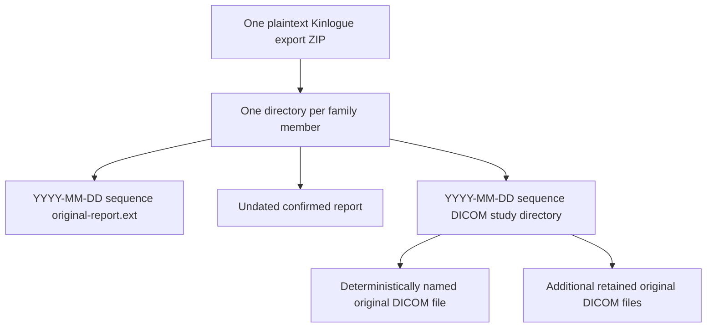
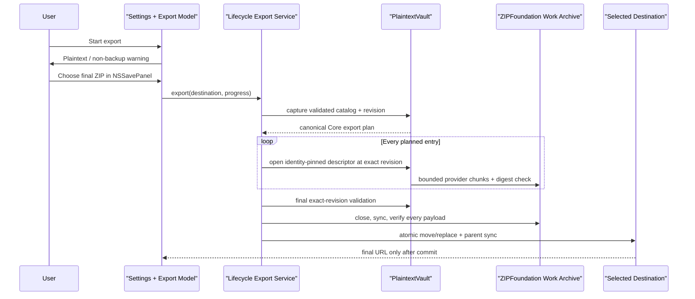

# Export All Original Files - Plan

## Goal Capsule

- **Objective:** Define a doctor-facing export that packages every confirmed report and DICOM original into one portable archive organized by family member and confirmed examination date where present, with an explicit undated fallback for confirmed reports.
- **Product authority:** This plan governs the proposed export behavior only. Current code and user documentation remain authoritative until the feature, tests, privacy wording, and acceptance evidence ship together.
- **Execution profile:** Deep cross-layer code change across Core, Platform, App, packaging, localization, privacy documentation, and installed acceptance.
- **Stop conditions:** Stop implementation if the exact-revision protocol cannot prevent a mixed successful archive, if atomic sandbox publication cannot preserve an existing destination on failure, or if the high-entry-count gate shows ZIPFoundation cannot satisfy R11 without changing the archive writer.
- **Tail ownership:** `ce-work` owns implementation and verification in U1–U5 order. Repository policy overrides generic workflow defaults: do not commit, push, or open a PR unless the user asks.

---

## Product Contract

### Summary

Kinlogue will add an “Export All Original Files” action under Settings → Data Management. The action produces one plaintext ZIP for copying to a phone, opening on another computer, or printing source documents for a doctor.

### Problem Frame

Confirmed health records are useful inside Kinlogue, but a user still needs their original files outside the App when preparing for an appointment. Manually finding report PDFs, images, and DICOM objects breaks the member and date organization that Kinlogue already maintains and makes it easy to omit part of a record.

The output is a readable handoff, not a Kinlogue backup. A recipient must be able to use ordinary file tools without understanding the Vault catalog, OCR provenance, or internal object identities.

### Key Decisions

- **Human-readable handoff, not restore.** (session-settled: user-directed — chosen over backup and restore: the primary need is to move originals to a phone or computer and print them for a doctor.) Governs R1, R2, R8.
- **Confirmed report and DICOM originals only.** (session-settled: user-directed — chosen over report-only or metadata-rich export: all reviewed source files should travel together without generated summaries or OCR data.) Governs R3, R6, R7, R8.
- **Confirmed content remains the trust gate.** (session-settled: user-approved — chosen over exporting drafts and inbox items: doctor-facing files should come from records that passed Kinlogue’s confirmation flow.) Governs R3.
- **Date-prefixed flat report layout with DICOM study folders.** (session-settled: user-directed — chosen over date and per-record directory trees: flat report names are easier to sort and print, while DICOM still needs a study boundary.) Governs R5, R6, R7.
- **One total ZIP.** (session-settled: user-directed — chosen over folder output or parallel folder-and-ZIP outputs: one bundle is easier to copy to a phone or send.) Governs R4.
- **Plaintext with ordinary DICOM study folders.** (session-settled: user-approved — chosen over password protection and nested DICOM ZIPs: an explicit warning plus one extraction step has the broadest phone, computer, and printing compatibility.) Governs R2, R7, R9.

### Actors

- A1. **Mac user:** Starts the export, chooses where to save it, transfers or opens the ZIP, and controls any later sharing with a doctor.
- A2. **Kinlogue App:** Selects eligible confirmed records, reads verified originals, creates the archive, reports progress and outcome, and leaves the Vault unchanged.

### Requirements

**Entry and eligibility**

- R1. Settings → Data Management must provide an “Export All Original Files…” action separate from destructive library deletion.
- R2. Before destination selection, the App must explain that the export is a readable archive rather than a restorable backup, that anyone who obtains the plaintext ZIP can read it, and that Kinlogue cannot revoke or remove exported copies when the in-App library is deleted.
- R3. The export must include every confirmed `HealthRecord` and confirmed `DICOMStudy`, including records belonging to archived family members, while excluding report drafts, unconfirmed DICOM studies, and LAN inbox items.

**Archive and organization**

- R4. One export operation must produce one standards-compatible plaintext ZIP at a location explicitly chosen by A1.
- R5. The ZIP must contain one uniquely named directory per family member, with report files and DICOM study directories named using sortable `YYYY-MM-DD` prefixes derived from the user-confirmed examination date; confirmed reports without a selected date must use a clearly labeled undated fallback and must not be omitted.
- R6. Each confirmed report must contribute one byte-identical output file for every ordered source row, preserving a recognizable sanitized source display name and file type when available while adding stable sequence suffixes to prevent collisions.
- R7. Each confirmed DICOM study must contribute one date-prefixed study directory containing every authoritative retained original as byte-identical files with deterministic safe names; the export must not claim to recreate source folder structure or filenames that Kinlogue does not persist.
- R8. The ZIP must not contain OCR documents, extracted fields, notes, summaries, search indexes, Vault manifests, internal identifiers, recovery material, or generated medical interpretation.

**Safety and user experience**

- R9. The App must show progress for a non-trivial export, allow cancellation, and report success only after a complete ZIP is durably available at the selected destination; cancellation or failure must not leave an artifact that appears complete.
- R10. Export must be read-only with respect to the Vault and must reflect one coherent validated catalog snapshot rather than mixing relationships from different generations.
- R11. Export must remain responsive and resource-bounded across the repository’s existing catalog and DICOM intake limits rather than scaling memory use with the total archive size.
- R12. Member names, source display names, and other user content must be sanitized before use as archive paths; export diagnostics must not log medical content, user-visible filenames, raw DICOM identifiers, or private filesystem paths.
- R13. New settings, warning, progress, cancellation, empty, failure, and success states must follow the existing Simplified Chinese and English localization and accessibility contracts.

### Output Structure

The root contains eligible member directories only. Dated names use an invariant UTC-Gregorian `YYYY-MM-DD` prefix; undated reports use the localized `Undated` token; DICOM objects use generic ordinal `.dcm` names because original hierarchy and filenames were not retained. KTD4 defines the complete safe-name and collision policy.

### Key Flows

- F1. Export confirmed originals
  - **Trigger:** A1 chooses “Export All Original Files…” in Settings → Data Management.
  - **Actors:** A1, A2.
  - **Steps:** A2 presents the plaintext and non-restorable warning; A1 chooses a destination; A2 validates one eligible snapshot, writes every eligible original into the ZIP, and reports progress.
  - **Outcome:** A1 receives one complete ZIP organized per R4–R8, and the Vault remains unchanged per R10.
  - **Covers:** R1–R13.
- F2. Use the handoff outside Kinlogue
  - **Trigger:** A1 copies the ZIP to a phone or computer, or opens it before printing.
  - **Actors:** A1.
  - **Steps:** A1 extracts the ZIP, chooses a member, and uses the date-prefixed names to locate report files or a DICOM study directory.
  - **Outcome:** Originals remain usable with ordinary file tools without exposing Kinlogue’s internal catalog or OCR data.
  - **Covers:** R4–R8.
- F3. Cancel or recover from failure
  - **Trigger:** A1 cancels, the destination becomes unavailable, storage is insufficient, or an original fails validation while export is running.
  - **Actors:** A1, A2.
  - **Steps:** A2 stops bounded work, prevents any incomplete artifact from appearing successful, preserves the Vault, and presents a localized actionable outcome.
  - **Outcome:** No source data changes and no partial archive is mistaken for the requested export.
  - **Covers:** R9–R13.

### Acceptance Examples

- AE1. **Mixed confirmed library. Covers R3–R8.** Given two active members with confirmed PDF/image reports and DICOM studies plus one archived member with confirmed reports, when A1 exports, then the ZIP contains directories for all three members and byte-identical originals for every eligible report source and retained DICOM object. Current domain validation does not permit a confirmed DICOM study to remain assigned to an archived member, so that invalid fixture is not required.
- AE2. **Sortable dates and undated fallback. Covers R5–R7.** Given multiple confirmed records on the same date and one confirmed report without a selected date, when A1 sorts a member directory by filename, then dated entries remain chronologically sortable, collisions remain distinct, and the undated report remains present under the defined fallback.
- AE3. **Confirmation gate. Covers R3, R8.** Given confirmed records alongside a report draft, an unconfirmed DICOM study, and LAN inbox items, when A1 exports, then only confirmed report and DICOM originals appear and no draft, inbox, OCR, note, or internal catalog data is included.
- AE4. **DICOM grouping without false reconstruction. Covers R7.** Given a confirmed study whose original source paths and filenames were not persisted, when A1 exports, then every authoritative retained original appears inside one study directory with safe deterministic names and the output makes no claim to reproduce the imported folder hierarchy.
- AE5. **Plaintext warning. Covers R2, R4.** Given A1 starts an export, when the warning is shown, then it clearly distinguishes the readable plaintext ZIP from backup/restore and password protection before A1 selects a destination.
- AE6. **Cancellation and failure safety. Covers R9–R12.** Given a large export is cancelled or fails after writing has begun, when the operation ends, then no artifact appears as a successful complete export, the existing Vault remains readable and unchanged, and diagnostics contain no medical content or private paths.
- AE7. **Empty eligible set. Covers R3, R9, R13.** Given the library has no confirmed report or DICOM study, when A1 invokes export, then the App explains that there are no confirmed originals to export and does not create an empty success archive.

### Scope Boundaries

- This plan does not add Kinlogue backup, restore, re-import, migration, or round-trip fidelity for the Vault.
- This plan does not export OCR, extracted fields, notes, summaries, search data, or generated medical conclusions.
- This plan does not export report drafts, unconfirmed DICOM studies, LAN inbox items, partially received uploads, or transient import staging.
- This plan does not add password-protected archives, application-layer encryption, recovery keys, Keychain behavior, cloud upload, email, sharing automation, or phone synchronization.
- This plan does not promise the original DICOM directory hierarchy or filenames; current persistence preserves authoritative bytes and study relationships without those source paths.
- This plan does not add per-member, date-range, record-type, or selective export filters; the first release exports all eligible confirmed originals.

### Dependencies and Assumptions

- `PlaintextVault` remains the authority for validated catalog state and verified original object bytes.
- Existing confirmation semantics remain unchanged: only confirmed reports and confirmed DICOM studies are eligible for the doctor-facing handoff.
- A standards-compatible plaintext ZIP can be opened or extracted by the intended phone and desktop workflows; broader device compatibility must be verified during implementation acceptance.
- The DICOM feature’s current “export unsupported” boundary is intentionally revised only when this feature ships. Implementation must update `README.md`, `PRIVACY.md`, `docs/project-overview.md`, `docs/privacy-and-security.md`, DICOM acceptance material, and `docs/index.md` without describing the plan as current capability beforehand.

### Deferred Questions

- DQ1. **Deferred, non-blocking:** Whether a later release should add selective export, encryption, password protection, or backup/restore remains a separate product decision.
- DQ2. **Deferred, non-blocking:** Real iPhone/Android extraction, printer behavior, and files larger than 4 GiB remain release-evidence gates; they do not change the implementation contract for a standards-compatible ZIP64 archive.

### Sources and Research

- `Sources/KinlogueApp/Views/SettingsView.swift` — current Data Management placement and deletion-only action.
- `Sources/KinlogueCore/Domain/HealthRecord.swift`, `Sources/KinlogueCore/Domain/ReportSource.swift`, and `Sources/KinlogueCore/Domain/DICOMStudy.swift` — confirmed member/date/source relationships and authoritative original sets.
- `Sources/KinloguePlatform/Storage/PlaintextVault.swift` and `docs/storage.md` — validated catalog reads, verified object access, generation semantics, and resource limits.
- `README.md`, `PRIVACY.md`, and `docs/privacy-and-security.md` — current plaintext, backup/restore, logging, and export boundaries.
- `docs/plans/2026-08-06-001-feat-dicom-mri-viewer-plan.md` and `docs/acceptance/dicom-mri-viewer-matrix.md` — current DICOM export non-goal that this proposal must revise only when implemented.
- `docs/localization.md` — Simplified Chinese and English resource, date formatting, error-state, and accessibility rules.
- `Package.swift`, `Package.resolved`, and `.build/checkouts/ZIPFoundation/` — Swift 6.1/macOS 14 package graph and exact ZIPFoundation 0.9.20 streaming, cancellation, UTF-8, and ZIP64 behavior.
- [ZIPFoundation Swift Package Manager documentation](https://github.com/weichsel/ZIPFoundation#swift-package-manager) and Apple `FileManager` item-replacement documentation — direct dependency declaration and same-volume publication strategy.
- Repository research found no `solutions/` or equivalent institutional-learning corpus; current code, tests, docs, and this Product Contract are the planning authority.

---

## Planning Contract

### Assumptions

- The user explicitly asked to proceed from the settled Product Contract, so planning uses the defaults below without reopening product choices.
- Export paths are presentation data inside the ZIP, not persisted domain state. Fixed structural tokens may be localized at export time, while member names and recognizable source display names remain untranslated user content.
- A successful export may become stale immediately after publication if the user later edits Kinlogue; it must nevertheless be internally coherent for the exact validated revision from which it was produced.

### Key Technical Decisions

- KTD1. **Use a direct, exact ZIPFoundation dependency.** Add ZIPFoundation `0.9.20` as an exact root dependency and a `KinloguePlatform` product dependency. Use `Archive.addEntry` with `.none`, a fixed bounded chunk, UTF-8 entry paths, and ZIP64 support. Do not rely on DICOM-Swift's transitive dependency, invoke `/usr/bin/zip`, or stage a second plaintext directory tree. `.none` preserves extracted bytes, avoids recompression CPU, and makes capacity estimation predictable. ZIPFoundation's mutable `Archive` remains confined to one synchronous worker. Covers R4, R6, R7, R11.
- KTD2. **Pin a revision and identity-pin each source descriptor.** Add export-specific `PlaintextVault` primitives that capture a validated catalog, object metadata, and `VaultRevision`. For every entry, reacquire the existing process-local/cross-process mutation lease, require the same revision and metadata, open a no-follow regular descriptor, capture its identity, and then release the mutation lease before ZIP metadata work begins. The descriptor keeps the validated bytes available while `pread` streams and hashes outside the lease. Reacquire only to validate the exact starting revision before final publication; any catalog mutation aborts the unpublished archive. Do not use `readObject`, and do not hold the root lease for a whole entry or ZIP because ZIP metadata work and ordinary catalog/LAN activity must not block one another. Covers R3, R6, R7, R10, R11.
- KTD3. **Publish only a completed same-volume work archive.** `NSSavePanel` chooses the final `.zip` URL after the warning. The App starts security-scoped access before dispatch, retains it through staging, validation, publication, and cleanup, and stops it exactly once on every terminal path. Create a unique non-`.zip` work file in an `.itemReplacementDirectory` appropriate for that destination, estimate available capacity before writing, use restrictive permissions where the selected volume supports them, write and close the archive, fully sync it, and reopen and stream every completed entry to verify path, size, and SHA-256 against the Core plan. Then move or replace the final URL through coordinated same-volume publication and sync the destination parent directory. A post-rename directory-sync failure is an indeterminate publication error that reconciles the final file before reporting. Preserve an existing destination byte-for-byte on pre-commit failure. Cancellation before the publish commit removes the work directory; cancellation observed after commit reports success. Reject a destination inside the Vault and unsafe symlink/non-regular replacements. Covers R2, R4, R9, R12.
- KTD4. **Build a deterministic manifest with identifier-free output paths.** A Foundation-only planner selects confirmed records and DICOM studies, maps attachments, and emits a canonical ordered list with expected size/digest and safe relative paths. Internal attachment locators and hidden UUID tie-breakers support Vault reads and stable ordering but are never serialized into archive paths or entries. Member directories use normalized visible name/disambiguation plus ` (2)`, ` (3)` collision suffixes. Report rows retain source order even when rows share bytes. Names use `YYYY-MM-DD` or localized `Undated`, stable report/source ordinals, sanitized display basenames, and extensions forced from attachment UTType. DICOM uses `YYYY-MM-DD - DICOM - NNN/0001.dcm`. Reject absolute/empty/dot components, `/`, `\`, NUL/control characters, leading/trailing dots or spaces, Windows reserved names, normalization/case-folded collisions, components over 120 UTF-8 bytes, or paths over 512 UTF-8 bytes. Covers R3, R5–R8, R12.
- KTD5. **Model progress by aggregate source bytes and entries.** Platform emits immutable semantic snapshots: preparing; writing `(completedBytes, totalBytes, completedEntries, totalEntries, isCancellable)`; committing with cancellation disabled; and terminal result. Cancellation is checked before/between entries and on every provider chunk. Callback delivery is throttled but cancellation is not. The App model fences late callbacks by operation generation, stores semantic failure cases rather than translated strings, disables interactive dismissal while writing/cancelling/committing, and exposes explicit Cancel only while the operation is cancellable. The first cancellation request moves to a controls-disabled Cancelling state; cancellation observed after the commit point reports success. Covers R9, R11, R13.
- KTD6. **Coordinate whole-library deletion through the existing lifecycle.** The App export service registers a revocation hook and wraps the whole operation in `LibraryLifecycleCoordinator.withActiveOperation`. Destruction cancels an admitted export and waits for cleanup before deleting the Vault; cross-process changes are rejected by KTD2's revision check. Settings/App modal exclusivity prevents a second in-process export or destructive UI from starting concurrently. Covers R9, R10, R13.
- KTD7. **Prove writer viability before Platform implementation.** ZIPFoundation 0.9.20 rewrites the accumulated central directory for every added entry, so metadata work is approximately quadratic even though payload memory is chunk-bounded. U0 must run `scripts/run-export-writer-probe.sh --entries 20000` and a valid near-maximum manifest dominated by repeated report source rows before U2–U5 begin. Record duration, peak RSS delta, cancellation latency, and main-thread responsiveness. If either probe cannot complete with chunk-bounded payload memory and responsive cancellation, stop and revise KTD1 to a linear writer before claiming R11; do not discover this after App integration. Covers R11.

### High-Level Technical Design

### System-Wide Impact

- **Data lifecycle:** Export reads immutable attachments only. The Vault catalog, OCR, drafts, inbox, indexes, notes, and derived data remain unchanged and absent from the ZIP.
- **Concurrency:** Successful output is tied to one `VaultRevision`; normal mutations may continue between short reads but invalidate the attempt. Whole-library deletion actively cancels and waits.
- **Privacy:** The final ZIP is intentionally plaintext and externally controlled. Kinlogue cannot revoke it or delete later copies. Temporary work is same-volume, opaque/non-success-looking, uses restrictive permissions where supported, and is removed best-effort. No medical content, visible names, DICOM identifiers, or private paths enter diagnostics.
- **Packaging:** Main `KinloguePlatform` gains direct ZIPFoundation linkage. DicomCore stays helper-only; existing helper resource-bundle rules and third-party notice already cover ZIPFoundation 0.9.20.
- **Performance:** Memory scales with one source chunk plus ZIP central-directory metadata, not total payload bytes. Archive size is approximately source bytes plus headers because compression is disabled.

### Sequencing

U0 proves or rejects the planned writer at the repository's entry-count limits. U1 defines selection, ordering, naming, and traceability. U2 starts only after U0 and implements verified streaming and publication against U1. U3 adds App lifecycle/UI behavior against U2. U4 strengthens package, concurrency, resource, installed, and privacy evidence. U5 reconciles all user promises only after the implementation gates pass.

---

## Implementation Units

### U0. Archive-writer viability probe

- **Goal:** Decide the archive writer before downstream code depends on it.
- **Requirements:** R4, R9, R11; KTD1, KTD7.
- **Files:** `scripts/run-export-writer-probe.sh` (new), a minimal executable/test fixture used only by that script, and its source-safety test if the script persists in the repository.
- **Approach:** Generate content-free synthetic entries with bounded providers and exercise both the 20,000-entry attachment boundary and a valid near-maximum manifest dominated by repeated report source rows. Measure elapsed time, peak RSS delta, cancellation latency, main-thread heartbeat progress, and cleanup. The probe must not include real names, paths, identifiers, or content.
- **Stop condition:** U2–U5 remain blocked until the recorded evidence shows bounded payload memory and responsive cancellation, or KTD1 is revised to a linear writer and the replacement passes the same probe.
- **Verification:** `scripts/run-export-writer-probe.sh --entries 20000`; `scripts/run-export-writer-probe.sh --manifest-limit`.
- **Dependencies:** None.

### U1. Canonical export plan and safe paths

- **Goal:** Convert one validated `VaultCatalog` into an ordered archive manifest whose output paths contain no internal identifiers.
- **Requirements:** R3, R5–R8, R12; F1–F2; AE1–AE4, AE7; KTD4.
- **Files:** `Sources/KinlogueCore/Export/OriginalArchivePlan.swift` (new), `Tests/KinlogueCoreTests/OriginalArchivePlanTests.swift` (new).
- **Approach:** Implement eligibility, archived-report inclusion, duplicate source-row preservation, UTC-Gregorian date prefixes, UTType-extension input mapping, deterministic member/report/study ordinals, path normalization/limits, and case/normalization collision checks. Fail closed on inconsistent attachment mappings or arithmetic overflow.
- **Test scenarios:** Mixed active/archived reports and active-member DICOM; undated reports; same-date and duplicate display names; two logical rows sharing one attachment; drafts/unconfirmed DICOM excluded; no OCR/index/internal ID entries; traversal, control, reserved, Unicode-equivalent, case-folded, very long, and extension-spoofing names.
- **Verification:** `swift test --disable-sandbox --filter OriginalArchivePlanTests`.
- **Dependencies:** None; may proceed in parallel with U0, but U2 remains gated on both.

### U2. Exact-revision streaming ZIP and atomic publication

- **Goal:** Produce a structurally valid plaintext ZIP without loading an original or the total archive into memory, and publish it only after complete validation.
- **Requirements:** R4, R6–R12; F1, F3; AE1–AE7; KTD1–KTD3, KTD5.
- **Files:** `Package.swift`, `Package.resolved` if resolution changes, `Sources/KinloguePlatform/Storage/PlaintextVault.swift`, `Sources/KinloguePlatform/Export/PlaintextOriginalArchiveExporter.swift` (new), `Tests/KinloguePlatformTests/PlaintextOriginalArchiveExporterTests.swift` (new), `Tests/KinloguePlatformTests/OriginalArchivePublicationTests.swift` (new).
- **Approach:** Add the exact dependency after U0 approves it, create a snapshot DTO with revision/object metadata, add descriptor-scoped exact-revision reads that release the Vault lease before ZIP work, feed 64 KiB exact `pread` chunks to the writer, hash every source entry, aggregate progress, estimate capacity, verify every completed ZIP payload against the plan, and use replacement-directory publication with file sync, atomic commit, parent-directory sync, reconciliation, and cleanup. Make fault injection possible at provider, archive-close, payload verification, file sync, directory sync, and publication boundaries.
- **Test scenarios:** Byte-identical PDF/image/DICOM extraction; short read, wrong size/digest, source replacement, completed-payload corruption, corrupt central directory, disk full/fault injection, cancellation mid-entry/between entries/committing, destination inside Vault, symlink target, old destination preservation, indeterminate post-commit sync reconciliation, no final or `.zip`-looking partial on pre-commit failure, ZIP64 metadata seam, and no logs containing canaries or paths.
- **Verification:** `swift test --disable-sandbox --filter PlaintextOriginalArchiveExporterTests`; `swift test --disable-sandbox --filter OriginalArchivePublicationTests`.
- **Dependencies:** U0, U1.

### U3. Lifecycle-coordinated Settings experience

- **Goal:** Add the warning, save panel, progress, cancellation, empty/failure, and success flow under Settings → Data Management.
- **Requirements:** R1–R3, R9–R13; F1, F3; AE5–AE7; KTD3, KTD5, KTD6.
- **Files:** `Sources/KinlogueApp/App/AppServiceContracts.swift`, `Sources/KinlogueApp/App/AppServices.swift`, `Sources/KinlogueApp/App/AppComposition.swift`, `Sources/KinlogueApp/App/AppModel.swift`, `Sources/KinlogueApp/ViewModels/OriginalExportModel.swift` (new), `Sources/KinlogueApp/Views/OriginalExportView.swift` (new), `Sources/KinlogueApp/Views/SettingsView.swift`, `Sources/KinlogueApp/Views/AppShellView.swift`, `Sources/KinlogueApp/Localization/Localizable.xcstrings`, `Sources/KinlogueApp/Resources/en.lproj/Localizable.strings`, `Sources/KinlogueApp/Resources/en.lproj/Localizable.stringsdict` when generated, and matching `Tests/KinlogueAppTests/` model/service/view/localization tests.
- **Approach:** Expose an App-owned export protocol and semantic errors, lifecycle-wrap the Platform exporter, register cancellation on revoke, and model warning → eligibility preflight → destination → preparing/writing/committing → terminal phases. Invoke `NSSavePanel` on the main actor only after the warning and non-empty preflight. Start security-scoped access before service dispatch, balance its release across every outcome, and keep export modal-exclusive, keyboard cancellable only before commit, non-dismissible while active, and accessible in both languages. The progress control exposes a localized phase label plus coarse percent and completed-entry count; VoiceOver announces phase changes and 10% boundaries only, never names or paths, and focus returns to the Settings export control on close.
- **Interaction states:**

  | State | Primary action | Secondary action | Keyboard/focus rule |
  | --- | --- | --- | --- |
  | Warning | Choose Location… | Cancel | Primary is default; Cancel/Escape closes and restores focus to the Settings export control. |
  | Empty | Done | — | No save panel appears; Done restores focus to the Settings export control. |
  | Writing | — | Cancel | Cancel/Escape is enabled only while `isCancellable`; first activation enters Cancelling and disables controls. |
  | Committing | — | — | Non-cancellable and non-dismissible; a cancellation observed after commit resolves as success. |
  | Failure | Try Again | Done | Try Again returns to destination selection; Done restores Settings focus. |
  | Success | Show in Finder | Done | Show in Finder reveals the final ZIP; Done restores Settings focus. |

- **Test scenarios:** Warning precedes preflight and panel; empty preflight avoids the panel; panel cancel makes no export call; progress monotonicity; repeated start suppression; balanced security-scope denial/release; Cancel/Escape state; committing disables cancellation; late callback fencing; delete revokes/cancels/waits; cancellation after commit is success; bounded VoiceOver announcement cadence with no names; language switch re-renders all states; keyboard/identifier/source-safety checks; settings export and delete remain separate.
- **Verification:** `scripts/compile-localizations.sh --write`; `scripts/compile-localizations.sh --check`; `swift test --disable-sandbox --filter OriginalExportModelTests`; `swift test --disable-sandbox --filter LiveOriginalExportServiceTests`; `swift test --disable-sandbox --filter AppLocalizationTests`; `swift test --disable-sandbox --filter LocalizationPackagingTests`.
- **Dependencies:** U2.

### U4. Packaging, concurrency, resource, and installed acceptance

- **Goal:** Prove the real package graph, process coordination, sandbox destination, large-entry posture, and privacy boundary.
- **Requirements:** R4, R9–R13; F1–F3; AE1, AE3, AE5–AE7; KTD1–KTD3, KTD6–KTD7.
- **Files:** `scripts/verify-package-graph.sh`, `scripts/run-export-writer-probe.sh`, `Tests/KinlogueAppTests/PackageGraphVerifierTests.swift`, `Sources/KinlogueStorageProcessFixture/KinlogueStorageProcessFixture.swift` if an export fixture command is needed, `Tests/KinlogueStorageProcessTests/CatalogProcessCoordinationTests.swift`, installed acceptance sources/scripts and `docs/acceptance/dicom-mri-viewer-matrix.md`.
- **Approach:** Update the direct-dependency allow-list without weakening DicomCore isolation. Add real multi-instance/cross-process revision-change and deletion tests, preserve the U0 writer probe as a reproducible release gate, and run an installed synthetic export through production composition/security scope. Independently reopen/extract the result and scan the archive entry list/bytes for forbidden artifacts and canaries.
- **Test scenarios:** Other-process mutation invalidates without mixed output; whole-library delete leaves no misleading partial; main link map contains ZIP support but no DicomCore/network code; direct pin/notice revision stays exact; sandbox save/replace succeeds; security scope releases once; old file survives failure; writer probes stay chunk-bounded and responsive; final archive opens with independent tooling.
- **Verification:** `swift test --disable-sandbox --filter PackageGraphVerifierTests`; `swift test --disable-sandbox --filter CatalogProcessCoordinationTests`; `scripts/run-export-writer-probe.sh --entries 20000`; `scripts/run-export-writer-probe.sh --manifest-limit`; `scripts/lint.sh`; `scripts/privacy-guard.sh`; `scripts/test.sh`; `scripts/verify-app.sh`; `scripts/run-acceptance.sh` after the acceptance fixture is extended.
- **Dependencies:** U2, U3.

### U5. Current-capability and privacy documentation

- **Goal:** Describe the shipped export accurately without turning it into a backup, security, or medical promise.
- **Requirements:** R2–R4, R7–R13; F2–F3; AE4–AE7.
- **Files:** `README.md`, `PRIVACY.md`, `docs/project-overview.md`, `docs/privacy-and-security.md`, `docs/storage.md`, `docs/architecture.md`, `docs/design-system.md`, `docs/testing-and-release.md`, `docs/acceptance/dicom-mri-viewer-matrix.md`, `docs/index.md`, `docs/log.md`, and this plan only for factual corrections discovered during execution.
- **Approach:** State that explicit confirmed-original export is plaintext, human-readable, non-restorable, user-destination-controlled, and includes generic DICOM names rather than original hierarchy. State that exported ZIPs and later copies are outside Kinlogue's control and are not removed by Delete Library. Preserve the no backup/restore/cloud-sync boundary; change only the superseded automatic-export statements. Record automated versus installed versus manual phone/printing/accessibility evidence separately.
- **Test scenarios:** Privacy guard and link checks pass; no doc calls SHA-256 encryption/authentication; no doc promises secure erase, diagnosis, universal DICOM printing, automatic sharing, original DICOM names, or unexecuted device compatibility.
- **Verification:** `scripts/privacy-guard.sh`; `scripts/lint.sh`; `git diff --check`; manual documentation contradiction scan against `README.md`, `PRIVACY.md`, and acceptance state.
- **Dependencies:** U4.

---

## Verification Contract

### Automated gates

1. Run each unit's focused tests while implementing.
2. Run `scripts/compile-localizations.sh --check`, `scripts/lint.sh`, `scripts/privacy-guard.sh`, and `git diff --check` after App/docs changes.
3. Run `scripts/test.sh` for the complete Swift and script suite.
4. Run both writer viability probes and record payload bytes, entry count, duration, peak RSS delta, cancellation latency, main-thread heartbeat, and partial-file cleanup. Passing requires no source object or archive-sized `Data`, monotonic progress, responsive cancellation checkpoints, and no crash/kill/resource-limit failure; time is recorded rather than compared across unlike Macs.
5. Run `scripts/verify-app.sh` and the extended `scripts/run-acceptance.sh` only with full Xcode. Report their results as current-Mac/install evidence, not public compatibility.

### Manual evidence

These checks provide non-blocking compatibility and accessibility evidence. Any check not run remains explicitly unverified and cannot be inferred from automated tests.

- Extract the completed ZIP with macOS Archive Utility/Finder and at least one real phone workflow; confirm member/date sorting and that source PDFs/images can be opened and printed where the OS supports that format.
- Confirm DICOM directories are present and byte-identical without claiming ordinary photo/PDF printing or diagnostic interoperability.
- Exercise new/overwrite/cancel/failure save-panel flows in the sandboxed installed App, including external-volume destination if available.
- Check Simplified Chinese and English at narrow width, keyboard-only navigation, focus order, progress announcements, cancellation, error recovery, and VoiceOver.
- Treat files larger than 4 GiB, macOS 14/15 breadth, real phone extraction, and printer combinations as unexecuted until each is actually run.

### Evidence rules

- Synthetic fixtures contain no real names, records, DICOM UIDs, addresses, or private paths.
- Logs and reports contain aggregate counts/timings only; entry names, member names, content, raw identifiers, and destination paths are forbidden.
- A lower-layer ZIP unit test does not satisfy installed sandbox, phone, printing, or accessibility gates.

---

## Definition of Done

- R1–R13 each trace to passing automated evidence or explicitly reported manual evidence; AE1–AE7 are covered without invalid domain fixtures.
- U1 is done when one deterministic Core plan proves eligibility, organization, byte expectations, and path safety with no IDs in output paths.
- U2 is done when a real `PlaintextVault` produces byte-identical independently readable ZIP entries from one exact revision, with bounded streaming, cancellation, cleanup, and existing-destination preservation proven under faults.
- U3 is done when Settings exposes a separate accessible export action and every warning/progress/cancel/empty/failure/success state is semantic, localized, modal-safe, and lifecycle-coordinated.
- U4 is done when the exact direct dependency and DicomCore boundary pass, cross-process mutation cannot produce a mixed success, the stress probe has acceptable resource behavior, and installed synthetic export succeeds on the current Mac.
- U5 is done when current capability, plaintext risk, exclusions, evidence level, and DICOM naming limits agree across user docs, technical docs, acceptance matrix, index, and log.
- No real medical data, private path, content log, archive output, `.build/`, `dist/`, or temporary replacement artifact is tracked by Git.
- Abandoned implementations, unused localization keys, dead test fixtures, and temporary diagnostics are removed; the final diff has no unrelated user changes.
- Unexecuted phone, printing, VoiceOver, system-version, or >4 GiB gates remain explicitly marked unverified rather than being inferred from lower-level tests.
