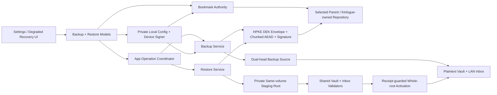
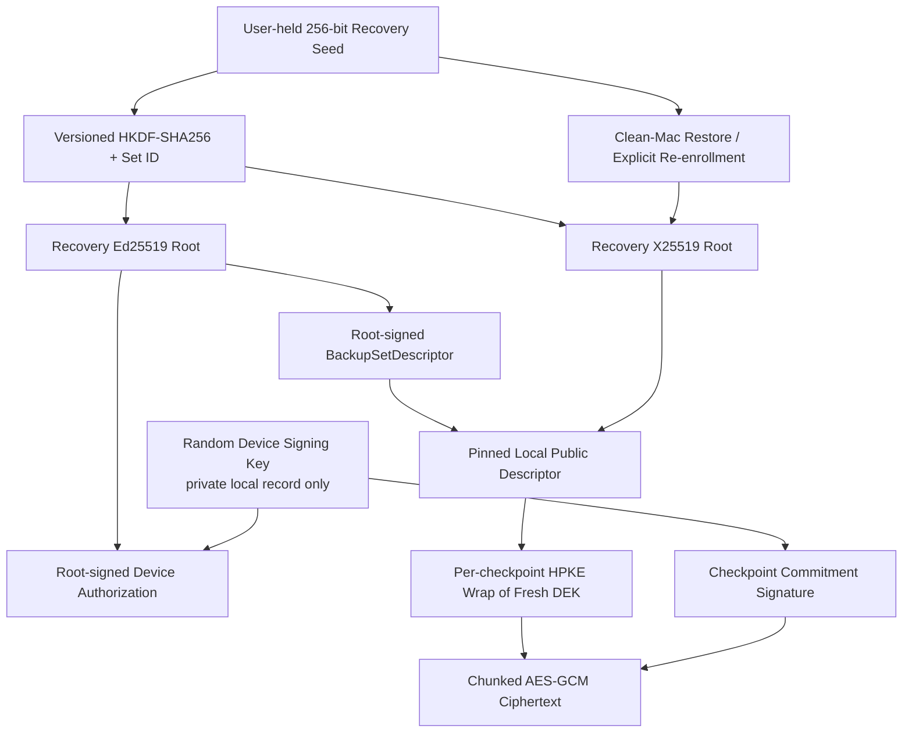

# Encrypted Folder Backup and Restore - Plan

## Goal Capsule

- **Objective:** 在“设置 → 数据备份”提供面向用户所选同步目录的客户端加密、版本化、可恢复备份，支持自动备份开关、可配置保留数量、立即备份和从备份恢复。
- **User outcome:** 只要一个 `.kinloguebackup` 文件和恢复码已保存到独立于原 Mac 的位置，用户即使遗失原 Mac，也能在一台没有原设备身份和备份配置的新 Mac 上恢复完整 Vault 与 durable LAN inbox；Kinlogue 只证明本地恢复点，不能证明第三方网盘已经形成异机副本。
- **Product authority:** 本计划保留实现决策和未执行门禁；当前能力以代码、[`../backup-and-restore.md`](../backup-and-restore.md) 和验收账本为准。无 Keychain、无内置云同步仍是不变量。
- **Execution profile:** Deep；跨 Core、Platform、App、存储事务、密码学、App Sandbox entitlement、安装验收和隐私文档的高风险变更。
- **Stop conditions:** 若 U0 不能证明已安装候选包跨重启读取严格的本机设备身份、仅持有公钥的 profile 能备份但不能解密、恢复码解码出的 recovery seed 能在干净 profile 重新派生根密钥并解密、目标目录 bookmark 可持续访问、代表性普通目录/File Provider 具备 KTD5 所需的发布语义与容量预算，或同卷 whole-Vault 交换能在所有故障点收敛为完整旧根或完整新根，则停止后续发布集成或收窄支持目标。不得回退 Data Protection/legacy Keychain、静默重建设备身份、原地覆盖或不受控目录复制。
- **Tail ownership:** `ce-work` 按 U0 → U1 → U2/U3 → U4 → U6 → U5 → U7 → U8 的依赖顺序实施。默认不 commit、push 或创建 PR，除非用户另行要求。
- **Product Contract preservation:** changed: R1–R2, R7–R10, R12–R19, R21–R26, SC1, SC3–SC6, F1–F6, AE1, AE4–AE7, AE9–AE11 — 用户在 U0 的 Data Protection Keychain 失败后选择了不使用任何 Keychain 的自动备份架构，并在文档审查后确认本地/异机状态、跨启动catch-up、容量、恢复码、preflight staging receipt与验收entitlement边界；其余产品范围与稳定 ID 保持不变。

---

## Product Contract

### Summary

Kinlogue 将备份目标抽象为“用户明确选择的父目录”。App 在其中创建一个由 Kinlogue 管理的专用子目录；该父目录可以是阿里云盘、百度网盘或其他桌面同步客户端管理的目录，也可以是普通本地目录、外置盘或已挂载 NAS。Kinlogue 只负责写入并从该目录回读验证加密恢复点，不集成网盘账号或 API，也不声称已经上传到远端。普通本地目录与原 Mac 同失，不提供设备丢失保护；所有目标都只显示“本地恢复点已验证 / 网盘同步状态未知”，不显示用户级“异机防丢失已就绪”。

首版每个恢复点是一个自包含、不可变的 `.kinloguebackup` 文件，包含一个精确 Vault revision 与一个精确 LAN inbox revision 的完整已提交状态。自动备份默认关闭；启用后仅在 App 运行期间执行，但持久记录待覆盖 revision 的首次观察时间并在后续启动补偿。手动备份和自动备份共享同一保留池，默认保留 5 份，可配置为 2–30 份；设置页同时展示单份和保留池的预计占用，以及发布/恢复所需临时额外空间。

### Problem Frame

当前 Kinlogue 的唯一权威资料库位于 App Sandbox 内。一台 Mac 丢失、磁盘损坏或资料库不可读时，没有内置恢复路径。现有“导出全部原始文件”是明文、非完整、不可回灌的医生交接包，不能充当灾难恢复备份。

直接把活动 Vault 放进同步目录会把中间状态、并发写入、同步乱序和删除传播交给第三方客户端，无法保证一致性；直接调用各网盘 API又会引入账号、网络客户端 entitlement、供应商差异和新的隐私边界。首版因此把“可恢复 checkpoint 的正确性”与“第三方客户端如何上传”分开。

### Key Decisions

- **用户选择父目录，Kinlogue 创建专用子目录。**（session-settled: user-approved — chosen over direct Aliyun/Baidu APIs and writing arbitrary files into the selected root；首版保持 provider-neutral，并把删除权限限制在 Kinlogue-owned namespace。）Governs R1, R3, R18.
- **自动备份开关、保留数量、立即备份和恢复入口都位于 Settings。**（session-settled: user-directed — chosen over always-on or background-only behavior；用户明确要求四项控制。）Governs R1–R2, R11–R13.
- **自动备份默认关闭，保留数量默认 5、范围 2–30。**（session-settled: user-approved scope with planning-resolved defaults — chosen over one unconfigurable policy；2 份下限避免一次覆盖式错误消灭唯一旧点。）Governs R2, R12.
- **备份完整 Vault 与 durable LAN inbox，不备份瞬态任务。**（session-settled: user-approved — chosen over confirmed-record-only export or byte-copying the live directory；恢复覆盖 `library.json`/objects 与 `inbox.json`/blobs/derived/terminal 状态，排除 LAN partial、进程内状态和未提交 staging。）Governs R4–R6.
- **恢复码只由用户保管；自动备份只持有加密公钥与不能解密病历的设备签名身份。**（session-settled: user-directed — chosen over Data Protection/legacy Keychain convenience key and prompting for the recovery code on every launch；用户可见的恢复码是原始 256-bit recovery seed 的带版本/校验码编码，内部派生只使用解码后的 seed。U0 已证明 ad-hoc Data Protection Keychain 路线不可用，而自动备份不能依赖每次人工解锁。）Governs R2, R7–R10, R18, R23, R25.
- **恢复是隔离验证后的整库替换，不做合并。**（session-settled: user-approved — chosen over importing selected records or live multi-device merge；成功激活后要求重启 App。）Governs R14–R17.
- **状态只证明本地目录中的恢复点。**（session-settled: user-approved — chosen over unverifiable cloud-success wording；没有 provider API就不显示“已上传”“异机防丢失已就绪”或“云端保留 N 份”，同机普通目录持续提示不能抵御 Mac 丢失。）Governs R1, R10, R12, R15, R19.
- **恢复准备度由独立保存确认与可重复验证组成。**（session-settled: user-approved — chosen over immediate setup re-entry as the only proof；首次配置要求用户确认恢复码已保存到独立位置，并提供不激活、不改 Vault 的“验证恢复码与恢复点”入口。）Governs R2, R8–R9, R18.
- **自动备份到期状态跨启动持久化。**（session-settled: user-approved — chosen over resetting the 5-minute quiet period on every launch；UI展示最近覆盖时间与过期状态，下一次启动/激活在quiet/minimum条件已满足时立即catch-up或留下可操作失败。）Governs R1, R12–R13.

### Actors

- A1. **现有 Mac 用户:** 配置目录和恢复码，开启自动备份，手动创建恢复点或恢复整库。
- A2. **干净 Mac / degraded-start 用户:** 在无 Vault、Vault 损坏、版本不支持或本机备份身份丢失时，从备份文件恢复。
- A3. **Kinlogue App:** 捕获一致 checkpoint、加密、发布、验证、延迟清理，并执行 crash-safe restore activation。
- A4. **第三方同步客户端或挂载存储:** 同步/保存 Kinlogue 已经发布的文件；其远端状态对 Kinlogue 不可观察。

### Requirements

**Settings 与首次配置**

- R1. Settings → Data Backup 必须显示目的目录、自动备份开关、最近被 checkpoint 覆盖的时间、本地已验证/已过期状态、网盘同步未知提示、保留数量、预计空间、“Back Up Now”“Verify Recovery Code…”和“Restore from Backup…”；普通本地目录持续提示不能抵御本机丢失，恢复入口在未配置备份时仍可用。
- R2. 自动备份默认关闭；保留数量默认 5，允许 2–30。启用自动备份前必须完成目录授权、专用 repository 初始化、恢复码完整回输、独立位置保存确认、根公钥固定和设备签名身份注册；用户取消任一步时开关保持关闭。验证恢复码入口必须只认证所选 checkpoint 与恢复根，不解密到持久 staging、不激活或修改 Vault。
- R3. 用户选择父目录后，Kinlogue 必须创建或采用一个固定的专用子目录，保存 security-scoped bookmark，并拒绝 Vault/其祖先或子目录、iCloud/ubiquitous container、卷根、符号链接、只读位置和身份被替换的目录。未知文件和不同 backup set 永不覆盖、移动或删除。

**一致性与备份范围**

- R4. 一个成功 checkpoint 必须绑定同一协调时点取得的 `(VaultRevision, LANInboxRevision)` pair；分开读取两个 public snapshot API、复制活动目录或使用当前 32-object/128-MiB `readSnapshot` 均不满足该要求。
- R5. checkpoint 必须包含已发布 Vault catalog 与所有 canonical reachable objects，以及 durable LAN inbox manifest 与其引用的 blobs、derived data、receipt/terminal 状态；不包含 LAN partial、进程内任务、未提交导入 staging、DICOM 临时 journal 工作区或备份偏好。
- R6. 备份前必须先完成现有 storage reconciliation。若 inbox 项处于 durable `.preprocessing`，备份其已提交状态；恢复后由现有启动恢复规则转入可重试终态，不宣称继续原进程内工作。

**加密、密钥与格式**

- R7. 最终文件和目标目录中的所有 work 文件从首个业务 payload byte 起必须是认证密文；不得在同步目录、本机配置、UserDefaults、日志或临时导出中持久化 recovery seed、恢复私钥、checkpoint DEK 或明文健康数据。本机只允许在 sandbox-private Application Support 保存不能解密 checkpoint 的设备签名私钥。
- R8. v1 必须生成随机 256-bit `recovery seed`，并只以固定格式、带版本与校验码的用户可见“恢复码”输入/输出；不接受用户自选低熵密码。内部先校验并解码恢复码，再用 recovery seed 按 backup set 域分离派生独立的恢复签名根与 HPKE 接收根；repository 和本机配置只保存根公钥。每个 checkpoint 使用新随机 DEK 并封装给恢复 HPKE 公钥，本机设备签名私钥只能在恢复根签发的 authorization 下证明 checkpoint 来源，不能派生或解封 DEK。
- R9. 一个 checkpoint 必须在没有原 Mac、没有原设备签名身份、没有本机配置且没有已保存 bookmark 的环境中，仅凭 checkpoint 与恢复码解封。错误恢复码、根公钥不匹配、设备 authorization 或 checkpoint 签名失败、HPKE/AEAD 认证失败、未知 crypto suite/major version、截断、重排、重复、超限长度/数量或路径异常必须 fail closed。
- R10. v1 使用自包含的不可变单文件恢复点，具备严格有界 public prologue、root-signed backup-set descriptor 与 device authorization、单消息 HPKE DEK envelope、加密且认证的 manifest、固定上限分块 AEAD、ciphertext commitment、device-signed commit footer，以及对象与 chunk 顺序/长度绑定。明文外层只允许 magic、格式/算法 ID、opaque set/checkpoint/device ID、公开序列、恢复公钥、authorization、envelope、commitment/signature 和严格长度；文件大小、数量和 filesystem 时间可能暴露，但不暴露成员、病历、对象图或 revision 元数据。

**手动与自动备份**

- R11. “Back Up Now”必须在已配置 repository 上创建一个新 checkpoint，即使 revision pair 与上次相同；它与自动备份、恢复、整库删除共享一个 app-level operation coordinator，重复点击不能产生并行 writer。
- R12. 自动备份只在 App 存活期间执行，但必须持久化每个未覆盖 durable revision pair 的首次观察时间与 due 状态；检测到变化后等待跨启动累计的 5 分钟 quiet period，且距上次本地已验证自动/手动 checkpoint 至少 24 小时才生成。启动、App 激活和系统 wake 时若条件已满足必须立即 catch-up，成功后清除对应 due；相同 revision 自动跳过。Mutation conflict 最多重试 3 次（1、5、15 分钟），目录/授权/身份错误进入持久、可操作的失败状态而非忙重试，UI始终显示最近覆盖时间和是否已过期。
- R13. 退出可取消尚未进入 publication commit 的自动/手动任务；进入不可取消 publication commit 后必须完成或明确报告 indeterminate publication 并在下次启动 reconcile。关闭 Settings 不取消 app-owned operation。

**发布、验证与保留**

- R14. writer 必须在目标子目录内使用同卷、非成功外观的 work 文件；它在临时 DEK 仍在内存时分块写入并完整解密验证 work 的 manifest、chunk 与对象图，最终复核源 pair 后才追加覆盖精确 ciphertext commitment 的 device-signed commit footer。随后通过 `NSFileCoordinator` 发布正式 `.kinloguebackup`、sync parent、绑定正式 URL 文件身份，并重新打开验证 footer、authorization、signature、字节 commitment 和完整恢复 reader，才可登记成功。任一源变化、取消、空间不足或校验失败不得留下可被列为成功的 checkpoint；final 扩展名和 rename 只是提示。
- R15. “本地恢复点已完成”只表示目标目录里的正式文件已完整回读、认证并通过恢复 reader 的全图验证；UI 必须明确“网盘上传状态未知”，普通本地目录还必须说明它与原 Mac 同失。该状态不得升级为用户级“异机防丢失已就绪”；不以 file write、rename 或 `NSFileCoordinator` 完成替代验证。
- R16. 手动和自动 checkpoint 使用同一保留池。Repository 可展示当前 backup set 中通过恢复根、设备 authorization、checkpoint signature、commit footer 和完整字节 commitment 的“公开有效点”，并按签名保护的 public sequence 排序；sequence 只用于排序与冲突检测，不提供全局新鲜度或唯一性，checkpoint/authorization 使用独立随机 ID。保留安全集合只统计当前安装、当前 writer epoch 在正式 URL 用临时 DEK 完成 full-reader/graph 验证并在 app-private durable ledger 留下 exact witness 的点；公开有效但无本机 witness 的文件可恢复候选不得用于证明可以删除其他点。重复/回退 sequence、相同 sequence 不同 commitment、未知并发 authorization 或后来出现的隐藏高序列进入 history-fork 状态并停止 writer/prune。损坏、未知、其他 set、work、冲突副本和用户文件不覆盖或删除；seed-only restore 只能选择当前可见点，不能证明全局最新。
- R17. 新点在正式 URL 完成 read-back并持久写入本机 verification witness 前禁止清理。Witness 绑定 set、checkpoint/authorization ID、writer epoch、sequence、signed ciphertext commitment、size 与最后验证的文件/目录 identity；超过保留数量的 witnessed 旧点至少等待 24 小时连续观察。后续 scheduler pass 必须在 coordinated accessor 内完整 materialize、重新验证 public trust chain/signature/footer/commitment、匹配 witness、重新证明最新 N 个 witnessed 点仍公开完整，才逐个删除并 sync parent。每次删除后再次确认仍有 N 个 witnessed 点；ledger缺失/损坏、App/系统重启后的连续性无法证明、时钟回退、目标/bookmark/root identity变化、dehydrate/rehydrate、文件替换、placeholder离线或history fork都重新开始宽限或停止prune。由于本机不保存 DEK，后续 prune 不声称重新执行 HPKE/AEAD；重新注册后只有积累足够新witness才恢复清理。调整保留数量也只在后续成功备份/验证后生效；失败不回滚新点，只显示warning，本地数量允许暂时超过N。

**恢复与生命周期**

- R18. 恢复入口必须在正常 Settings 以及无 Vault、Vault 损坏、Vault 版本不支持或本机备份身份缺失的 degraded bootstrap UI 中可用；用户可选择单个 `.kinloguebackup`，无需先配置目的目录或生成设备身份。读取 File Provider placeholder 时必须协调 materialization，并对离线/下载失败给出可操作错误。
- R19. 恢复必须先解析有界 header、解封 key、认证 manifest、检查容量，并在写入第一个明文 byte 前于稳定父目录持久化 root-external preflight receipt，绑定 operation ID 与 exact staging identity；随后才流式解密到与 Vault 同卷、位于经验证 sandbox-private Application Support 稳定父目录下的 app-owned sibling staging。Staging/rollback 不得位于被交换的 Vault root 内或同步目录中，使用 restrictive permissions 与 no-follow 创建。取消、验证失败或重启时只 identity-check 并清理 receipt 绑定的 exact app-owned staging；身份不明确则隔离并阻断自动删除。只使用格式定义的固定内部路径，拒绝 symlink、hard-link 异常、路径穿越、重复 ID、整数溢出和资源上限超限；不承诺 APFS secure erase。
- R20. staging 必须先用共享 strict validator 在不创建、修补或综合任何 committed manifest/object 的前提下验证 Vault 和 LAN inbox 的 schema、catalog、所有 reachable objects、digest、vaultID 与 inbox 图；missing commit point或reachable object必须失败。随后只在 staging运行显式支持的schema migration/recovery transition，再做第二次 strict reopen并将结果root identity绑定到activation receipt。不得复制弱化decoder或借普通startup repair把损坏备份变成成功。验证完成后显示不含 PHI 的 checkpoint 时间、成员/记录/inbox 数量摘要，再要求用户明确确认“替换而非合并”。
- R21. 确认前活动 Vault 字节和现有备份配置不得变化。确认后停止 LAN，取消/等待导入、OCR、导出和备份，revoke `LibraryLifecycleCoordinator`，取得并全程持有位于可交换 root 外的稳定跨进程 destructive fence；拿不到时不得写 intent、删除本机备份身份或改根。所有普通 Vault/config mutation、backup publication和prune必须取得同一稳定fence的非破坏性lease，并在durable commit前复核monotonic transaction epoch；destructive restore/delete独占推进epoch，使旧进程、旧root descriptor和cached signer都不能晚提交。持锁后通过KTD11 typed intent把writer reset与restore绑定为同一epoch，再推进`intent → writerRevoked → prepared → activated → validated → committed`，失败回滚另有`rollbackPrepared → rolledBack`终态。Receipt绑定current/staging/rollback identities；“已有current exchange”和“无current activation”分别定义每次root操作、receipt更新和parent fsync顺序。Fresh reopen后要求重启；每个崩溃点只能收敛为完整旧root或完整新root，验证失败字节级保留原损坏root且不恢复旧writer。
- R22. 恢复不修改所选 checkpoint、不执行 retention，也不自动采用源目录或保留恢复前的 backup set；成功或已进入 writer-revoked 阶段的恢复在重启后始终处于未配置备份状态。Typed receipt 必须持久化 operation kind、transaction epoch、restored pair、scheduler barrier和root identities，并在restore/delete终态前保留；若只完成writer reset便崩溃，启动明确收敛为“旧Vault仍完整、备份未配置、staging受控清理/隔离”，不会猜测继续激活或恢复旧writer。启动顺序固定为 preflight staging receipt reconcile → typed reset/restore/delete receipt reconcile → 安装 barrier → 启动 mutation observer；多份、截断、过时或identity不匹配的receipt保持services blocked且不删除任何root。只有用户另行选择repository、输入对应恢复码并签发新device identity后才能启动scheduler。

**删除、隐私与平台边界**

- R23. “删除本机数据”必须先持久停用自动备份并删除本机设备签名身份，再删除活动 Vault；它不删除现有备份、不把空资料库自动备份到同一 set，也不声称从第三方网盘删除副本。崩溃恢复必须避免出现“Vault 已删除但旧 writer 身份仍处于启用状态”，相应确认文案必须说明外部恢复点仍保留。
- R24. 日志、错误、测试、截图和验收报告不得包含 recovery seed/恢复码、恢复私钥、设备签名私钥、checkpoint DEK、业务内容、完整用户路径、对象 digest 或可逆身份信息；用户可见错误保存语义 case/key，并支持中英切换与 VoiceOver。
- R25. 生产 App 只新增持久 app-scope bookmark capability；生产 App 与非验收 helper/fixture 不得新增 Keychain entitlement/API、显式 Security.framework 依赖、`network.client`、iCloud、CloudKit、账号、遥测、helper key sharing 或多设备 writer。现有 run-scoped acceptance App 可保留仅用于 loopback 验收的 test-only `network.client`，但其 entitlement、签名身份与工件 digest 不能充当 production evidence。阿里云盘/百度网盘兼容性是目录/File Provider 人工矩阵，不是内置 provider 集成。

**容量与可用性**

- R26. 首次启用与调整保留数量前，Settings 必须展示基于当前 committed graph 的预计单份 checkpoint 大小、`N` 份预计本地占用和至少一个额外完整 work/checkpoint 的临时空间，并提示验证宽限或清理失败可能暂时超过 N。备份与恢复 preflight 必须按 U0 冻结的最大支持对象/字节、wall-clock预算、目标发布空间和私有 staging + rollback/current 共存空间公式 fail before write；估算必须标为估计值，不能当作网盘 quota 或远端耐久性证明。

### Success Criteria

- SC1. 干净 Mac 上没有旧 Vault、本机备份身份或 bookmark，仅用一个 checkpoint 和恢复码即可解码 recovery seed、验证恢复根与设备 authorization、解封 DEK、恢复完整合成 Vault + durable inbox，并在重启后重新打开。
- SC2. backup 与 restore 的每个持久化/fault-injection 边界只留下旧完整状态、新完整状态或不会通过认证 footer + full-reader gate 的无效文件/work；扩展名不构成成功，Vault/inbox 永不跨代混合。
- SC3. 目标目录和所有备份/work 文件的扫描找不到合成明文 canary；任一 descriptor、root/device key、authorization、HPKE info/AAD/envelope、nonce、ciphertext、tag、manifest、commitment、signature 或 footer 修改都在激活前失败。
- SC4. U0 为最大对象、2 GiB DICOM seam 和 20,000-object 合成边界冻结源字节/对象数、备份与恢复 wall-clock、目标临时空间及私有 staging/rollback 空间门禁；在该边界内峰值内存随 chunk/manifest 上限而非资料库总大小增长，UI 保持可取消且主线程可响应。
- SC5. 保留清理永远晚于新点完整验证、本机 witness commit和安全宽限，只由当前安装 witnessed 点支撑删除；未知、无 witness、不同 set、损坏或history-fork点保持原样，UI 不把本地 N 份描述成远端 N 份。
- SC6. 已安装 sandbox App 跨退出、重启和覆盖升级后能恢复 bookmark、固定的 backup-set descriptor 与本机设备签名身份；权限撤销、卷离线、身份缺失/损坏/替换/权限异常均进入稳定的重新选择或重新注册状态，且 public-only profile 无法解密 checkpoint。

### Key Flows

- F1. **首次配置。** A1 选择父目录 → A3 校验 authority/identity、容量并创建专用子目录 → 生成 recovery seed/set ID并把seed编码为恢复码 → 域分离派生恢复根并签发 backup-set descriptor/device authorization → A1 确认恢复码已保存到独立位置并完整回输 → A3 把 bookmark、固定 descriptor、公钥、设备签名私钥和自动化设置作为一个 app-private commit 原子启用。取消或失败保持未配置/auto off，recovery seed/恢复私钥不落盘；后续可用同一恢复码非破坏性验证所选恢复点。Covers R1–R3, R7–R10, R26.
- F2. **手动备份。** A1 点击 Back Up Now → A3 取得 exact dual-head pair → 生成新 DEK、HPKE envelope 并流式生成密文 work → 用临时 DEK 完整解密验证 → 最终复核源 pair并追加签名 commit → 原子发布 → 绑定正式 URL 文件身份并验证 signature/commitment 与完整 reader → 显示本地成功 → 清除临时 key 引用并延迟 retention。Covers R4–R17.
- F3. **自动 catch-up。** A3 观察到新 durable pair并持久记录first-seen/due → 跨启动累计5分钟quiet → 检查24小时间隔和互斥状态 → 当前或下次启动立即创建，或持久显示可操作失败；同一 pair 不重复。Covers R1, R11–R17.
- F4. **从同步目录在干净 Mac 恢复。** A2 从正常或 degraded UI 选文件 → 输入恢复码 → A3 解码recovery seed、重新派生恢复根、验证 descriptor/authorization/signature、HPKE 解封 DEK、协调下载 → 在第一个明文byte前写preflight receipt → 解密到 staging并完整reopen → A2 确认替换 → 持久撤销现有 writer/config → whole-root activation → 重启。恢复后备份保持未配置，另行 enrollment 才可自动写入。Covers R18–R23, R26.
- F5. **目标或身份失效。** bookmark stale 时刷新或要求重选；目录离线/空间不足时保持 due；本机身份缺失、损坏或与固定 descriptor 不匹配时暂停 manual/auto/prune。重新注册先完整 materialize/公开验证当前可见 set、输入恢复码并解码seed，以当前可见 `max(sequence)+1` 作为best-effort floor并生成随机authorization/device ID，由用户确认旧writer已停止；它不构成旧authorization撤销或全局最新证明。后来出现隐藏高序列、sequence overlap/回退或并发authorization时进入history fork，禁止自动选赢家/覆盖/prune。选择已有repository先验证set、签名历史与descriptor；重新注册后在积累N个新witness前不清理旧点，一次恢复不会自动采用它。Covers R2–R3, R8–R9, R12–R18, R23.
- F6. **本机删除后保留灾难恢复。** A1 删除活动资料库 → A3 持久停用 scheduler 并移除本机设备签名身份 → 再按现有 destructive transaction 删除 Vault → 不运行 backup/retention、不碰同步目录 → UI 明确外部恢复点与恢复码仍可使用。Covers R11, R17, R23.

### Acceptance Examples

- AE1. **同步目录首次配置与恢复准备度。 Covers R1–R3, R7–R10, R26.** Given 用户选择阿里云盘或百度网盘客户端管理的父目录，when 确认恢复码已独立保存并完成全码回输，then App 创建单一 Kinlogue-owned 子目录、固定 root-signed descriptor、注册不能解密的设备 signer并跨重启解析bookmark；“Verify Recovery Code…”可认证所选checkpoint但不写持久明文staging或修改Vault。任何一步失败都不启用自动备份，配置中找不到recovery seed、恢复码或恢复私钥；若选择普通本机目录，界面持续提示它不能抵御本机丢失。
- AE2. **一致整库 checkpoint。 Covers R4–R6, R14–R15.** Given Vault 有 confirmed/draft/OCR/DICOM 状态且 inbox 有 pending/failed/terminal items，when 手动备份成功，then restore reader 能验证 `library.json` 全图与 durable `inbox.json` 全图；partial 与进程内任务不在文件中。
- AE3. **并发 mutation。 Covers R4, R11–R15.** Given backup 正在流式读取大对象，when 另一 actor/process 提交 Vault 或 inbox mutation，then 尝试有限重试或失败，且没有 mixed pair 被发布；普通写入不被整段大文件加密长期锁住。
- AE4. **自动调度。 Covers R1, R11–R13.** Given auto on 且一批连续 mutation 到达，when App 在5分钟quiet前反复退出并在条件到期后重新启动，then 持久due状态使App立即创建恰好一个已验证checkpoint或显示持久、可操作的失败；最近覆盖时间/已过期状态准确，睡眠唤醒、离线重连和重复 UI 点击不会生成并行 writer。
- AE5. **本地状态诚实。 Covers R14–R17.** Given File Provider 客户端暂停上传或用户选择同机普通目录，when checkpoint 在目标目录用临时 DEK 完成 full-reader read-back且正式文件的signature/commitment通过，then UI只显示本地恢复点完成与云端状态未知；普通目录另显示同机丢失警告，不显示uploaded/synced/异机防丢失已就绪。后续public-only重扫只证明文件仍等于已签名恢复点。
- AE6. **保留数量。 Covers R16–R17.** Given retention=5、目录含7个本set公开有效点但只有6个带当前writer epoch的本机full-reader witness，另有未知/不同set/损坏/无witness高序列文件，when 新点验证且witnessed候选满足24小时宽限后prune，then只删除超限的witnessed候选；无witness高序列不能支撑删除，未知/不同/损坏保持。Ledger或时钟连续性丢失、placeholder离线、history fork和删除失败都只暂停清理/产生warning，恢复仍要求HPKE/AEAD验证。
- AE7. **干净 Mac 恢复。 Covers R8–R10, R18–R22, R26.** Given 没有本机设备身份、Vault 或 bookmark，when 用户提供有效 checkpoint 与恢复码，then App 解码seed、派生根、验证授权链、解封DEK并完整验证staging后恢复所有durable state；错误恢复码、伪造签名、损坏块或缺失placeholder在确认前失败，取消/崩溃由preflight receipt精确清理或隔离staging，当前根不存在或保持不变。
- AE8. **替换与崩溃。 Covers R19–R22.** Given 现有 Vault 正常或损坏，when 在 receipt、root exchange、reopen validation 每个边界强制退出并重启，then 只打开完整旧根或完整新根，永不出现 Vault 新/inbox 旧，成功后要求 relaunch。
- AE9. **删除本机数据。 Covers R11, R17, R23.** Given 备份目录已有可恢复点，when 用户删除本机 Vault 并在身份移除/Vault quarantine 任一边界退出，then 重启后旧 writer 不再启用，外部文件原样保留、不会生成空 checkpoint、不会执行 retention，确认文案不声称删除云端副本。
- AE10. **隐私与无障碍。 Covers R15, R24–R25.** Given 中英文动态切换与 VoiceOver，when backup/restore 处于配置、设备身份需重新注册、写入、过期、等待、失败、清理 warning、不可取消激活和重启状态，then 语义与操作均可达，且日志/announcement 不包含 recovery seed/恢复码、私钥、DEK、内容或路径。
- AE11. **容量预检。 Covers R1–R2, R14, R19, R26.** Given 当前committed graph、retention=N和目标/私有卷可用空间，when 用户首次启用、调整N、立即备份或恢复，then UI展示单份/N份/临时额外空间估算；低于U0冻结公式或超出支持字节/对象/wall-clock预算时在第一个target或plaintext staging write前失败，已有Vault/checkpoint不变。

### Scope Boundaries

- 不接入阿里云盘、百度网盘或其他 provider API，不创建 Kinlogue 账号，不取得远端上传确认。
- 不支持 iCloud Drive、CloudKit、iCloud Keychain 同步或生产运行时 `network.client`；run-scoped acceptance App 仅保留现有 loopback test-only 例外，不能成为生产能力证据。
- 不把活动 Vault 放进同步目录，不支持两台 Mac 同时写同一 backup repository。
- 不做实时/双向同步、record merge、冲突合并、远端 tombstone 或多设备删除传播。
- v1 每个 checkpoint 自包含完整状态；不做跨 checkpoint ciphertext object deduplication、增量 object pool 或远端 object lock。
- 不提供用户自选密码、就地 recovery-seed/恢复码轮换、旧 key 撤销或“忘记恢复码”后绕过加密；需要新 key 时创建新 backup set。
- 不把设备签名私钥描述成硬件绑定、不可导出或能抵御同一登录用户、本机恶意软件、root 或已攻陷的 Kinlogue 进程；重新注册也不等于远端撤销旧 authorization。
- 不提供固定/永久保留的手动备份；手动和自动点进入同一 retention pool。
- 不承诺勒索软件隔离、恶意远端回滚检测、远端精确保留 N 份或网盘回收站行为。
- 不在恢复时合并、选择成员或自动采用源目录为新的自动备份目标。

### Dependencies and Assumptions

- 最低 macOS 14、Swift tools 6.1 与现有 exact dependency graph 保持；Platform 已链接 CryptoKit，macOS 14 的系统 CryptoKit 提供 HPKE、Curve25519、HKDF 与 AES.GCM，不新增 Security.framework 或第三方密码依赖。
- 活动 Vault 继续在 App Sandbox 内明文；本计划只改变外部 checkpoint 的保密性，不把本地存储描述为加密。
- `library.json` 与 `lan-inbox/inbox.json` 继续是各自 logical commit point，且两者继续共享 `VaultMutationCoordinator`/process lock 与同一个 Vault root。
- 第三方目录可能是普通文件夹、File Provider placeholder、外置盘或 NAS；`NSFileCoordinator` 和 `fsync` 只能证明本地文件操作，不能证明远端成功。
- 仓库没有 `docs/solutions/` 或 `CONCEPTS.md` institutional learnings；本计划以当前代码、测试、Wiki、Apple 官方文档和公开标准为依据。

### Deferred Questions

- DQ1. 未来是否接 S3-compatible API、版本锁或 provider-specific upload status，需单独威胁模型、账号/credential 设计和 network-client 发布门禁。
- DQ2. 是否增加可固定恢复点、备份频率选择、跨 checkpoint 增量去重或独立离线介质提醒，待首版大小、时延和恢复使用数据后决定。
- DQ3. iCloud/CloudKit 只有在分发路径和 Apple 对健康信息存储政策得到明确结论后才重新评估，不属于本计划实现。

### Sources and Research

- `docs/ideation/2026-08-13-cloud-backup-and-sync-ideation.html` — provider-neutral checkpoint、恢复证据、iCloud 门禁和多设备同步边界。
- `docs/storage.md`, `docs/lan-upload.md`, `docs/privacy-and-security.md`, `README.md`, `PRIVACY.md` — 当前 Vault/inbox commit、恢复、隐私与用户承诺。
- `Sources/KinloguePlatform/Storage/PlaintextVault.swift`, `Sources/KinloguePlatform/LAN/PlaintextLANInboxStore.swift`, `Sources/KinloguePlatform/Storage/VaultMutationCoordinator.swift` — exact revision、双 store 共用协调器与现有 snapshot 上限。
- `Sources/KinloguePlatform/Export/PlaintextOriginalArchiveExporter.swift` — descriptor streaming、same-volume work、read-back、atomic publication 与 security-scope 处理模式。
- `Sources/KinloguePlatform/Storage/PlaintextVaultInitializationTransaction.swift`, `Sources/KinloguePlatform/Storage/PlaintextVaultDeletionTransaction.swift`, `Sources/KinloguePlatform/Storage/AtomicFileStore.swift` — durable receipt、root identity、quarantine 与 restart reconciliation 模式。
- `Sources/KinlogueApp/App/LibraryLifecycleCoordinator.swift`, `Sources/KinlogueApp/App/AppComposition.swift`, `Sources/KinlogueApp/Views/SettingsView.swift` — destructive lifecycle、composition root 与 Settings 入口。
- [Apple: Accessing files from the macOS App Sandbox](https://developer.apple.com/documentation/security/accessing-files-from-the-macos-app-sandbox), [security-scoped bookmark access](https://developer.apple.com/documentation/professional-video-applications/enabling-security-scoped-bookmark-and-url-access), [NSFileCoordinator](https://developer.apple.com/documentation/foundation/nsfilecoordinator) — persistent directory authority and coordinated File Provider access.
- [Apple: HPKE](https://developer.apple.com/documentation/cryptokit/hpke), [HPKE sender](https://developer.apple.com/documentation/cryptokit/hpke/sender), [HPKE cipher suites](https://developer.apple.com/documentation/cryptokit/hpke/ciphersuite), [Curve25519 signing](https://developer.apple.com/documentation/cryptokit/curve25519/signing/privatekey), [AES.GCM](https://developer.apple.com/documentation/cryptokit/aes/gcm), [HKDF](https://developer.apple.com/documentation/cryptokit/hkdf) — macOS 14 系统密码 API；Xcode 26.5 SDK interface 将 HPKE 标记为 macOS 14.0+。
- [RFC 9180](https://www.rfc-editor.org/rfc/rfc9180.html), [RFC 8032](https://www.rfc-editor.org/rfc/rfc8032.html), [RFC 7748](https://www.rfc-editor.org/rfc/rfc7748.html), [RFC 5869](https://www.rfc-editor.org/rfc/rfc5869.html), [RFC 5116](https://www.rfc-editor.org/rfc/rfc5116.html), [NIST SP 800-38D](https://csrc.nist.gov/pubs/sp/800/38/d/final), [NIST SP 800-184](https://csrc.nist.gov/pubs/sp/800/184/final) — HPKE、Ed25519/X25519、key derivation、AEAD nonce/AAD 与恢复测试约束。
- [IETF CFRG: Divergences of Ed25519 in Web Crypto and beyond](https://datatracker.ietf.org/meeting/121/materials/slides-121-cfrg-divergences-of-ed25519-in-web-crypto-and-beyond-00) — 记录CryptoKit randomized Ed25519与RFC 8032 deterministic基线的互操作差异；计划不依赖重新签名bytes重现，并要求目标OS installed verification。

---

## Planning Contract

### Assumptions

- 自动备份的首版频率不是设置项；固定 5-minute quiet period 与 24-hour minimum interval，后续可依据产品数据调整。
- 手动创建相同 revision 的新 checkpoint 是用户显式请求，允许；自动任务只对新 pair 工作。
- 选择新父目录不会搬迁或删除旧 repository；采用已有 repository 必须用相应恢复码解码 seed 并验证 envelope，检测到不同 set 时 fail closed。
- 备份状态和 bookmark 偏好不属于业务 Vault checkpoint。恢复后只有用户显式选择才会把源目录配置为自动备份目标。

### Key Technical Decisions

- KTD1. **以一个自包含不可变文件作为 v1 restore unit。** 每个 `.kinloguebackup` 包含 recovery envelope、认证 manifest、完整 Vault/inbox 已提交图和 commit footer。选择它而不是共享 ciphertext object pool，是为了让普通网盘的乱序、冲突副本、迁移和 retention 都能按单文件 fail closed；代价是每次完整重写与上传。格式保留 version/suite 字段，但增量去重不进入 v1。Covers R9–R10, R14–R22.
- KTD2. **用 exact pair read plan + 有界 descriptor window 流式读取。** 在一次短 `VaultMutationCoordinator` + process lock lease内完成reconciliation、固定两份manifest原始字节并解析canonical reachability/read plan，但不一次打开最多20,000个descriptor。每个entry（或极小固定window）重新取得短lease、核对同一dual-head pair与catalog digest、no-follow打开并identity-check一个regular descriptor，释放lease后流式读取并close；发布前再做final pair check。选择该模式而不是全量FD pin、长时间持锁或顺序public snapshots，以同时满足bounded resources、正常写入可用和no mixed checkpoint。Covers R4–R6, R11–R14.
- KTD3. **使用用户持有的 recovery seed、标准 HPKE 和 root-certified device signer。**（session-settled: user-directed — chosen over Data Protection/legacy Keychain convenience key and per-launch recovery-code prompts；自动备份需要在不持久化解密能力的前提下运行。）随机 256-bit recovery seed 不落盘，只通过带版本/校验码的恢复码交给用户；以包含随机 set ID 与协议版本的冻结 salt、两个不相交的 role label 经 HKDF-SHA256 派生 Ed25519 恢复签名根和 X25519 恢复接收根。root-signed `BackupSetDescriptor` 固定 set ID、suite/version 与两个根公钥；root-signed device authorization 固定 descriptor digest、随机 authorization/device ID、随机 Ed25519 device public key 与 public sequence floor。每个 checkpoint 生成随机 ID/fresh 256-bit DEK，并为该点新建一次 CryptoKit HPKE sender，以 RFC 9180 base mode `.Curve25519_SHA256_ChachaPoly` 单次封装 DEK；`info` 与 AAD 绑定规范化 descriptor/prologue，禁止手写 X25519 + HKDF wrapping。自动 writer 只读取本机固定 descriptor/public key 与 device signer，不能从同步目录重新信任 recovery public key，也不能解密 checkpoint。重新注册前完整公开扫描当前可见 set、以可见 `max(sequence)+1` 设best-effort floor并由用户确认旧writer停止；sequence不进入nonce或文件身份。旧authorization不可撤销，seed-only restore不能证明全局最新；隐藏历史后来出现、回退、overlap、同sequence不同commitment或并发authorization都进入history fork并暂停writer/prune。复制的device signer可用公开HPKE key制作内容任意但“authorized”的新checkpoint，永久破坏旧set的来源完整性但不解密旧点；只有停止旧writer并创建全新seed/set/roots才能密码学隔离该事件，KTD11 reset不被描述为撤销。Covers R2, R7–R10, R16–R18, R23, R25.
- KTD4. **使用固定上限分块 AEAD 与公开可验证的签名 commit proof。** Bulk payload 使用 fresh DEK 下的 AES-256-GCM 固定上限 frame；nonce 采用 fresh random prefix + checked big-endian global frame counter，AAD 绑定完整 prologue、frame type/index、plain length 与 checkpoint ID，取消、崩溃或重试必须放弃 DEK、nonce prefix 与 checkpoint ID。加密 manifest 绑定总 frame/object count、顺序、plain length/digest、VaultRevision/LANInboxRevision 和 reader version。Writer 先在 work URL 用仍在内存的 DEK 完成 full-reader/graph 验证，再流式计算带算法与 role prefix 的 SHA-256 ciphertext commitment；device signer 只签固定长度 canonical commitment record，不能实现自制 streaming Ed25519。签名 footer 覆盖 descriptor/authorization digest、suite/version、public prologue、HPKE envelope、encrypted-content commitment 与 commit state。Reader顺序冻结为：bounded framing/version/suite → recovery-root descriptor → device authorization → exact ciphertext commitment/device signature → HPKE open → 每frame AEAD → manifest/graph/path strict validation → private staging；所有entry/candidate/file/frame/object/plain/path/hydration/time/CPU上限在认证前检查，encoded length不驱动无界allocation或mmap。后续public-only扫描只证明文件仍等于authorized签名点，不证明内容真实或可恢复；restore仍执行完整HPKE/AEAD。Generated signature bytes不作为跨调用或跨OS稳定契约；golden固定canonical preimage、既有签名验证和标准vectors，不用重新签名bytes相等作为验收。Covers R7, R9–R10, R14–R20.
- KTD5. **目标 authority 留在 App，密码与敌对目录文件事务留在 Platform。** main App 用 `NSOpenPanel` 获取父目录并维护 `.withSecurityScope` app-scope bookmark lease；Platform 接收仍有效的 URL authority，固定并复核选定目录identity，拥有CryptoKit、私有配置store、后台`NSFileCoordinator`、同卷work、close/fsync、publication和正式URL验证。Repository只接受固定叶名和no-follow regular file；拒绝symlink/package/directory/FIFO/device与超限sparse input，使用exclusive create且永不覆盖既有final leaf，在每个coordinator callback内复核parent/file identity，读/hash/sign同一opened bytes，删除只作用于exact revalidated leaf且不递归遍历敌对节点。若File Provider不能提供这些语义，U0先做架构spike，仍只从私有staging发布并以reopen identity/commitment gate决定成功。Core只承载Foundation DTO/bounds，不引入CryptoKit/AppKit/filesystem；生产target不链接Security，helpers无bookmark/identity access。Covers R2–R3, R7–R10, R14–R18, R25.
- KTD6. **保留数量是本地 witnessed eventual target。** Repository scanner把root/device/signature/footer/commitment通过的文件标为公开有效，但只有当前安装/当前writer epoch在正式URL以transient DEK完成full-reader并写入durable witness的点进入retention safety set；无witness点永不支撑删除。Ledger绑定set/checkpoint/authorization/epoch/sequence/commitment/size/last identity，丢失、损坏、连续时间不明、时钟/target/bookmark/root/hydration/identity变化都保守重置24小时dwell。每个coordinated delete重新materialize并验证公开链、匹配witness、证明最新N个witnessed点仍完整，再删除exact leaf并sync；placeholder离线、history fork或无法读取时跳过。重新注册后需积累N个新witness才恢复prune。它不等同重新解密恢复，也无法保证远端N份。Covers R15–R17.
- KTD7. **一个 actor 串行所有 backup lifecycle，固定每日策略。** coordinator 合并 durable pair change，实行5-minute quiet/24-hour minimum，并把first-observed pair、due time和最近覆盖点持久写入KTD10 record；App退出不重置quiet，下一次启动/激活在条件满足时立即catch-up或保留可操作失败。Manual bypasses due check，restore/destroy优先并排斥backup/prune。区分 transient mutation retry、waiting-for-volume、bookmark-reselect、device-identity-needs-enrollment 与 permanent format error；身份错误不自动生成新 signer。设置页只是观察者。选择 app-lifetime scheduler 而不是 launch agent，保持当前单进程与 entitlement 边界。Covers R1, R11–R13, R17–R18, R22–R23.
- KTD8. **用稳定跨进程fence、monotonic epoch和完整phase receipt交换整棵Vault root。** staging直接重建完整root（含`lan-inbox`）；它与rollback是active root的app-owned siblings，receipt/fence/epoch位于永不参与交换的stable sandbox-private parent。所有普通Vault/config mutation、backup publication/prune取得非破坏性lease并在commit前复核epoch；restore/delete取得destructive ownership并先推进epoch，缓存旧root descriptor或device signer的进程不能晚提交。预验证在revoke前完成；existing-current exchange与absent-current activation分别冻结identity decision table，阶段至少覆盖`prepared → activated → validated → committed`与失败路径`rollbackPrepared → rolledBack`，每次root operation、receipt update、parent fsync及cleanup都有唯一identity predicate。多份/截断/过时/mismatch receipt阻断service且不删除root；rollback只在terminal receipt与后续成功启动后清理。选择whole-root swap而非分别替换Vault/inbox或热重组services，以排除跨代混合、旧inode写入和rollback oscillation。Covers R18–R23.
- KTD9. **发布门禁明确区分 active Vault 与 backup confidentiality。** `storage.confidentiality=plaintext` 与 `storage.keychainDependency=false` 保持，新增 backup checkpoint encryption、app-private non-decrypting device identity 和 built-in restore 事实；`cloudSync=false` 与生产 App/非验收组件无 `network.client` 保持。`verify-app.sh` 继续全面禁止 `Security.framework`、`import Security` 与 `SecItem*`，只精确放行 backup codec/type 路径；现有run-scoped acceptance App的loopback `network.client`作为test-only例外单独验签和记证，绝不混入production evidence，并重新完成encryption export-compliance判断。Covers R7–R10, R24–R25.
- KTD10. **以一个 root-bound app-private record 和显式enrollment phase保存本机自动化身份。** `AppRuntimeIdentity` 在受信任Application Support下提供位于Vault外的sibling路径；canonical bounded record保存opaque bookmark、pinned descriptor/public roots、device private signing seed/authorization、auto/retention/scheduler metadata、writer epoch和verification ledger。Store通过rooted descriptor、0700 parent、0600 regular file、当前euid、单hard link、`O_NOFOLLOW | O_EXCL`、bounded FD read、canonical re-encode、identity recheck、fsync/rename/parent fsync实现。Setup先在stable fence/epoch下写disabled pending enrollment（复用同一device signer），再发布并read-back外部descriptor/authorization，最后CAS promote本机record为enabled；崩溃或并发setup只能留下可显式resume/adopt或abandon的pending状态，不能启用不匹配writer、覆盖旧配置或静默生成第二signer。缺失、损坏、权限/identity/private-public mismatch均fail closed并要求seed enrollment；默认composition不创建身份。系统backup exclusion只作best effort。Covers R2–R3, R7–R9, R12–R13, R23–R25.
- KTD11. **删除或恢复用typed durable intent把writer reset与Vault transaction绑定为同一epoch。** 位于Vault外的receipt先记录operation kind、epoch、barrier及绑定的current/staging identities，再停止scheduler、移除local identity/config并fsync stable parent，标记`writerRevoked`后才允许Vault quarantine/delete或restore activation；receipt保留到对应terminal state，startup在scheduler/service暴露前reconcile。崩溃在intent与root mutation之间明确收敛为完整旧Vault、备份未配置、受控staging cleanup，不猜测继续操作或恢复旧writer；外部repository永不进入事务。该机制提供crash consistency，不撤销已复制的device signer。Covers R11, R17, R21–R23.
- KTD12. **发布采用candidate-bound evidence与分阶段go/no-go。** 历史architecture evidence不自动升级为candidate evidence；U0架构门、自动集成、installed ad-hoc、目标distribution签名、OS/provider/accessibility矩阵逐级promotion。每份evidence manifest绑定plan revision、source/commit、bundle digest与ID/version/build、签名证书/Team ID、App/helper entitlement digest、OS build、probe/vector/report digest、owner、timestamp和outcome；候选bytes或关键路径变化即重跑受影响门禁。发布前必须有命名release DRI和签名go/no-go record；任一release-blocking cell为failed/blocked/notExecuted即NO-GO，用户文档只在最终promotion后描述为current。Covers R24–R25, SC1–SC6.
- KTD13. **用U0先冻结目标发布语义与容量预算。**（session-settled: user-approved — chosen over discovering provider/capacity limits after container and writer implementation；先用代表性普通目录与至少一个File Provider验证non-success work、exclusive non-overwrite、coordinated publication、final identity/read-back、parent sync与offline/placeholder失败，再冻结最大源对象/字节、备份/恢复wall-clock及target/staging空间公式。失败时在U1前修订KTD5或收窄支持目标；阿里云盘/百度网盘若公开点名仍各自在U8完成全矩阵。）Covers R3, R14–R19, R26, SC2, SC4.
- KTD14. **明文restore staging从第一个byte起由preflight receipt拥有。**（session-settled: user-approved — chosen over relying only on the later writer-reset receipt；receipt位于stable parent且绑定operation/staging identity，取消、验证失败和重启只清理exact app-owned root，身份歧义时隔离并阻断自动删除。）Covers R19–R22, R24.

### High-Level Technical Design

以下图是组件责任和事务边界，不规定最终 Swift API 命名。





```mermaid
sequenceDiagram
  participant Trigger as Manual/Auto Trigger
  participant Ops as Operation Coordinator
  participant Source as Dual-head Source
  participant Codec as Encrypted Writer
  participant Identity as Pinned Descriptor + Device Signer
  participant Repo as Selected Repository
  Trigger->>Ops: request backup
  Ops->>Source: reconcile + freeze exact pair
  Source-->>Codec: exact-pair read plan
  Identity-->>Codec: recovery public key + authorized signer
  Codec->>Codec: fresh DEK + one-shot HPKE envelope
  loop Bounded chunks
    Codec->>Source: recheck pair + open bounded descriptor
    Codec->>Codec: seal AES-GCM frame with bound AAD
    Codec->>Repo: write opaque work bytes
  end
  Codec->>Repo: close + fsync + full decrypt/graph verify work
  Codec->>Source: final exact-pair check
  Source-->>Codec: unchanged
  Codec->>Codec: sign canonical ciphertext commitment
  Codec->>Repo: coordinated atomic publication
  Codec->>Repo: bind final identity + signature/commitment/full-reader verify
  Ops-->>Trigger: local checkpoint verified; cloud unknown
  Ops->>Repo: later safe retention pass
```

```mermaid
stateDiagram-v2
  [*] --> Selected
  Selected --> Authenticating
  Authenticating --> Staging: derived roots, authorization, signature, HPKE and manifest valid
  Authenticating --> Rejected: invalid/incomplete/unsupported
  Authenticating --> Cancelled: user cancels; receipt-bound cleanup or isolation
  Staging --> Validating: bounded decrypt complete
  Staging --> Cancelled: user cancels; receipt-bound cleanup or isolation
  Validating --> AwaitingConfirmation: full Vault + inbox reopen valid
  Validating --> Rejected: graph/schema/capacity failure
  Validating --> Cancelled: user cancels; receipt-bound cleanup or isolation
  AwaitingConfirmation --> Cancelled: user cancels
  AwaitingConfirmation --> Intent: user confirms replace
  Intent --> WriterRevoked: typed receipt + epoch; services fenced
  WriterRevoked --> Prepared: reset durable; root identities bound
  Prepared --> Activating: existing exchange or absent activation
  Activating --> ValidatingActivated: parent synced
  ValidatingActivated --> RestartRequired: fresh reopen valid + committed
  ValidatingActivated --> RollbackPrepared: post-swap validation failed
  RollbackPrepared --> RolledBack: old/absent state restored + synced
  Intent --> ReconcileOnLaunch: crash/indeterminate
  WriterRevoked --> ReconcileOnLaunch: crash/indeterminate
  Prepared --> ReconcileOnLaunch: crash/indeterminate
  Activating --> ReconcileOnLaunch: crash/indeterminate
  RollbackPrepared --> ReconcileOnLaunch: crash/indeterminate
  ReconcileOnLaunch --> RestartRequired: new root proven
  ReconcileOnLaunch --> RolledBack: old root restored
  Rejected --> [*]
  Cancelled --> [*]
  RestartRequired --> [*]
  RolledBack --> [*]
```

### System-Wide Impact

- **Data lifecycle:** 活动 Vault仍为明文且固定在Application Support；外部备份为独立密文。恢复staging、rollback、receipt和destructive lock都在verified stable parent下，前三者使用restrictive permissions；在receipt/restart验证完成前保留原根，不声称secure erase。
- **Consistency:** backup引入`(VaultRevision, LANInboxRevision)` compound identity；restore激活交换包含两个manifest的whole root。普通mutation/config/publication/prune与destructive activation共享stable fence + epoch协议；typed intent和existing/absent两张identity decision table覆盖forward与rollback终态。Final pair check、post-publication file identity/full-reader witness与strict post-migration reopen共同决定成功。
- **Concurrency:** manual/auto/restore/destroy由App actor串行，跨进程仍由stable fence/epoch裁决；大文件crypto在mutation lease外运行，但每个durable commit前复核epoch。Restore预验证可取消，writer-revoked之后不可取消并禁止退出/其他操作；旧root FD或cached signer不能绕过commit fence。
- **Security:** 目标目录是攻击者输入；本机writer使用固定descriptor/public key，目录公钥替换不能重定向新备份，所有I/O限定在identity-checked regular leaf。只控制外部目录的攻击者不能解密或伪造authorized signature；能够复制0600 device signer的同用户/本机攻击者可用公开HPKE key制作任意内容但签名有效的新checkpoint，却仍不能解密旧点。此事件使旧set的来源完整性永久不可信，只能以新seed/set隔离；本计划不把re-enrollment/reset称为撤销。所有长度、计数、版本、路径和对象身份先限界再认证；生产随机源不可由测试注入。
- **Privacy:** 目标/文件名使用固定名称与opaque ID；外部仍可观察文件存在、数量、大小和时间。Recovery seed、HKDF private outputs/HPKE recipient key、DEK/nonce prefix和device signer分别有明确residency：前三类只在setup/restore或单checkpoint内存中，device signer只在strict local record；它们不进入preferences/state restoration/default clipboard、路径/文件名、日志/error或外部temp，background/cancel/success时清空UI引用并best-effort缩短内存驻留，不承诺完整zeroization或抵御同登录用户。
- **Sandbox/distribution:** main App 只增加 app-scope bookmark entitlement；系统 CryptoKit 不需要新增 entitlement，production 与 fixtures 都不显式链接 Security 或调用 Keychain。Helpers不变，production与非验收组件仍无outbound network；run-scoped acceptance App保留现有loopback client例外且证据隔离。Ad-hoc 与 Developer ID/provisioned 的 bookmark/identity persistence 分开验证。
- **File Provider/NAS:** coordinated access可能阻塞materialization，必须在后台、有资源/时间上限并可取消；本地提交不等于provider上传。卷卸载、placeholder、冲突副本、父/叶替换和外部删除通过identity-bound重扫收敛，不能materialize时不prune。
- **Compatibility:** checkpoint format有 major/minor、crypto suite、minimum reader与 golden fixture；旧点不原地迁移，reader解密到 staging后再运行受支持的当前数据迁移。未知 major/suite fail closed。
- **Deletion semantics:** 删除本机Vault先通过root-outside typed intent/epoch移除writer identity并停用scheduler，但不删除备份；retention只管理当前安装full-reader witnessed且仍公开完整的当前set点。外部同步客户端如何传播删除、保留历史或提供回收站不属于App承诺。

### Sequencing

U0 先把已证伪的 Keychain probe 改写为五项 load-bearing gate：bookmark、私有 device identity、public-only/seed-only crypto profile、repository publication/capacity、whole-root activation，并保留已通过的 256 KiB chunk 与 writer fencing 证据；任何一项失败都先修订 KTD。U1 固定领域格式与策略，U2/U3 并行建立目录/identity authority 和 crypto codec。U4 完成可验证 backup，U6 先完成 restore transaction 与持久化 scheduler barrier，U5 再集成 retention/scheduler 与 local reset。U7 最后接 UI/degraded bootstrap，U8 才更新正式能力声明与安装证据。

---

## Implementation Units

### U0. Installed capability, repository-publication and transaction probes

- **Goal:** 将已证伪的 Keychain probe 改写为 installed bookmark、app-private device identity、no-Keychain crypto profile、repository publication/capacity、chunk sizing 和 whole-root activation 的交付门禁。
- **Requirements:** R2–R3, R7–R10, R14–R23, R25–R26; SC1–SC4, SC6; KTD3–KTD5, KTD8–KTD14.
- **Files:** `Package.swift`, `Sources/KinloguePlatform/Storage/VaultMutationCapabilityLock.swift`, `Sources/KinlogueStorageProcessFixture/BackupCapabilityProbe.swift`, `Sources/KinlogueStorageProcessFixture/KinlogueStorageProcessFixture.swift`, `Tests/KinlogueAppTests/BackupCapabilityProbeSourceSafetyTests.swift`, `Tests/KinlogueStorageProcessTests/BackupCapabilityActivationProbeTests.swift`, `packaging/KinlogueBackupCapabilityProbe.entitlements`, `scripts/run-backup-capability-probe.sh`.
- **Approach:**
  1. 删除 probe 中全部 `Security.framework`、`import Security`、`SecItem*`、Keychain entitlement/result/gate，并保持 package/security 禁止项为绿。
  2. 将已通过的 whole-root activation、真实 writer fencing、2 GiB DICOM/object seam 与 256 KiB bulk chunk/golden digest 明确标为 `architectureEvidence`，Keychain失败标为`superseded`；只有probe版本、相关source digest、installed bundle digest、签名路线和OS cell与目标候选一致时才升级为`candidateEvidence`，否则重跑受影响门禁，不得把历史通过与改写后的probe混成一个passed。
  3. 在已安装 ad-hoc 与 provisioned/Developer ID 候选中验证 security-scoped bookmark create/resolve/stale/start-stop，以及 root-bound 0700 parent + canonical 0600 identity record 的 create/read/relaunch/overwrite-upgrade。
  4. 用 synthetic recovery seed/set ID 固定两个 root public-key vectors、root-signed descriptor/device authorization 和 signature verification；public-only profile 必须能生成 DEK、HPKE wrap、分块加密并 device-sign，但不能 unwrap；seed-only clean profile 必须能重新派生 roots、注册新 device、验证签名并解密同一 synthetic checkpoint。
  5. 实际签名 entitlement 必须 dump 核对，不从源 plist 推断；每项报告携带evidence ID、plan/probe revision、source/bundle/entitlement/report digest、OS/build、签名路线、synthetic vector/dataset digest、时间与outcome，只记录合成opaque ID、枚举状态和资源指标。
  6. 在代表性普通目录与至少一个真实File Provider目录运行KTD13 installed publication/capacity spike：验证同目录非成功外观work、exclusive non-overwrite、coordinated publication、final URL identity/read-back、parent sync、rename-as-copy/conflict、offline/placeholder失败和无路径逃逸；同时用命名worst-case synthetic dataset冻结最大source bytes/objects、备份/恢复wall-clock、一个额外完整checkpoint的target空间和staging+rollback/current共存空间公式。
- **Test scenarios:** identity 跨 relaunch/overwrite-upgrade；missing/corrupt/truncated/wrong-owner/wrong-mode/hardlink/symlink/parent-or-file replacement/public-key mismatch；repository descriptor/public-key substitution；public-only cannot decrypt；seed-only clean-profile restore/re-enrollment；RFC 5869/8032/9180 vector open；bookmark跨重启与stale；普通目录与代表性File Provider的exclusive create/non-overwrite/publication/final identity/parent sync/offline/placeholder/rename-as-copy；低target/private-volume空间与最大bytes/objects/wall-clock；macOS 14/15/current；forward/rollback每阶段kill；old/new root reopen；旧进程持root内lock/descriptor/cached signer跨reset后尝试Vault/config/publication/prune commit均被epoch拒绝；preflight/restore receipt截断/多份/stale staging/rollback；大流内存不随总量增长；test RNG不能从production composition到达。
- **Stop condition:** installed identity 不能在受支持签名路线保持精确权限与身份、public-only profile 获得解密能力、seed-only profile不能恢复/重新注册、bookmark不能可靠恢复、代表性目标不能满足KTD5的non-overwrite/identity/read-back/parent-sync语义或命名容量/wall-clock预算，或whole-root exchange不能给出old/new-only结果时，停止U1–U8并回到架构评审或明确收窄支持目标。禁止 Keychain/Secure Enclave fallback、静默重建设备身份或双 rename 原地覆盖。
- **Verification outcome:** capability report先证明bookmark、strict local identity、public-only/seed-only crypto、repository publication/capacity和whole-root activation五项能力，并保留已冻结256 KiB chunk；原ad-hoc Keychain `errSecMissingEntitlement`和旧pass只作为带provenance的历史architecture evidence。只有绑定exact installed candidate的同项报告可支撑release；未执行平台矩阵保持`notExecuted`，失败保持`blocked`。
- **Dependencies:** None.

### U1. Core checkpoint, format and retention contract

- **Goal:** 固定 Foundation-only 的 checkpoint identity、public trust records、strict manifest、revision pair、状态/error 和 retention选择规则。
- **Requirements:** R4–R10, R12, R16–R17, R24; SC3–SC5; KTD1–KTD4, KTD6.
- **Files:** `Sources/KinlogueCore/Backup/BackupCheckpoint.swift` (new), `Sources/KinlogueCore/Backup/BackupTrustRecords.swift` (new), `Sources/KinlogueCore/Backup/BackupManifest.swift` (new), `Sources/KinlogueCore/Backup/BackupRetentionPolicy.swift` (new), `Sources/KinlogueCore/Backup/BackupState.swift` (new), `Tests/KinlogueCoreTests/BackupCheckpointManifestTests.swift` (new), `Tests/KinlogueCoreTests/BackupTrustRecordTests.swift` (new), `Tests/KinlogueCoreTests/BackupRetentionPolicyTests.swift` (new).
- **Approach:** 定义严格magic/version/suite/set/checkpoint/device/authorization random ID、public sequence、descriptor、authorization、HPKE envelope fields、ciphertext commitment、dual revision、canonical entries、reader compatibility、history-fork与semantic state；冻结每个HKDF/descriptor/authorization/HPKE/frame/commitment transcript的product+protocol+version+role prefix、显式length/endian和最大entry/candidate/file/frame/object/plain/path/hydration/time预算，所有整数checked。Retention输入区分public verification与Platform-issued full-reader witness，只对同writer epoch witnessed points输出keep/pending/delete，并编码5 default、2–30、24-hour conservative dwell与“不按mtime”。Core不引入CryptoKit、AppKit或filesystem。
- **Test scenarios:** canonical transcript/manifest round trip；unknown major/suite/role；重复/乱序/超大entry；non-canonical length/trailing/ambiguous concatenation；长度溢出；不同set/role/device authorization；相同mtime；clock rollback；count 2/5/30与非法值；无witness/wrong epoch、签名/commitment未验证、grace未满、history fork或最新N不完整时没有delete；未知文件不进入plan。
- **Verification outcome:** 固定 synthetic vectors 在不同执行顺序得到相同 manifest bytes/retention plan，所有 malformed input fail closed且无超限分配。
- **Dependencies:** U0 capability decisions.

### U2. Destination authority, pinned recovery roots and local device identity

- **Goal:** 为首次配置、跨启动自动化、设备重新注册和已有 repository adoption 提供可原子恢复的 authority 与 no-Keychain identity lifecycle。
- **Requirements:** R1–R3, R7–R9, R12–R13, R16–R18, R24–R26; F1, F5; AE1, AE11; KTD3, KTD5, KTD8–KTD10, KTD13.
- **Files:** `Package.swift`, `packaging/Kinlogue.entitlements`, `packaging/KinlogueAcceptance.entitlements`, `Sources/KinlogueApp/App/AppRuntimeIdentity.swift`, `Sources/KinloguePlatform/Backup/BackupKeyHierarchy.swift` (new), `Sources/KinloguePlatform/Backup/BackupLocalConfigurationStore.swift` (new), `Sources/KinlogueApp/Backup/BackupDestinationAuthority.swift` (new), `Sources/KinlogueApp/Backup/BackupSetupService.swift` (new), `Tests/KinlogueAppTests/AppRuntimeIdentityTests.swift`, `Tests/KinlogueAppTests/BackupDestinationAuthorityTests.swift` (new), `Tests/KinlogueAppTests/BackupSetupServiceTests.swift` (new), `Tests/KinloguePlatformTests/BackupKeyHierarchyTests.swift` (new), `Tests/KinloguePlatformTests/BackupLocalConfigurationStoreTests.swift` (new).
- **Approach:**
  1. `AppRuntimeIdentity` 为 production 与 run-scoped acceptance 提供位于 Vault 外的可信 sibling 配置路径；默认 composition 只构造 store，不生成目录、repository 或 key。
  2. `NSOpenPanel` 选择父目录，创建固定Kinlogue-owned child/opaque marker；App获取bookmark，Platform的KTD10 store在stable fence/epoch下先保存disabled pending enrollment，再将opaque bookmark、pinned descriptor/public roots、同一device signer/authorization、auto/retention/scheduler metadata CAS promote为一个enabled local commit。
  3. 系统 CSPRNG 生成recovery seed/set ID/device key。用户可见恢复码只编码seed/version/checksum；验证全码回输并确认已独立保存后，KTD3派生roots、签发descriptor与device authorization，再提交本机配置。Repository descriptor是可恢复副本，本机自动备份只信pinned bytes/digest；“Verify Recovery Code…”只验证恢复码与所选checkpoint trust/envelope，不写持久明文staging。
  4. Setup receipt与pending record绑定同一enrollment epoch/device signer：先durable pending、再外部exclusive publish/read-back、最后local CAS promote；final commit前auto关闭。Crash留下的pending/public artifact只允许输入恢复码并解码seed后显式resume/adopt或abandon，复用同一signer，不自动删除、覆盖旧配置或生成第二signer。
  5. 已有set adoption或identity re-enrollment先完整materialize当前可见repository，用恢复码解码的recovery seed验证selected checkpoint、derived roots、descriptor、authorization、signature与visible sequence history；用户确认旧writer停止后生成新device key，以visible `max(sequence)+1`作为best-effort floor并原子替换local record。在此之前不改bookmark/auto/旧配置。不同set、descriptor substitution、identity mismatch、placeholder不完整、并发setup/writer或sequence conflict fail closed；later hidden history触发history fork，重新注册后的retention witness从零开始。
- **Test scenarios:** setup cancel的auto保持off；恢复码独立保存确认、full re-entry、checksum错误和non-destructive verify不写staging/Vault；pending/external-publication/read-back/local-CAS各边界kill并显式resume/abandon；两个进程并发setup只一个promote且不产生第二signer；parent moved/renamed/offline/read-only/replaced；Vault/iCloud/volume-root/symlink rejection；unknown sibling保留；stale refresh；错误/遗失恢复码；root derivation golden；descriptor/public-key substitution；existing same/different set；authorization cross-set；missing/corrupt/wrong-mode/symlink/hardlink/replaced local record；re-enrollment时placeholder/stale hidden history/sequence gap/duplicate/concurrent authorization；later reveal高sequence进入fork且无write/prune；每个fsync/rename/parent-sync kill；换目录不迁移；recovery seed/恢复码/private-root/DEK/path/canary不进入record/repository/log。
- **Verification outcome:** 已安装 App 退出、重启和覆盖升级后重新获得目录与同一 device identity；public-only 本机配置不能解密；干净 profile 只凭 checkpoint + 恢复码解码seed即可验证/adopt set并签发新 device，helpers 实际签名不含新增 capability。
- **Dependencies:** U0, U1.

### U3. Chunked authenticated backup container

- **Goal:** 实现不随总库大小增长的自包含加密 checkpoint writer/reader与兼容性fixture。
- **Requirements:** R7–R10, R14–R16, R19–R20, R24; SC1, SC3–SC4; KTD1, KTD3–KTD4.
- **Files:** `Sources/KinloguePlatform/Backup/EncryptedBackupContainer.swift` (new), `Sources/KinloguePlatform/Backup/BackupCrypto.swift` (new), `Sources/KinloguePlatform/Backup/BackupTrustVerifier.swift` (new), `Sources/KinloguePlatform/Backup/BackupContainerReader.swift` (new), `Tests/KinloguePlatformTests/EncryptedBackupContainerTests.swift` (new), `Tests/KinloguePlatformTests/BackupTrustVerifierTests.swift` (new), `Tests/KinloguePlatformTests/Fixtures/backup-v1.synthetic.kinloguebackup` (new synthetic-only golden fixture).
- **Approach:** 采用U0冻结的256 KiB chunk与KTD3–KTD4。每次attempt生成fresh random checkpoint ID、DEK、nonce prefix与HPKE sender，DEK只seal一次；canonical descriptor/prologue进入冻结info/AAD。Bulk frames使用checked global counter，abandoned attempt永不resume。Manifest自身加密认证；writer在work full-reader通过后签ciphertext commitment并追加footer。Reader严格按KTD4顺序执行，pre-auth和post-signature阶段均服从U1硬预算，不mmap、不从encoded length无界分配；只有每frame AEAD通过后才把固定内部路径输出到受控sink。生产random source不可替换；测试initializer隔离且不可从App composition到达。
- **Test scenarios:** RFC5869/7748/8032与RFC9180 Appendix A.2 open vectors、NIST GCM vectors；fixed seed/set ID的distinct roots；同key/message重复CryptoKit签名均可验证但bytes相等/不等都不作格式契约；empty/1-byte/chunk±1/multi-chunk/2GiB；public-only cannot decrypt；wrong seed/root；每个descriptor/authorization/signature/HPKE info/AAD/encapsulated key/wrapped DEK/tag/nonce/ciphertext/manifest/commitment/footer bit flip；chunk splice；cross-role/domain/prologue substitution；ID reuse/counter wrap/cancel-retry；unknown suite/version；fuzz truncation/duplicate/noncanonical/overflow；million-entry目录预算、huge sparse file、malicious count/path/repeated placeholder；golden fixture；RSS/cancel/time/hydration上限。
- **Verification outcome:** committed golden fixture跨重启/reader验证，root/public derivation、canonical preimage digest与历史签名验证保持稳定；不要求重新生成的HPKE ciphertext或signature bytes重现。所有tamper/超限在active Vault改变前失败，target/work无业务canary，config/state restoration/log中无recovery seed/private root/DEK。
- **Dependencies:** U0, U1; may proceed in parallel with U2 after HPKE envelope DTO is frozen.

### U4. Coherent whole-library backup and atomic publication

- **Goal:** 从一个 exact dual-head pair 生成并发布可独立恢复的本地 checkpoint。
- **Requirements:** R4–R11, R14–R16, R24, R26; F2; AE2–AE3, AE5, AE11; SC2–SC4; KTD1–KTD6, KTD8, KTD10, KTD13.
- **Files:** `Sources/KinloguePlatform/Storage/PlaintextVault.swift`, `Sources/KinloguePlatform/LAN/PlaintextLANInboxStore.swift`, `Sources/KinloguePlatform/Backup/PlaintextLibraryBackupSource.swift` (new), `Sources/KinloguePlatform/Backup/EncryptedCheckpointWriter.swift` (new), `Tests/KinloguePlatformTests/PlaintextLibraryBackupSourceTests.swift` (new), `Tests/KinloguePlatformTests/EncryptedCheckpointWriterTests.swift` (new), `Sources/KinlogueStorageProcessFixture/KinlogueStorageProcessFixture.swift`, matching `Tests/KinlogueStorageProcessTests/` coordination tests.
- **Approach:** 抽取可在single shared lease中调用的manifest codec/strict validator/reconciliation seam并构造canonical read plan；每个entry或极小window重新取得lease、核对exact pair/catalog digest、no-follow打开并identity-check descriptor，释放lease后流式处理并及时close。写入前按KTD13/R26对source bounds、target临时空间和wall-clock预算preflight。KTD10 pinned trust/device signer与stable epoch在操作开始固定；每次durable commit前复核epoch。KTD5 repository boundary在coordinator callback内复核parent/leaf identity并exclusive create。Work close/fsync后用transient DEK full-reader，再final pair/epoch check、签commit并验证同一opened bytes；发布不覆盖既有final，sync parent。正式URL绑定目录/文件identity后同时验证signature/commitment与DEK full-reader，再durably写KTD6 witness，才登记成功并释放key。无DEK的后续扫描只作public verification；invalid/indeterminate保留不计入retention。
- **Test scenarios:** mixed Vault/inbox；20,000 objects + low FD/no leak；GC/mutation/short read；Vault/inbox跨进程writer；pinned descriptor/device/epoch替换；cancel/disk full；work/final corruption；sign/publish faults；coordinator URL变化；provider conflict/rename-as-copy；symlink/hardlink/directory/FIFO/device/sparse-file substitution、parent swap、final-leaf race、readback/delete replacement；existing final不覆盖；每个callback复核identity；证明无write/delete逃出selected root；正式full-reader后witness commit崩溃不产生可清理点。
- **Verification outcome:** 每个成功文件在正式 URL 映射一个 exact pair，并在创建时由 U3 完整解密读取；任意冲突/故障只产生不会通过 root/device/signature/footer/commitment gate 的无效 artifact。后续 public-only scan 可证明正式 bytes 未变，但不声称重新执行过恢复解密；正常 Vault/inbox 写入不被整个大文件时长阻塞且 FD 使用有界。
- **Dependencies:** U1, U2 authority/key contract, U3.

### U5. Retention and app-lifetime automation coordinator

- **Goal:** 串行manual/auto/prune与安全应用用户的保留设置。
- **Requirements:** R1–R2, R7–R9, R11–R17, R22–R23, R26; F2–F3, F5–F6; AE4–AE6, AE9, AE11; SC5–SC6; KTD3, KTD6–KTD8, KTD10–KTD11, KTD13.
- **Files:** `Sources/KinlogueApp/Backup/BackupOperationCoordinator.swift` (new), `Sources/KinlogueApp/Backup/BackupScheduler.swift` (new), `Sources/KinloguePlatform/Backup/BackupRepository.swift` (new), `Sources/KinloguePlatform/Backup/BackupRetentionExecutor.swift` (new), `Tests/KinlogueAppTests/BackupOperationCoordinatorTests.swift` (new), `Tests/KinlogueAppTests/BackupSchedulerTests.swift` (new), `Tests/KinloguePlatformTests/BackupRepositoryTests.swift` (new), `Tests/KinloguePlatformTests/BackupRetentionExecutorTests.swift` (new).
- **Approach:** Actor owns one active operation与durable due state；manual总是新建，auto把pair/first-observed/due写入KTD10 record，按跨启动quiet/minimum interval/catch-up去重，mutation冲突按1/5/15min有界重试。App关闭前未发布任务可取消但不清除due；下次启动条件满足时立即尝试，并以verified checkpoint或持久可操作failure结束。Repository区分U3 public verification与U4 durable full-reader witness；只有同writer epoch witnessed点进入keep/delete plan。Witness ledger用stable epoch和连续性证据绑定KTD6字段；任何loss/corruption/clock/root/bookmark/hydration/identity变化重置dwell。Sequence regression/overlap、same-sequence different commitment、later hidden history或unknown authorization进入history fork并阻止writer/prune。每次delete在coordinated accessor内materialize、验证exact leaf/public chain/witness与最新N，再delete+sync并复核epoch。Restore/destroy取得destructive fence，抢占未publish任务；typed reset/restore/delete receipt在scheduler前reconcile。身份异常进入enrollment-required，不忙重试或静默生key。
- **Test scenarios:** burst/manual/catch-up/clock jump/restart；反复少于5分钟启动仍保留first-observed并在到期后恰好一次catch-up；latest-covered/overdue状态；identity/bookmark/volume异常；backup-vs-restore/destroy；retention decrease与N份空间估算；dwell ledger missing/corrupt、dehydrate/rehydrate、target switch、identical-content replacement；公开有效但无witness/不同writer epoch/签名有效但AEAD或图无效的高sequence点不能支撑delete；stale-view re-enrollment后revealed hidden/fork history零write/prune；每次delete前外部替换；delete fault/sync；unknown/different/corrupt files；typed intent/writerRevoked/Vault quarantine每边界kill；old cached signer跨epoch publication拒绝；reset后checkpoint+seed仍可restore/new-set enrollment。
- **Verification outcome:** 任意交错最多一个writer/pruner，auto每24小时最多一个成功点且不遗漏之后durable pair；prune只作用于current installation witnessed candidates，任何无法证明的状态只增加保留不减少，新checkpoint成功不因cleanup失败回滚。
- **Dependencies:** U2, U4, U6.

### U6. Staged restore verifier and crash-safe whole-root activation

- **Goal:** 在正常/损坏/缺失Vault场景中，以checkpoint完整重建并原子替换活动资料库。
- **Requirements:** R7–R10, R18–R24, R26; F4–F6; AE7–AE9, AE11; SC1–SC4; KTD3–KTD4, KTD8, KTD11, KTD13–KTD14.
- **Files:** `Sources/KinloguePlatform/Storage/PlaintextVaultInitializationTransaction.swift`, `Sources/KinloguePlatform/Storage/PlaintextVaultDeletionTransaction.swift`, shared Vault/inbox validators, `Sources/KinloguePlatform/Backup/BackupLocalResetTransaction.swift` (new), `Sources/KinloguePlatform/Backup/PlaintextVaultRestoreTransaction.swift` (new), `Sources/KinloguePlatform/Backup/EncryptedCheckpointRestore.swift` (new), `Tests/KinloguePlatformTests/BackupLocalResetTransactionTests.swift` (new), `Tests/KinloguePlatformTests/EncryptedCheckpointRestoreTests.swift` (new), `Tests/KinloguePlatformTests/VaultRestoreTransactionTests.swift` (new), `Sources/KinlogueStorageProcessFixture/KinlogueStorageProcessFixture.swift`, matching restart/process tests.
- **Approach:** preflight协调materialize并按KTD4/KTD13检查public trust/header/capacity；从恢复码解码recovery seed、派生roots并HPKE解封DEK。创建private staging后、写入第一个明文byte前先持久化KTD14 preflight receipt，绑定exact app-owned staging identity。U3 reader只向verified stable parent的same-volume sibling staging输出，strict permissions/no-follow且不落入sync目录。先non-repair strict validation，再仅在staging运行supported transition并second strict reopen；取消、验证失败和启动reconcile只清理receipt证明的exact staging，identity ambiguity隔离并阻断自动删除。确认后App lifecycle取得KTD8 destructive fence并推进epoch；KTD11先写typed restore intent，随后writer reset与restore共享同一receipt chain。Existing/absent各有身份decision table，覆盖`intent/writerRevoked/prepared/activated/validated/committed/rollbackPrepared/rolledBack`每个receipt update、root op和parent sync。Reset后即使激活失败也只保留完整old/new Vault与backup未配置；startup先reconcile preflight再reconcile所有typed receipt/barrier，ambiguous state阻断service且不删root，rollback保留到terminal receipt后的成功启动。Source只读、不retention、不创建/adopt identity。
- **Test scenarios:** no/damaged/unsupported Vault；no identity/bookmark；wrong recovery code/root/authorization/signature/HPKE/AEAD/placeholder/capacity；path/symlink/hardlink/duplicate/overflow；missing graph；startup repair不得掩盖；preflight receipt create/fsync后与首个/任意plaintext chunk前后crash；确认前cancel/validation failure精确清理，staging identity替换时隔离且不递归删除；old process持root FD与cached signer；拿不到fence不写intent；existing与absent decision table中每个intent/reset/root-op/receipt/sync/reopen/barrier/rollback/cleanup边界kill；rollbackPrepared/rolledBack重复reconcile；多份/truncated/stale/mismatch receipt阻断且不删root；post-swap failure；source bytes不变；restore后identity absent/scheduler disabled；plaintext仅stable private parent且不宣称secure erase/完整内存zeroization。
- **Verification outcome:** clean-profile恢复全图且restart可读；fault matrix只有完整old/new root，错误输入在current bytes改变前终止，rollback在receipt证明安全前不删。
- **Dependencies:** U0, U3, U4 validator seams; activation integration precedes U7 UI success wording.

### U7. App services, degraded bootstrap, Settings and localization

- **Goal:** 将配置、状态、手动/自动控制与安全恢复流程接入真实App生命周期。
- **Requirements:** R1–R3, R7–R26; F1–F6; AE1, AE4–AE5, AE7–AE11; KTD3, KTD5–KTD14.
- **Files:** `Sources/KinlogueApp/App/AppServiceContracts.swift`, `Sources/KinlogueApp/App/AppComposition.swift`, `Sources/KinlogueApp/App/AppModel.swift`, `Sources/KinlogueApp/App/KinlogueApp.swift`, `Sources/KinlogueApp/App/LibraryLifecycleCoordinator.swift`, `Sources/KinlogueApp/Backup/LiveBackupService.swift` (new), `Sources/KinlogueApp/Backup/LiveRestoreService.swift` (new), `Sources/KinlogueApp/ViewModels/BackupModel.swift` (new), `Sources/KinlogueApp/ViewModels/RestoreModel.swift` (new), `Sources/KinlogueApp/Views/SettingsView.swift`, `Sources/KinlogueApp/Views/AppShellView.swift`, `Sources/KinlogueApp/Views/BackupAndRestoreView.swift` (new), `Sources/KinlogueApp/Localization/Localizable.xcstrings`, generated English resources, matching App model/service/view/localization tests.
- **Approach:** Composition 注入 protocol/service，View 不创建 storage/crypto。正常 Settings 展示 destination、同机目录风险、auto intent/effective state、retention、estimated single/N/temp space、last covered time、local verified/overdue、cloud unknown、cleanup warning和buttons；root-level sheets承载 setup/re-enrollment/progress/recovery code/verify/summary/confirm/restart。恢复码默认不自动copy/save；若提供复制，必须用户显式触发并提示剪贴板副本不再由Kinlogue管理。App bootstrap在Vault open失败时保留一个不依赖LiveAppService或local identity的minimal restore composition。ViewModels保存semantic case并用operation generation拒绝迟到callback；success/cancel/lifecycle exit清空恢复输入。Prevalidation可取消，publication/activation不可取消且阻止dismiss/quit；VoiceOver只播phase/粗进度，不播路径/恢复码。删除与恢复确认说明都会移除本机writer/config但保留外部checkpoint。
- **Interaction states:** `notConfigured`, `enrollmentPending`, `ready`, `due`, `backupOverdue`, `backingUp`, `verifying`, `localCheckpointComplete`, `cloudStatusUnknown`, `sameMacLossRisk`, `capacityWarning`, `waitingForVolume`, `bookmarkNeedsReselection`, `identityNeedsEnrollment`, `identityInvalid`, `repositoryIdentityConflict`, `repositoryHistoryFork`, `retentionWarning`, `recoveryCodeVerifying`, `restoreAuthenticating`, `restoreValidating`, `awaitingReplaceConfirmation`, `writerRevoked`, `activating`, `rollingBack`, `restartRequired`, `failed`.
- **Test scenarios:** setup cancel/recovery-code full re-entry/independent-copy confirmation/non-destructive verify；explicit clipboard warning/clear与background/cancel/success清空；toggle prerequisite；同机目录risk、cloud unknown、last-covered/overdue与单份/N/temp空间文案；identity failure保留auto intent但暂停effective scheduler；Back Up Now路由re-enrollment；history fork显示“无法证明最新/已暂停写入清理”而不自动选赢家；设备签名密钥疑似泄露只引导停止旧writer并创建新set，不承诺旧set撤销；retention plural 2/5/30；modal exclusivity/late callback；dynamic language/keyboard/VoiceOver；degraded restore；prevalidation cancel vs writerRevoked no-cancel；quit；restore清旧config且不adopt source；post-restore enrollment；delete warning/no-empty-backup。
- **Verification outcome:** 中英/键盘/VoiceOver可完成setup、manual backup和restore；无Vault/坏Vault启动也能选择checkpoint；UI中不存在“uploaded/synced/云端已保存N份”等未验证文案。
- **Dependencies:** U2, U5, U6.

### U8. Packaging, privacy, installed acceptance and durable documentation

- **Goal:** 将新增能力精确写入bundle门禁、安装恢复证据和用户承诺，同时保持cloud/network边界。
- **Requirements:** R7–R10, R14–R26; SC1–SC6; KTD3–KTD6, KTD8–KTD14.
- **Files:** `Package.swift`, `packaging/Kinlogue.entitlements`, `packaging/KinlogueAcceptance.entitlements`, `scripts/verify-app.sh`, `scripts/build-acceptance-app.sh`, `scripts/run-acceptance.sh`, `scripts/package-adhoc-candidate.sh`, `scripts/package-distribution.sh`, relevant `Tests/KinlogueAppTests/*PackagingTests.swift` and installed acceptance tests, `README.md`, `PRIVACY.md`, `docs/project-overview.md`, `docs/architecture.md`, `docs/storage.md`, `docs/privacy-and-security.md`, `docs/testing-and-release.md`, `docs/localization.md`, `docs/design-system.md`, `docs/acceptance/current-release.md`, `docs/index.md`, `docs/log.md`.
- **Approach:** Entitlement exact allowlist只给production App增加`bookmarks.app-scope`；production App、fixture与非验收helper继续拒绝Security.framework、`import Security`、`SecItem*`、Keychain capability与network client。Run-scoped acceptance App保留仓库既有loopback `network.client` test-only例外，单独绑定其entitlement/signature/artifact digest并禁止充当production evidence。Release report按KTD12绑定exact candidate，分别陈述active Vault plaintext、backup encryption、exportable/non-decrypting device identity、no recovery-private-key persistence、built-in restore、cloudSync=false和本地攻击边界；`storage.keychainDependency=false`不变，并审计export compliance/required-reason API。Promotion顺序固定U0 architecture → automated integration → installed ad-hoc → target distribution → OS/provider/accessibility → public release；命名DRI签署go/no-go后才更新current capability文档。Provider矩阵拆为本机File Provider行为和干净第二profile/Mac byte-for-byte传播+seed-only restore；文档点名Aliyun/Baidu则两者都必须通过，否则收窄兼容声明。
- **Test scenarios:** production/acceptance actual signed entitlement与candidate manifest分别核对；production与非验收组件allowlist/linked dylib/symbol无Security/Keychain/network client，acceptance仅保留既有loopback client且其digest不能满足production gate；ad-hoc/target distribution/Team ID/notarization cells；helper无authority；privacy scan覆盖checkpoint/work/config/evidence bundle；installed identity/re-enroll/clean restore；tamper；macOS14/15/current；普通目录、Aliyun和Baidu若点名、外置盘、NAS的local materialize/conflict/rename-as-copy/offline/remount与KTD13容量/wall-clock；clean second profile收到相同ciphertext size/digest并完成restore；previous GA→candidate→previous GA→fixed candidate，rollback只换可执行文件、不回滚Vault或删config/checkpoint；keyboard/VoiceOver。
- **Verification outcome:** 每个stage的Swift/privacy/docs/localization/package/installed/manual结果绑定exact candidate；release-blocking cell只要failed/blocked/notExecuted、证据缺provenance、候选bytes/signature变化或DRI缺失即NO-GO。若identity/repository/provider失败，setup/writer/auto/prune fail-safe关闭但verified restore保留；若parser/crypto/activation安全性不明，所有backup操作关闭、checkpoint/config保留并等待fixed reader，不依赖remote kill switch。Public distribution与真实矩阵未执行时不能发布或写成current。
- **Dependencies:** U0–U7.

---

## Verification Contract

### Automated gates

- Core format/retention：canonical bytes、bounds、checked arithmetic、2–30 policy和malformed input。
- Crypto/container：RFC 5869/7748/8032/9180 与 NIST GCM vectors、root derivation、root-signed descriptor/device authorization、HPKE-wrapped DEK、device-signed ciphertext commitment、v1 golden fixture、跨domain substitution/tamper matrix、256 KiB chunk memory/cancellation，以及 public-only不能解密、seed-only能够恢复/重新注册的 profile 隔离。
- Platform backup：dual-head process races、low-FD/20k-object bounded window、descriptor identity、work与final URL两次full read-back、authenticated-footer success gate、no plaintext work与fault injection。
- Platform restore：strict non-repair validation、supported staging migration、stable-parent plaintext placement、shared/destructive fence + epoch、typed intent、existing/absent forward/rollback decision tables、restart reconciliation与old-process/cached-signer isolation。
- App：scheduler timing/coalescing、pending enrollment与CAS、identity missing/corrupt/re-enrollment/history-fork、witnessed retention、persistent reset/restore/delete barrier、operation exclusivity、degraded bootstrap、semantic localization、focus/keyboard/VoiceOver contracts。
- Packaging/privacy：exact candidate dependencies/entitlements/symbol ownership、无 `Security.framework`/`import Security`/`SecItem*`/Keychain capability；production与非验收组件无`network.client`，run-scoped acceptance的既有loopback例外单独记证且不能满足production gate；helper无bookmark/identity access，checkpoint/work/config/evidence bundle都无secret/private root/device key/DEK/content/path。

### Installed and manual gates

- 已安装 ad-hoc 和目标 Developer ID/provisioned bundle 分别执行 bookmark + root-bound 0700/0600本机identity record的创建、跨重启读取、覆盖升级、损坏/权限异常失败关闭；实际失败路线不得笼统写成通过。
- 最新受支持 macOS 14、15、26.2+ 分别验证 sandbox bookmark、CryptoKit HPKE/Curve25519/HKDF/AES.GCM、public-only backup与seed-only restore/re-enrollment；禁止卷根目标并覆盖已知 stale/reselection行为。
- 本机File Provider矩阵验证普通目录、外置盘、NAS及目标网盘的materialization、placeholder/conflict、rename-as-copy、offline/remount与删除传播；这些结果只证明本地行为。若发布文档点名阿里云盘和百度网盘，两者都必须通过；否则只声明实际通过的目录类型/provider。
- 外部传播矩阵在干净第二profile或第二Mac完整materialize最终文件，比对源/接收ciphertext size+digest并执行seed-only restore；该矩阵仍不把本地成功推断为网盘远端耐久性。
- clean profile（无本机identity、bookmark和旧Vault）只凭checkpoint + 恢复码执行真实恢复演练；恢复后重启并核对synthetic Vault/inbox语义与原始digest，且自动备份保持未配置。
- 已有repository重新注册需完整公开扫描，以当前可见`max(sequence)+1`设best-effort floor并处理旧writer/history fork；测试隐藏高序列后出现时不覆盖、不清理、不选赢家。确认本机不保存seed/private roots/DEK，并在UI/文档说明旧authorization不可撤销、seed-only视图不能证明最新。
- 20,000 objects、100 MiB附件、2 GiB DICOM seam、低磁盘、睡眠、App kill和不可取消commit的人工作业。
- 命名worst-case dataset验证U0冻结的最大source bytes/objects、backup/restore wall-clock、target额外完整checkpoint空间和private staging + rollback/current空间公式；超限候选保持NO-GO或收窄支持范围。
- 简体中文/英文、键盘、VoiceOver检查setup、secret confirmation、backup、waiting/error、restore replace和restart流程。

### Evidence wording

- 自动化、architecture evidence、exact-candidate installed evidence、真实provider和public distribution矩阵分别记录，不合并passed；每项绑定KTD12 manifest。所有release-blocking cell的`notExecuted`在开发文档中可诚实记录，但对public release等同NO-GO。
- `local checkpoint verified` 不等于 `cloud uploaded`；`retention target N` 不等于 `remote copies N`。
- `local checkpoint verified` 也不等于设备丢失保护：同机普通目录会与原Mac一起丢失，第三方目录的远端传播对运行时不可观察。
- `authorized signature`只表示某已授权device key签名；被复制signer可制作内容任意但验证通过的新点。密文AEAD保护保密/传输完整性，但没有独立远端锚点时不声称全局最新或防合法旧checkpoint回滚。
- Evidence bundle只含opaque ID、digest、enum phase、count、resource metric和old/new-root outcome；backup success必须串起work full-reader→final full-reader→witness commit，restore success必须串起typed phases→relaunch graph/digest，UI文本或截图不能单独作为通过证据。

---

## Risks and Mitigations

- **RISK1 — 本机设备身份可导出、损坏或被复制。** 身份只放在root-bound 0700/0600 record并严格检查；异常暂停backup/prune并要求seed重新注册，绝不静默生成。复制signer虽不能解密旧点，却可用公开HPKE key加密攻击者自选内容并生成旧set下完全authorized的新checkpoint；重新注册不能撤销它。疑似泄露时停止旧writer并创建新seed/set/roots；旧set只保留为来源完整性不可信的历史恢复候选。
- **RISK2 — 云盘同步乱序、rename-as-copy或先删后传。** 自包含immutable file、authenticated footer、final URL再次read-back、24h delayed identity-bound retention；UI拒绝远端成功承诺，无效final-named artifact保留并报告。
- **RISK3 — HPKE/AEAD nonce或domain绑定错误。** 使用系统CryptoKit RFC 9180 HPKE而不手写ECIES；每checkpoint fresh DEK/HPKE sender/checkpoint ID/nonce prefix，bulk AES-GCM使用checked global frame counter，descriptor/prologue/role/frame metadata进入冻结的info/AAD/signature transcript；标准、golden、counter-wrap、cross-domain substitution与retry uniqueness vectors共同门禁，中断/重试永不续用abandoned identity。
- **RISK4 — 快照混合、GC竞态或FD耗尽。** shared lease只冻结read plan；每entry用bounded descriptor window重新核对pair/identity，final复核并覆盖low-FD/20k-object/跨进程tests；大I/O不长持lease。
- **RISK5 — 恢复破坏唯一资料或旧进程绕过swap。** stable-parent strict staging、shared/destructive fence + epoch、typed intent、明确replace、existing/absent forward+rollback receipt、whole-root exchange和restart验证；拿不到fence不写intent，旧root FD/cached signer在commit前因epoch失配被拒绝。
- **RISK6 — untrusted parser或敌对目录耗尽资源/逃逸路径。** KTD4 validation order与硬预算先于allocation，KTD5只操作identity-checked regular leaf且不递归/覆盖；fuzz、million-entry、sparse file、FIFO/symlink/parent/leaf race和取消矩阵证明CPU/内存/水化/路径有界且无写删逃逸。
- **RISK7 — 完整checkpoint体积、临时放大与耗时。** v1接受简单性成本，以chunk-bounded memory、24h automatic interval、可取消precommit、Settings单份/N份/额外work估算和U0最大bytes/objects/wall-clock/target/staging空间门禁控制；验证宽限与cleanup失败允许实际数量暂时超过N，增量object pool另立计划。
- **RISK8 — 备份被误认为当前Vault加密。** verify-app、PRIVACY和Settings并列说明“本地Vault明文 / 外部backup密文”，不复用模糊的storage encrypted状态。
- **RISK9 — 恢复入口依赖损坏Vault初始化或repair掩盖损坏。** U7提供minimal degraded composition；U6 strict validator不创建/修复committed graph，只在已验证staging运行显式migration；installed acceptance从损坏/unsupported/no-Vault启动直接进入restore。
- **RISK10 — provider compatibility随OS变化。** 依赖稳定macOS 14 API，不使用macOS 26-only sync control；真实OS/provider矩阵作为发布门禁。
- **RISK11 — 同步目录公钥替换把新备份加密给攻击者。** 首次enrollment将root-signed descriptor及digest固定在app-private record，device authorization同时绑定descriptor digest；自动writer从不重新信任目录里的recovery public key。目录副本不匹配立即暂停，干净Mac只用recovery seed重新派生并验证roots。
- **RISK12 — 不持久化DEK使后续保留扫描无法重做AEAD恢复验证。** 创建成功前用transient DEK完成work/final两次full-reader并durably写本机witness；之后public chain/commitment只能证明bytes未变，不能证明内容可恢复或未由被盗signer伪造。Retention只由同writer epoch witness支撑，ledger/placeholder/identity不明即不删；真正恢复始终执行HPKE/AEAD与图验证。
- **RISK13 — attacker-censored repository使sequence/freshness错误。** Sequence只作排序与fork检测，随机ID提供标识；continuous install可用本机observed high-water发现目录回退，但re-enrollment floor只是当前可见best effort，clean restore只能选当前可见点。隐藏历史、回退、overlap或并发authorization一律history-fork并停止writer/prune。
- **RISK14 — 部分候选或错误证据被误发布。** KTD12逐级promotion、candidate-bound manifest、命名DRI和NO-GO规则阻止历史probe、不同bundle或`notExecuted`矩阵被写成release pass；证据bundle本身接受privacy scan。
- **RISK15 — 已发布候选需要紧急停用。** 无remote kill switch：identity/repository/provider异常时fail-safe关闭setup/writer/auto/prune但保留已验证restore；parser/crypto/activation安全性不明时关闭全部backup操作并保留Vault/config/checkpoints，等待fixed reader。Executable rollback不回滚Vault或删除恢复资料，并覆盖previous-GA→candidate→rollback→fixed-candidate安装矩阵。
- **RISK16 — 用户把本地成功误解为异机防丢失。** Product outcome明确依赖checkpoint与恢复码位于独立位置；同机目录常驻风险提示、cloud-status-unknown状态和禁止“异机已就绪”文案共同避免伪承诺。发布时的provider传播演练只证明候选兼容性，不证明某位用户之后的账号、quota或远端耐久性。
- **RISK17 — 确认前取消/崩溃遗留明文staging。** KTD14在首个明文byte前写root-external preflight receipt，取消、失败和startup只清理exact identity；歧义时隔离并阻断自动删除，不宣称secure erase。

---

## Resolved During Planning

- RP1. 自动备份首版固定 5-minute quiet period、24-hour minimum interval、3次mutation retry，不增加频率设置。
- RP2. 默认保留5、范围2–30；降低数量不即时删除，统一走后续验证与24小时宽限。
- RP3. 用户选择父目录，Kinlogue创建专用子目录；不同backup set不混写。
- RP4. 手动相同revision仍新建；manual/auto无“永久保留”差别。
- RP5. 每个v1 checkpoint自包含；shared encrypted object pool与incremental dedup延期。
- RP6. restore source不自动成为新备份配置；恢复后下一次真实mutation前抑制auto/retention。
- RP7. whole Vault root包含LAN inbox，以一次root activation保持两个logical heads一致；成功后必须relaunch。
- RP8. U0已在64 KiB、256 KiB、1 MiB中选择256 KiB作为v1 bulk chunk上限，并固定synthetic golden digest；后续格式实现复用该值，不由实现者临时改动。
- RP9. Data Protection Keychain路线已被U0的`errSecMissingEntitlement`证伪并由用户明确放弃；自动备份改用app-private不可解密的device signer + pinned recovery public roots，恢复seed/private roots不落盘，生产继续禁止Security/Keychain依赖。
- RP10. DEK只活到checkpoint创建期的full-reader验证结束；创建成功时额外持久化不含秘密的local verification witness。重启扫描用root-certified device signature + full ciphertext commitment做公开完整性复核，retention还必须匹配当前writer epoch witness；恢复时才用seed重新执行HPKE/AEAD。
- RP11. 恢复或删除本机资料先持久移除旧writer/config，再进入Vault destructive transaction；恢复无论是否来自同一set，完成后都保持备份未配置。
- RP12. Device re-enrollment先完整公开扫描当前可见repository，以visible `max(sequence)+1`设best-effort floor并要求用户确认旧writer停止；它不证明全局最新。旧authorization/复制signer不可撤销，后来出现隐藏历史或冲突时进入history fork而不是last-writer-wins。
- RP13. 当前CryptoKit在本机实测可对同一key/message产生不同的有效signature，而RFC8032基线EdDSA描述为deterministic；格式不依赖重新签名bytes是否相等，只冻结canonical preimage、标准vector和历史signature verification，并把跨OS行为留给installed matrix。
- RP14. Setup使用disabled pending enrollment→外部publish/read-back→local CAS promote；恢复/删除使用typed intent→writerRevoked→root transaction。两者都以stable epoch收敛，不能靠多个未关联receipt猜测意图。
- RP15. Release evidence按candidate与stage绑定；public release要求命名DRI、target distribution签名以及全部release-blocking OS/provider/restore/accessibility cell通过，`notExecuted`不是可发布状态。
- RP16. 用户可见输入统一称“恢复码”，它是原始256-bit recovery seed的version/checksum编码；内部派生只使用解码后的seed，计划不再把两者当成可互换术语。
- RP17. 本地checkpoint成功不升级为异机防丢失状态；同机目录持续显示本机丢失风险，所有第三方目标显示网盘同步未知。
- RP18. 自动备份持久化first-observed/due与最近覆盖时间，App退出不重置quiet；下一次启动在条件满足时必须立即catch-up或留下可操作失败。
- RP19. U0在U1前冻结代表性普通目录/File Provider发布语义以及最大bytes/objects、wall-clock和target/staging空间公式；失败即修订架构或收窄支持目标。
- RP20. Restore在首个明文staging byte前写独立preflight receipt；run-scoped acceptance App保留现有test-only loopback `network.client`，但与production evidence严格隔离。

## Open Questions

- OQ1. U0应在目标发布路线中验证哪一种非ad-hoc签名（Development、Developer ID或两者）；这不改变功能契约，但决定release evidence矩阵。
- OQ3. 若当前支持卷上的原子directory exchange在sandbox或故障矩阵中失败，需回到架构评审选择generation pointer迁移；禁止在U6临时改成两个无关联rename。

---

## Definition of Done

- [ ] U0的bookmark、严格本机identity、public-only/seed-only crypto profile、代表性repository publication/capacity和whole-root activation五项stop-condition gate通过，并记录实际签名/OS/目标范围；已冻结256 KiB chunk证据继续有效。
- [ ] 一个exact Vault/inbox pair可生成self-contained、chunk-bounded、目标端read-back验证的密文checkpoint。
- [ ] 干净Mac在无本机identity/bookmark/Vault时只凭checkpoint + 恢复码完成staged restore、whole-root activation和restart reopen；恢复后backup保持未配置，确认前cancel/crash的明文staging由preflight receipt精确清理或隔离。
- [ ] manual/auto/restore/destroy串行，auto持久due/跨启动catch-up、最近覆盖/过期状态、retention固定策略和全部错误状态有测试。
- [ ] 保留清理只触及当前安装/current writer epoch具备full-reader witness且仍公开完整的点；ledger/history/placeholder不明只停止删除，并不声称远端N份。
- [ ] Settings与degraded startup都提供恢复；Settings区分本地恢复点、同机丢失风险与cloud unknown，显示单份/N份/临时空间估算并提供非破坏性恢复码验证；中英、键盘、VoiceOver和quit/cancel边界完成。
- [ ] 生产bundle仍无Security/Keychain依赖、`network.client`/iCloud/CloudKit；helper不获得bookmark或本机backup identity能力。Run-scoped acceptance仅保留既有loopback client例外且不能充当production evidence。
- [ ] KTD12 candidate manifest、命名release DRI与go/no-go record绑定最终bundle；所有release-blocking distribution/OS/provider/clean-restore/accessibility cell通过，任何`failed`/`blocked`/`notExecuted`均NO-GO。
- [ ] README、PRIVACY、Wiki、release gates和installed acceptance与真实能力同步；只有最终promotion后才描述为current。
- [ ] 隐私扫描证明checkpoint/work/config/log及evidence bundle无明文canary、recovery seed/恢复码/private roots/device private key/DEK、完整路径和业务内容。
- [ ] `docs/plans/README.md` 与 `docs/log.md` 能导航本计划，且计划不被描述成当前已发布能力。
